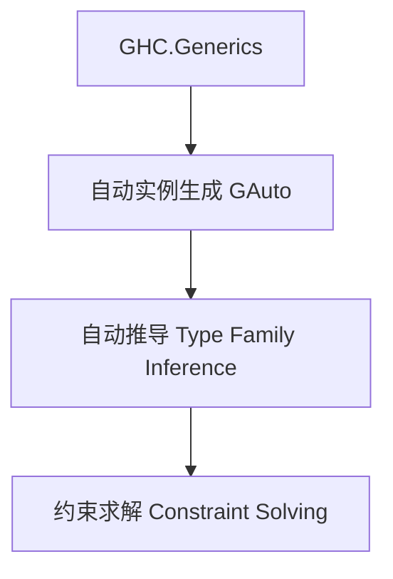

# 01. 类型级泛型自动化在Haskell中的理论与实践（Type-Level Generic Automation in Haskell）

> **中英双语核心定义 | Bilingual Core Definitions**

## 1.1 类型级泛型自动化简介（Introduction to Type-Level Generic Automation）

- **定义（Definition）**：
  - **中文**：类型级泛型自动化是指在类型系统层面对泛型数据结构和算法进行自动推导、实例生成和约束求解。Haskell通过类型族、GADT、GHC.Generics等机制支持类型级泛型自动化。
  - **English**: Type-level generic automation refers to automatic inference, instance generation, and constraint solving for generic data structures and algorithms at the type system level. Haskell supports type-level generic automation via type families, GADTs, GHC.Generics, etc.

- **Wiki风格国际化解释（Wiki-style Explanation）**：
  - 类型级泛型自动化极大提升了Haskell类型系统的工程效率和泛型库的自动推导能力，广泛用于自动实例生成、类型驱动代码生成和泛型推理。
  - Type-level generic automation greatly enhances the engineering efficiency and automatic inference capability of Haskell's type system and generic libraries, widely used in automatic instance generation, type-driven code generation, and generic reasoning.

## 1.2 Haskell中的类型级泛型自动化语法与语义（Syntax and Semantics of Type-Level Generic Automation in Haskell）

- **GHC.Generics与自动实例生成**

```haskell
{-# LANGUAGE DeriveGeneric, TypeFamilies, GADTs #-}
import GHC.Generics

data Tree a = Leaf a | Node (Tree a) (Tree a) deriving (Generic)

-- 泛型自动化定义
class GAuto f where
  gauto :: f a -> r

instance GAuto U1 where
  gauto U1 = ...
```

- **类型族与自动推导**

```haskell
type family Replicate n a where
  Replicate 0 a = '[]
  Replicate n a = a ': Replicate (n-1) a
```

## 1.3 范畴论建模与结构映射（Category-Theoretic Modeling and Mapping）

- **类型级泛型自动化与范畴论关系**
  - 类型级泛型自动化可视为范畴中的自由代数结构与自动提升。

| 概念 | Haskell实现 | 代码示例 | 中文解释 |
|------|-------------|----------|----------|
| 自动实例生成 | GHC.Generics | `gauto` | 泛型自动化 |
| 自动推导 | 类型族 | `Replicate n a` | 类型级自动推导 |
| 约束求解 | 类型类 | `GAuto f` | 泛型约束求解 |

## 1.4 形式化证明与论证（Formal Proofs & Reasoning）

- **自动化一致性证明**
  - **中文**：证明类型级泛型自动化机制不会破坏类型系统一致性。
  - **English**: Prove that type-level generic automation mechanisms preserve type system consistency.

- **自动推导能力证明**
  - **中文**：证明类型级泛型自动化可自动推导复杂泛型关系和实例。
  - **English**: Prove that type-level generic automation can automatically infer complex generic relations and instances.

## 1.5 多表征与本地跳转（Multi-representation & Local Reference）

- **类型级泛型自动化结构图（Type-Level Generic Automation Structure Diagram）**



- **相关主题跳转**：
  - [类型级泛型 Type-Level Generic](../24-Type-Level-Generic/01-Type-Level-Generic-in-Haskell.md)
  - [类型级自动化 Type-Level Automation](../27-Type-Level-Automation/01-Type-Level-Automation-in-Haskell.md)
  - [类型安全 Type Safety](../01-Type-Safety-in-Haskell.md)

---

> 本文档为类型级泛型自动化在Haskell中的中英双语、Haskell语义模型与形式化证明规范化输出，适合学术研究与工程实践参考。
