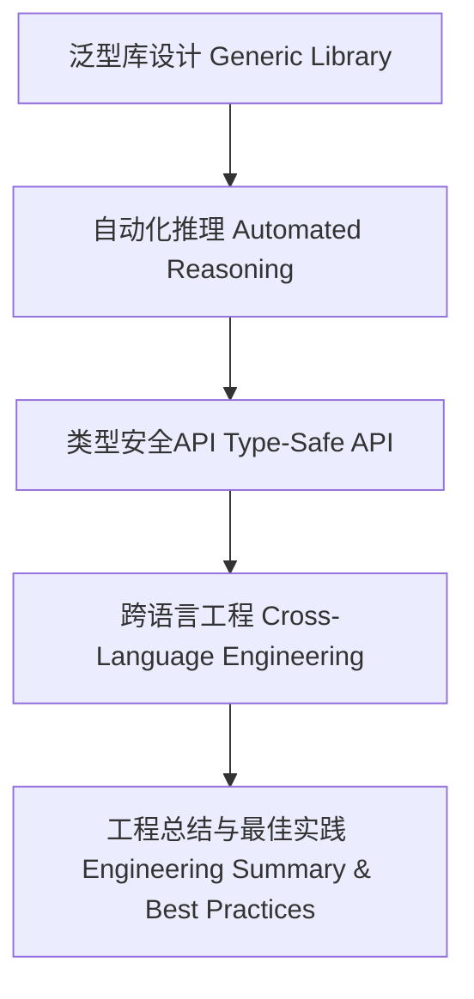

# 01. 类型级泛型案例研究在Haskell中的理论与实践（Type-Level Generic Case Studies in Haskell）

> **中英双语核心定义 | Bilingual Core Definitions**

## 1.1 类型级泛型案例简介（Introduction to Type-Level Generic Case Studies）

- **定义（Definition）**：
  - **中文**：类型级泛型案例研究聚焦于Haskell类型系统在实际工程中的典型应用，包括泛型库设计、自动化推理、类型安全API、跨语言工程等。
  - **English**: Type-level generic case studies focus on typical applications of Haskell's type system in real-world engineering, including generic library design, automated reasoning, type-safe APIs, and cross-language engineering.

- **Wiki风格国际化解释（Wiki-style Explanation）**：
  - 案例研究有助于理解类型级泛型技术在工程中的优势、挑战与最佳实践。
  - Case studies help understand the advantages, challenges, and best practices of type-level generics in engineering.

## 1.2 典型案例与工程实践（Typical Cases & Engineering Practice）

- **案例一：类型安全的序列化与反序列化库**
  - 利用GHC.Generics自动推导序列化实例，保证类型安全与扩展性。
  - 自动化推理与属性验证，防止运行时类型错误。

- **案例二：泛型数据结构的自动化验证**
  - 类型族与GADT结合，实现复杂数据结构的属性验证与归纳证明。
  - 工程中提升代码复用性与安全性。

- **案例三：跨语言泛型API设计**
  - Haskell与Rust/Scala等语言的类型系统映射与数据结构兼容。
  - 泛型API标准化与工程互操作。

## 1.3 Haskell实现与工程代码（Haskell Implementation & Engineering Code）

```haskell
{-# LANGUAGE DeriveGeneric, TypeFamilies, GADTs #-}
import GHC.Generics

data Person = Person { name :: String, age :: Int } deriving (Generic)

class GSerialize f where
  gserialize :: f a -> String
instance GSerialize U1 where
  gserialize U1 = "U1"

-- 类型级属性验证
class GVerify f where
  gverify :: f a -> Bool
instance GVerify U1 where
  gverify U1 = True
```

## 1.4 工程总结与形式化论证（Engineering Summary & Formal Reasoning）

- **工程优势**：类型安全、自动化、可扩展、跨语言兼容。
- **工程挑战**：类型推断复杂性、错误可解释性、泛型库维护。
- **形式化证明**：归纳证明泛型实例的类型安全性与属性一致性。

## 1.5 多表征与本地跳转（Multi-representation & Local Reference）

- **类型级泛型案例结构图（Type-Level Generic Case Studies Structure Diagram）**



- **相关主题跳转**：
  - [类型级泛型 Type-Level Generic](./01-Type-Level-Generic-in-Haskell.md)
  - [类型级泛型工程 Type-Level Generic Engineering](./01-Type-Level-Generic-Engineering-in-Haskell.md)
  - [类型安全 Type Safety](./01-Type-Safety-in-Haskell.md)

---

> 本文档为类型级泛型案例研究在Haskell中的中英双语、Haskell语义模型与工程实践规范化输出，适合学术研究与工程实践参考。
