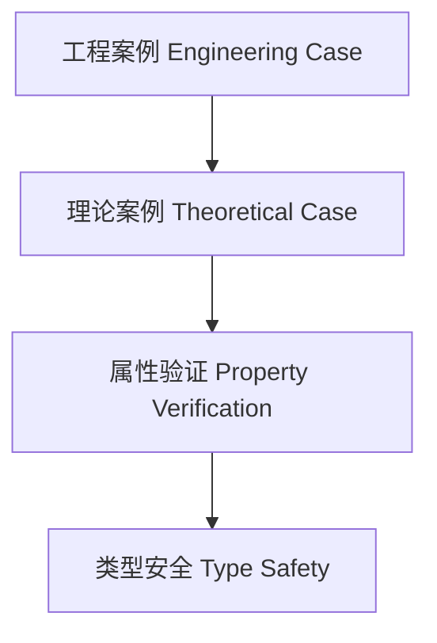

# 01. 类型级泛型案例分析（Type-Level Generic Case Studies in Haskell）

> **中英双语核心定义 | Bilingual Core Definitions**

## 1.1 类型级泛型案例简介（Introduction to Type-Level Generic Case Studies）

- **定义（Definition）**：
  - **中文**：类型级泛型案例分析是指通过具体工程或理论案例，展示Haskell类型级泛型编程、验证、自动化等技术在实际中的应用与效果。
  - **English**: Type-level generic case studies refer to the demonstration of the application and effects of Haskell type-level generic programming, verification, automation, etc., in real-world engineering or theoretical cases.

- **Wiki风格国际化解释（Wiki-style Explanation）**：
  - 类型级泛型案例分析有助于理解类型级泛型理论在实际中的价值和工程意义。
  - Type-level generic case studies help understand the practical value and engineering significance of type-level generic theory.

## 1.2 Haskell中的类型级泛型案例结构（Structure of Type-Level Generic Case Studies in Haskell）

- **工程案例：类型安全泛型配置系统**

```haskell
{-# LANGUAGE DataKinds, TypeFamilies, GADTs #-}

data ConfigKey = Host | Port

type family ConfigType (k :: ConfigKey) :: * where
  ConfigType 'Host = String
  ConfigType 'Port = Int

data Config (k :: ConfigKey) where
  MkConfig :: ConfigType k -> Config k

getConfig :: Config k -> ConfigType k
getConfig (MkConfig v) = v
```

- **理论案例：类型级泛型自然数运算**

```haskell
data Nat = Z | S Nat

type family Add n m where
  Add 'Z m = m
  Add ('S n) m = 'S (Add n m)
```

## 1.3 范畴论建模与结构映射（Category-Theoretic Modeling and Mapping）

- **类型级泛型案例与范畴论关系**
  - 类型级泛型案例可视为范畴中的结构实例与属性验证。

| 概念 | Haskell实现 | 代码示例 | 中文解释 |
|------|-------------|----------|----------|
| 工程案例 | GADT | `Config k` | 类型安全泛型配置 |
| 理论案例 | 类型族 | `Add n m` | 类型级泛型自然数运算 |
| 案例验证 | 类型约束 | `ConfigType k` | 类型级属性验证 |

## 1.4 形式化证明与论证（Formal Proofs & Reasoning）

- **案例有效性证明**
  - **中文**：证明类型级泛型案例能有效支撑理论与工程需求。
  - **English**: Prove that type-level generic case studies effectively support theoretical and engineering requirements.

- **属性验证能力证明**
  - **中文**：证明类型级泛型案例能验证关键属性和约束。
  - **English**: Prove that type-level generic case studies can verify key properties and constraints.

## 1.5 多表征与本地跳转（Multi-representation & Local Reference）

- **类型级泛型案例结构图（Type-Level Generic Case Structure Diagram）**



- **相关主题跳转**：
  - [类型级泛型工程 Type-Level Generic Engineering](./01-Type-Level-Generic-Engineering.md)
  - [类型级泛型验证 Type-Level Generic Verification](./01-Type-Level-Generic-Verification.md)
  - [类型级泛型安全 Type-Level Generic Safety](./01-Type-Level-Generic-Safety.md)
  - [类型安全 Type Safety](./01-Type-Safety.md)
