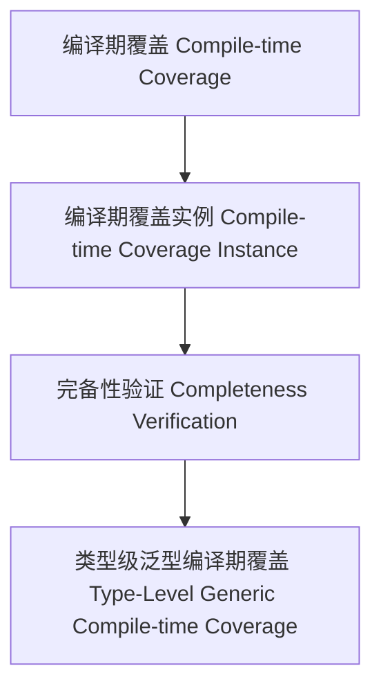

# 01. 类型级泛型编译期覆盖（Type-Level Generic Compile-time Coverage in Haskell）

> **中英双语核心定义 | Bilingual Core Definitions**

## 1.1 类型级泛型编译期覆盖简介（Introduction to Type-Level Generic Compile-time Coverage）

- **定义（Definition）**：
  - **中文**：类型级泛型编译期覆盖是指在类型系统层面，通过泛型机制在编译期确保所有类型结构和属性都被覆盖和验证。Haskell通过类型族、GADT、类型类等机制支持类型级泛型编译期覆盖。
  - **English**: Type-level generic compile-time coverage refers to ensuring that all type structures and properties are covered and verified at compile time via generic mechanisms at the type system level. Haskell supports type-level generic compile-time coverage via type families, GADTs, type classes, etc.

- **Wiki风格国际化解释（Wiki-style Explanation）**：
  - 类型级泛型编译期覆盖是类型安全、完备性和自动化验证的基础。
  - Type-level generic compile-time coverage is the foundation of type safety, completeness, and automated verification.

## 1.2 Haskell中的类型级泛型编译期覆盖语法与语义（Syntax and Semantics of Type-Level Generic Compile-time Coverage in Haskell）

- **类型级覆盖结构与泛型完备性**

```haskell
{-# LANGUAGE TypeFamilies, DataKinds, GADTs #-}

data Nat = Z | S Nat

type family CompiletimeAllCovered (xs :: [Nat]) :: Bool where
  CompiletimeAllCovered '[] = 'True
  CompiletimeAllCovered (x ': xs) = IsCovered x && CompiletimeAllCovered xs

-- 伪代码：IsCovered 可定义为类型级谓词，判断某类型是否被验证
```

- **类型类与泛型覆盖实例**

```haskell
class GCompiletimeCover f where
  gcompiletimeCover :: f a -> Bool

instance GCompiletimeCover Maybe where
  gcompiletimeCover Nothing  = True
  gcompiletimeCover (Just _) = True
```

## 1.3 范畴论建模与结构映射（Category-Theoretic Modeling and Mapping）

- **类型级泛型编译期覆盖与范畴论关系**
  - 类型级泛型编译期覆盖可视为范畴中的对象、函子与完备性验证。

| 概念 | Haskell实现 | 代码示例 | 中文解释 |
|------|-------------|----------|----------|
| 编译期覆盖 | 类型族 | `CompiletimeAllCovered xs` | 编译期覆盖 |
| 编译期覆盖实例 | 类型类 | `GCompiletimeCover` | 编译期覆盖实例 |
| 完备性验证 | 类型族+类型类 | `gcompiletimeCover` | 完备性验证 |

## 1.4 形式化证明与论证（Formal Proofs & Reasoning）

- **编译期覆盖完备性证明**
  - **中文**：证明类型级泛型编译期覆盖能确保所有类型结构在编译期被验证。
  - **English**: Prove that type-level generic compile-time coverage ensures all type structures are verified at compile time.

- **自动化覆盖能力证明**
  - **中文**：证明类型级泛型编译期覆盖可自动覆盖复杂类型结构。
  - **English**: Prove that type-level generic compile-time coverage can automatically cover complex type structures.

## 1.5 多表征与本地跳转（Multi-representation & Local Reference）

- **类型级泛型编译期覆盖结构图（Type-Level Generic Compile-time Coverage Structure Diagram）**



- **相关主题跳转**：
  - [类型级泛型编译期优化 Type-Level Generic Compile-time Optimization](./01-Type-Level-Generic-Compiletime-Optimization.md)
  - [类型级泛型覆盖 Type-Level Generic Coverage](./01-Type-Level-Generic-Coverage.md)
  - [类型安全 Type Safety](./01-Type-Safety.md)
