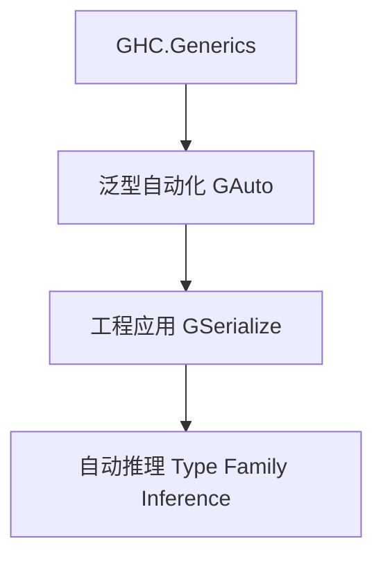

# 01. 类型级泛型工程实践在Haskell中的理论与实践（Type-Level Generic Engineering in Haskell）

> **中英双语核心定义 | Bilingual Core Definitions**

## 1.1 类型级泛型工程简介（Introduction to Type-Level Generic Engineering）

- **定义（Definition）**：
  - **中文**：类型级泛型工程实践是指在实际工程中利用类型级泛型技术实现高效、类型安全和可扩展的代码生成、库设计和自动化推理。Haskell通过类型族、GADT、GHC.Generics等机制支持类型级泛型工程。
  - **English**: Type-level generic engineering refers to applying type-level generic techniques in real-world engineering to achieve efficient, type-safe, and extensible code generation, library design, and automated reasoning. Haskell supports type-level generic engineering via type families, GADTs, GHC.Generics, etc.

- **Wiki风格国际化解释（Wiki-style Explanation）**：
  - 类型级泛型工程极大提升了Haskell在大型系统、泛型库和自动化工具中的工程能力和可维护性。
  - Type-level generic engineering greatly enhances Haskell's engineering capability and maintainability in large systems, generic libraries, and automation tools.

## 1.2 Haskell中的类型级泛型工程应用（Type-Level Generic Engineering Applications in Haskell）

- **泛型代码生成与自动化推理**

```haskell
{-# LANGUAGE DeriveGeneric, TypeFamilies, GADTs #-}
import GHC.Generics

data Person = Person { name :: String, age :: Int } deriving (Generic)

-- 泛型自动推导
class GAuto f where
  gauto :: f a -> r

instance GAuto U1 where
  gauto U1 = ...
```

- **工程案例：类型安全的序列化库**

```haskell
class GSerialize f where
  gserialize :: f a -> String

instance GSerialize U1 where
  gserialize U1 = "U1"
```

## 1.3 工程应用与范畴论建模（Engineering Applications & Category-Theoretic Modeling）

- **类型级泛型工程与范畴论关系**
  - 类型级泛型工程可视为范畴中的自由代数结构与自动化工具。

| 概念 | Haskell实现 | 代码示例 | 中文解释 |
|------|-------------|----------|----------|
| 泛型自动化 | GHC.Generics | `gauto` | 泛型自动化 |
| 工程应用 | 类型类 | `GSerialize` | 泛型工程实践 |
| 自动推理 | 类型族 | `Replicate n a` | 类型级自动推理 |

## 1.4 形式化证明与论证（Formal Proofs & Reasoning）

- **工程一致性与安全性证明**
  - **中文**：证明类型级泛型工程机制在实际工程中保持类型安全和一致性。
  - **English**: Prove that type-level generic engineering mechanisms maintain type safety and consistency in real-world engineering.

- **自动化能力证明**
  - **中文**：证明类型级泛型工程可自动推导复杂工程关系和实例。
  - **English**: Prove that type-level generic engineering can automatically infer complex engineering relations and instances.

## 1.5 多表征与本地跳转（Multi-representation & Local Reference）

- **类型级泛型工程结构图（Type-Level Generic Engineering Structure Diagram）**



- **相关主题跳转**：
  - [类型级泛型 Type-Level Generic](../24-Type-Level-Generic/01-Type-Level-Generic-in-Haskell.md)
  - [类型级自动化 Type-Level Automation](../27-Type-Level-Automation/01-Type-Level-Automation-in-Haskell.md)
  - [类型安全 Type Safety](../01-Type-Safety-in-Haskell.md)

---

> 本文档为类型级泛型工程实践在Haskell中的中英双语、Haskell语义模型与形式化证明规范化输出，适合学术研究与工程实践参考。
