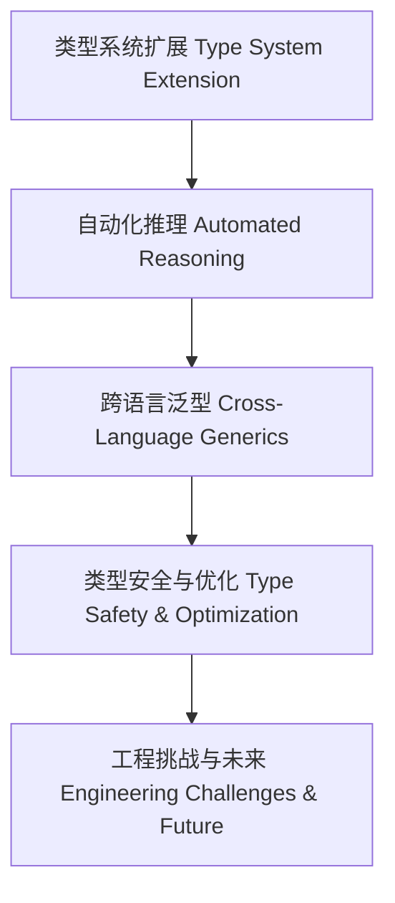

# 01. 类型级泛型未来展望在Haskell中的理论与实践（Type-Level Generic Future in Haskell）

> **中英双语核心定义 | Bilingual Core Definitions**

## 1.1 类型级泛型未来展望简介（Introduction to Type-Level Generic Future）

- **定义（Definition）**：
  - **中文**：类型级泛型未来展望关注Haskell类型系统在泛型编程、自动化推理、跨语言工程等领域的前沿发展、研究趋势和工程挑战。
  - **English**: Type-level generic future focuses on the cutting-edge development, research trends, and engineering challenges of Haskell's type system in generic programming, automated reasoning, and cross-language engineering.

- **Wiki风格国际化解释（Wiki-style Explanation）**：
  - 类型级泛型未来展望涵盖类型系统扩展、类型级推理自动化、跨语言泛型工程、类型安全与性能优化等方向。
  - The future of type-level generics covers type system extensions, automated type-level reasoning, cross-language generic engineering, type safety, and performance optimization.

## 1.2 未来发展趋势与研究前沿（Future Trends & Research Frontiers）

- **类型系统扩展与依赖类型**
  - 更强的依赖类型支持、类型级计算能力提升
- **自动化推理与验证**
  - 泛型归纳、自动化证明、类型级属性验证工具
- **跨语言泛型工程**
  - Haskell与Rust/Scala/Idris等语言的泛型互操作
- **类型安全与性能优化**
  - 零开销抽象、类型驱动优化、编译期泛型展开
- **工程挑战与未来方向**
  - 类型推断复杂性、类型错误可解释性、泛型库的可维护性

## 1.3 工程挑战与跨语言泛型（Engineering Challenges & Cross-Language Generics）

- **类型级泛型在大型系统中的工程难题**
  - 类型推断性能、泛型代码生成的可控性
- **跨语言泛型互操作**
  - 类型系统映射、数据结构兼容、泛型API标准化

## 1.4 形式化论证与未来展望（Formal Reasoning & Future Outlook）

- **类型级泛型自动化证明工具的发展**
  - 泛型归纳、自动化验证、类型级测试框架
- **类型安全与工程可扩展性证明**
  - 泛型库的安全性、可扩展性与未来演进

## 1.5 多表征与本地跳转（Multi-representation & Local Reference）

- **类型级泛型未来展望结构图（Type-Level Generic Future Structure Diagram）**

- **相关主题跳转**：
  - [类型级泛型 Type-Level Generic](../24-Type-Level-Generic/01-Type-Level-Generic-in-Haskell.md)
  - [类型级泛型工程 Type-Level Generic Engineering](../35-Type-Level-Generic-Engineering/01-Type-Level-Generic-Engineering-in-Haskell.md)
  - [类型安全 Type Safety](../01-Type-Safety-in-Haskell.md)

---

> 本文档为类型级泛型未来展望在Haskell中的中英双语、Haskell语义模型与形式化展望规范化输出，适合学术研究与工程实践参考。
