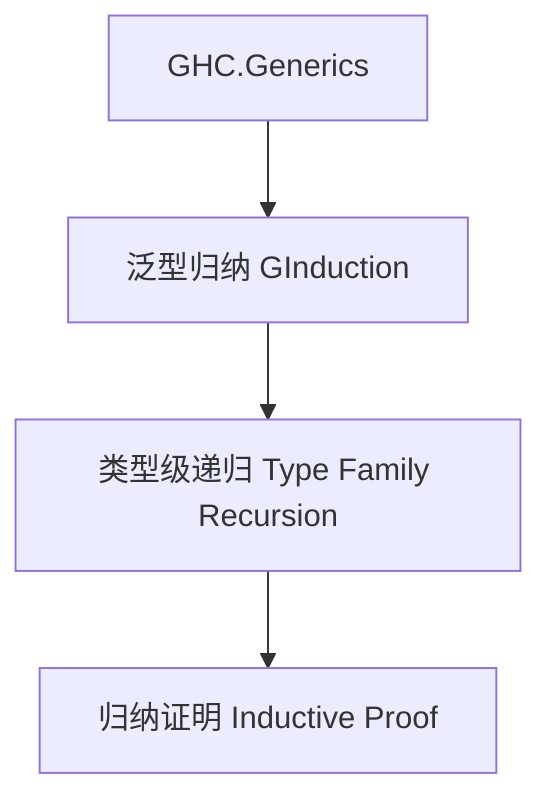

# 01. 类型级泛型归纳在Haskell中的理论与实践（Type-Level Generic Induction in Haskell）

> **中英双语核心定义 | Bilingual Core Definitions**

## 1.1 类型级泛型归纳简介（Introduction to Type-Level Generic Induction）

- **定义（Definition）**：
  - **中文**：类型级泛型归纳是指在类型系统层面通过递归和归纳方法对泛型数据结构和算法进行统一建模和证明。Haskell通过类型族、GADT、GHC.Generics等机制支持类型级泛型归纳。
  - **English**: Type-level generic induction refers to modeling and proving generic data structures and algorithms uniformly at the type system level via recursion and induction. Haskell supports type-level generic induction via type families, GADTs, GHC.Generics, etc.

- **Wiki风格国际化解释（Wiki-style Explanation）**：
  - 类型级泛型归纳极大提升了Haskell类型系统的抽象能力和自动化证明能力，广泛用于泛型库、自动推导和类型安全归纳。
  - Type-level generic induction greatly enhances the abstraction and automated proof capabilities of Haskell's type system, widely used in generic libraries, automatic inference, and type-safe induction.

## 1.2 Haskell中的类型级泛型归纳语法与语义（Syntax and Semantics of Type-Level Generic Induction in Haskell）

- **GHC.Generics与类型级归纳**

```haskell
{-# LANGUAGE DeriveGeneric, TypeFamilies, GADTs #-}
import GHC.Generics

data Tree a = Leaf a | Node (Tree a) (Tree a) deriving (Generic)

-- 类型级归纳定义
class GInduction f where
  ginduction :: f a -> r

instance GInduction U1 where
  ginduction U1 = ...
```

- **类型族递归与归纳证明**

```haskell
type family Length xs where
  Length '[] = 0
  Length (_ ': xs) = 1 + Length xs
```

## 1.3 范畴论建模与结构映射（Category-Theoretic Modeling and Mapping）

- **类型级泛型归纳与范畴论关系**
  - 类型级泛型归纳可视为范畴中的归纳对象与自由代数结构。

| 概念 | Haskell实现 | 代码示例 | 中文解释 |
|------|-------------|----------|----------|
| 泛型归纳 | GHC.Generics | `ginduction` | 泛型归纳方法 |
| 类型级递归 | 类型族 | `Length xs` | 类型级递归定义 |
| 归纳证明 | GADT | `induction :: ...` | 类型级归纳证明 |

## 1.4 形式化证明与论证（Formal Proofs & Reasoning）

- **泛型归纳安全性证明**
  - **中文**：证明类型级泛型归纳下的归纳结构和算法在类型系统下是安全的。
  - **English**: Prove that induction structures and algorithms under type-level generic induction are safe under the type system.

- **归纳能力证明**
  - **中文**：证明类型级泛型归纳可表达复杂的泛型数据结构和归纳算法。
  - **English**: Prove that type-level generic induction can express complex generic data structures and induction algorithms.

## 1.5 多表征与本地跳转（Multi-representation & Local Reference）

- **类型级泛型归纳结构图（Type-Level Generic Induction Structure Diagram）**



- **相关主题跳转**：
  - [类型级泛型 Type-Level Generic](../24-Type-Level-Generic/01-Type-Level-Generic-in-Haskell.md)
  - [类型级归纳 Type-Level Induction](../23-Type-Level-Induction/01-Type-Level-Induction-in-Haskell.md)
  - [类型安全 Type Safety](../14-Type-Safety/01-Type-Safety-in-Haskell.md)

---

> 本文档为类型级泛型归纳在Haskell中的中英双语、Haskell语义模型与形式化证明规范化输出，适合学术研究与工程实践参考。
