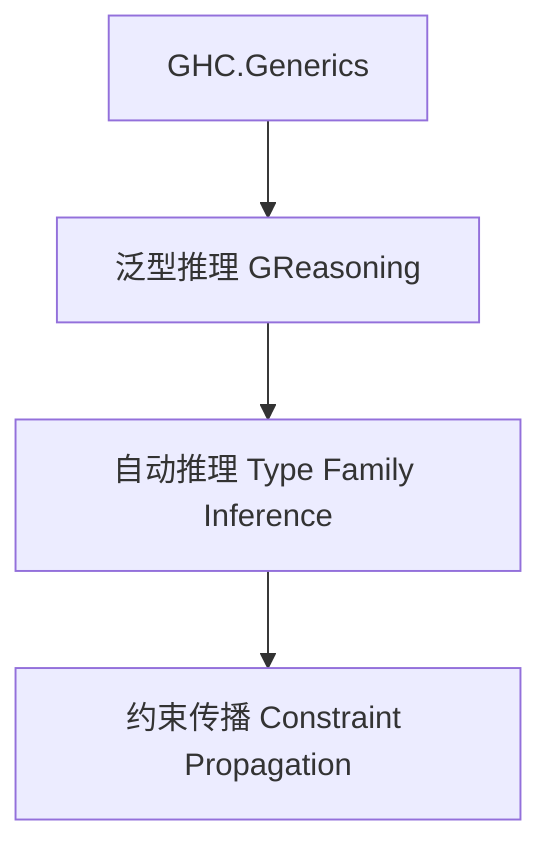

# 01. 类型级泛型推理在Haskell中的理论与实践（Type-Level Generic Reasoning in Haskell）

> **中英双语核心定义 | Bilingual Core Definitions**

## 1.1 类型级泛型推理简介（Introduction to Type-Level Generic Reasoning）

- **定义（Definition）**：
  - **中文**：类型级泛型推理是指在类型系统层面对泛型数据结构和算法进行自动化推导、约束传播和结论生成。Haskell通过类型族、GADT、GHC.Generics等机制支持类型级泛型推理。
  - **English**: Type-level generic reasoning refers to automated inference, constraint propagation, and conclusion generation for generic data structures and algorithms at the type system level. Haskell supports type-level generic reasoning via type families, GADTs, GHC.Generics, etc.

- **Wiki风格国际化解释（Wiki-style Explanation）**：
  - 类型级泛型推理极大提升了Haskell类型系统的自动化能力和泛型表达力，广泛用于泛型库、自动推导和类型安全推理。
  - Type-level generic reasoning greatly enhances the automation and generic expressiveness of Haskell's type system, widely used in generic libraries, automatic inference, and type-safe reasoning.

## 1.2 Haskell中的类型级泛型推理语法与语义（Syntax and Semantics of Type-Level Generic Reasoning in Haskell）

- **GHC.Generics与类型级推理**

```haskell
{-# LANGUAGE DeriveGeneric, TypeFamilies, GADTs #-}
import GHC.Generics

data Tree a = Leaf a | Node (Tree a) (Tree a) deriving (Generic)

-- 类型级推理定义
class GReasoning f where
  greason :: f a -> r

instance GReasoning U1 where
  greason U1 = ...
```

- **类型族与自动推理**

```haskell
type family AllEq xs where
  AllEq '[] = 'True
  AllEq (x ': xs) = (x ~ x) && AllEq xs
```

## 1.3 范畴论建模与结构映射（Category-Theoretic Modeling and Mapping）

- **类型级泛型推理与范畴论关系**
  - 类型级泛型推理可视为范畴中的约束传播与结论生成。

| 概念 | Haskell实现 | 代码示例 | 中文解释 |
|------|-------------|----------|----------|
| 泛型推理 | GHC.Generics | `greason` | 泛型推理方法 |
| 自动推理 | 类型族 | `AllEq xs` | 类型级自动推理 |
| 约束传播 | 类型类 | `GReasoning f` | 泛型约束传播 |

## 1.4 形式化证明与论证（Formal Proofs & Reasoning）

- **泛型推理一致性证明**
  - **中文**：证明类型级泛型推理过程与类型系统一致。
  - **English**: Prove that the type-level generic reasoning process is consistent with the type system.

- **自动推理能力证明**
  - **中文**：证明类型级泛型推理可自动推导复杂泛型关系和结论。
  - **English**: Prove that type-level generic reasoning can automatically infer complex generic relations and conclusions.

## 1.5 多表征与本地跳转（Multi-representation & Local Reference）

- **类型级泛型推理结构图（Type-Level Generic Reasoning Structure Diagram）**



- **相关主题跳转**：
  - [类型级泛型 Type-Level Generic](../24-Type-Level-Generic/01-Type-Level-Generic-in-Haskell.md)
  - [类型级推理 Type-Level Reasoning](../29-Type-Level-Reasoning/01-Type-Level-Reasoning-in-Haskell.md)
  - [类型安全 Type Safety](../01-Type-Safety-in-Haskell.md)

---

> 本文档为类型级泛型推理在Haskell中的中英双语、Haskell语义模型与形式化证明规范化输出，适合学术研究与工程实践参考。
