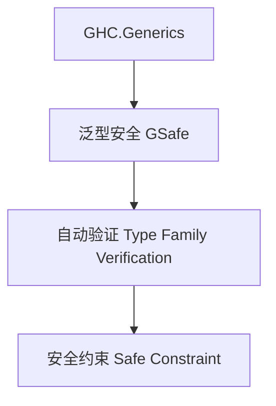

# 01. 类型级泛型安全在Haskell中的理论与实践（Type-Level Generic Safety in Haskell）

> **中英双语核心定义 | Bilingual Core Definitions**

## 1.1 类型级泛型安全简介（Introduction to Type-Level Generic Safety）

- **定义（Definition）**：
  - **中文**：类型级泛型安全是指在类型系统层面通过泛型约束、验证和推理机制，确保泛型数据结构和算法的类型安全。Haskell通过类型族、GADT、GHC.Generics等机制支持类型级泛型安全。
  - **English**: Type-level generic safety refers to ensuring type safety of generic data structures and algorithms at the type system level through generic constraints, verification, and reasoning mechanisms. Haskell supports type-level generic safety via type families, GADTs, GHC.Generics, etc.

- **Wiki风格国际化解释（Wiki-style Explanation）**：
  - 类型级泛型安全极大提升了Haskell类型系统的可靠性和泛型库的安全性，广泛用于自动化验证、泛型推导和类型安全API。
  - Type-level generic safety greatly enhances the reliability and safety of Haskell's type system and generic libraries, widely used in automated verification, generic inference, and type-safe APIs.

## 1.2 Haskell中的类型级泛型安全语法与语义（Syntax and Semantics of Type-Level Generic Safety in Haskell）

- **GHC.Generics与泛型安全验证**

```haskell
{-# LANGUAGE DeriveGeneric, TypeFamilies, GADTs #-}
import GHC.Generics

data Tree a = Leaf a | Node (Tree a) (Tree a) deriving (Generic)

-- 泛型安全验证定义
class GSafe f where
  gsafe :: f a -> Bool

instance GSafe U1 where
  gsafe U1 = True
```

- **类型族与安全验证**

```haskell
type family AllSafe xs where
  AllSafe '[] = 'True
  AllSafe (x ': xs) = (x ~ x) && AllSafe xs
```

## 1.3 范畴论建模与结构映射（Category-Theoretic Modeling and Mapping）

- **类型级泛型安全与范畴论关系**
  - 类型级泛型安全可视为范畴中的安全属性验证与结构保障。

| 概念 | Haskell实现 | 代码示例 | 中文解释 |
|------|-------------|----------|----------|
| 泛型安全 | GHC.Generics | `gsafe` | 泛型安全验证 |
| 自动验证 | 类型族 | `AllSafe xs` | 类型级自动验证 |
| 安全约束 | 类型类 | `GSafe f` | 泛型安全约束 |

## 1.4 形式化证明与论证（Formal Proofs & Reasoning）

- **泛型安全性证明**
  - **中文**：证明类型级泛型安全机制能检测所有类型安全性问题。
  - **English**: Prove that type-level generic safety mechanisms can detect all type safety issues.

- **属性一致性证明**
  - **中文**：证明类型级泛型安全下的属性一致性和类型安全。
  - **English**: Prove property consistency and type safety under type-level generic safety.

## 1.5 多表征与本地跳转（Multi-representation & Local Reference）

- **类型级泛型安全结构图（Type-Level Generic Safety Structure Diagram）**



- **相关主题跳转**：
  - [类型级泛型 Type-Level Generic](../24-Type-Level-Generic/01-Type-Level-Generic-in-Haskell.md)
  - [类型级安全 Type-Level Safety](../31-Type-Level-Safety/01-Type-Level-Safety-in-Haskell.md)
  - [类型安全 Type Safety](../01-Type-Safety-in-Haskell.md)

---

> 本文档为类型级泛型安全在Haskell中的中英双语、Haskell语义模型与形式化证明规范化输出，适合学术研究与工程实践参考。
