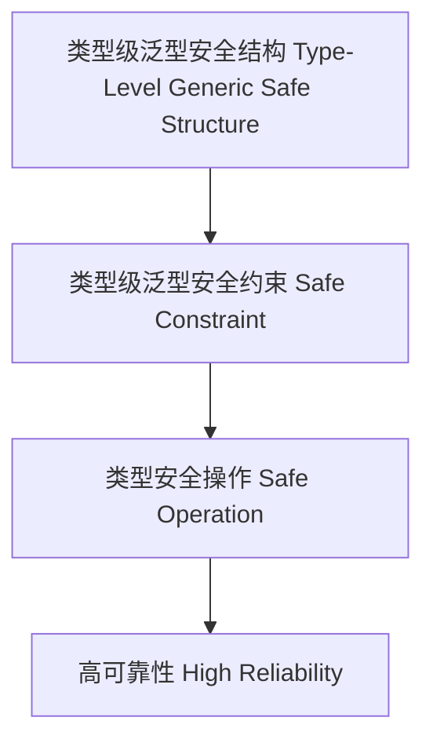

# 01. 类型级泛型安全性（Type-Level Generic Safety in Haskell）

> **中英双语核心定义 | Bilingual Core Definitions**

## 1.1 类型级泛型安全性简介（Introduction to Type-Level Generic Safety）

- **定义（Definition）**：
  - **中文**：类型级泛型安全性是指通过类型系统在编译期保证泛型类型属性、约束和不变量，防止类型错误和不安全行为。Haskell类型系统通过类型族、GADT、类型类等机制实现类型级泛型安全。
  - **English**: Type-level generic safety refers to ensuring generic type properties, constraints, and invariants at compile time via the type system, preventing type errors and unsafe behaviors. Haskell achieves type-level generic safety via type families, GADTs, type classes, etc.

- **Wiki风格国际化解释（Wiki-style Explanation）**：
  - 类型级泛型安全性是高可靠性、可验证性和工程实践的基础。
  - Type-level generic safety is the foundation of high reliability, verifiability, and engineering practice.

## 1.2 Haskell中的类型级泛型安全性语法与语义（Syntax and Semantics of Type-Level Generic Safety in Haskell）

- **类型级安全结构**

```haskell
{-# LANGUAGE GADTs, TypeFamilies, DataKinds, TypeOperators #-}

data Nat = Z | S Nat

data Vec n a where
  VNil  :: Vec 'Z a
  VCons :: a -> Vec n a -> Vec ('S n) a

safeHead :: Vec ('S n) a -> a
safeHead (VCons x _) = x
```

- **类型级安全约束**

```haskell
-- 只允许非空向量调用safeHead，类型系统保证安全
```

## 1.3 范畴论建模与结构映射（Category-Theoretic Modeling and Mapping）

- **类型级泛型安全与范畴论关系**
  - 类型级泛型安全可视为范畴中的对象不变量与安全态映射。

| 概念 | Haskell实现 | 代码示例 | 中文解释 |
|------|-------------|----------|----------|
| 安全结构 | GADT | `Vec n a` | 类型级泛型安全结构 |
| 安全约束 | 类型约束 | `Vec ('S n) a` | 类型级泛型安全约束 |
| 安全操作 | 类型安全函数 | `safeHead` | 类型安全操作 |

## 1.4 形式化证明与论证（Formal Proofs & Reasoning）

- **类型级泛型安全性证明**
  - **中文**：证明类型级泛型结构和操作在类型系统下是安全的。
  - **English**: Prove that type-level generic structures and operations are safe under the type system.

- **安全约束能力证明**
  - **中文**：证明类型级泛型约束能防止不安全行为。
  - **English**: Prove that type-level generic constraints can prevent unsafe behaviors.

## 1.5 多表征与本地跳转（Multi-representation & Local Reference）

- **类型级泛型安全结构图（Type-Level Generic Safety Structure Diagram）**



- **相关主题跳转**：
  - [类型级泛型验证 Type-Level Generic Verification](./01-Type-Level-Generic-Verification.md)
  - [类型级泛型归纳 Type-Level Generic Induction](./01-Type-Level-Generic-Induction.md)
  - [类型级泛型推理 Type-Level Generic Reasoning](./01-Type-Level-Generic-Reasoning.md)
  - [类型安全 Type Safety](./01-Type-Safety.md)
