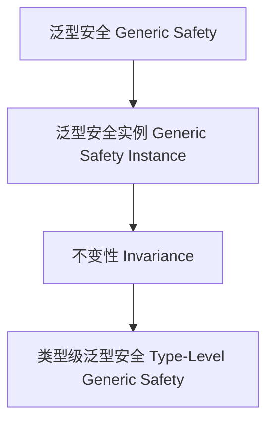

# 01. 类型级泛型安全（Type-Level Generic Safety in Haskell）

> **中英双语核心定义 | Bilingual Core Definitions**

## 1.1 类型级泛型安全简介（Introduction to Type-Level Generic Safety）

- **定义（Definition）**：
  - **中文**：类型级泛型安全是指在类型系统层面，通过泛型机制确保任意类型结构的类型安全和属性不变性。Haskell通过类型族、GADT、类型类等机制支持类型级泛型安全。
  - **English**: Type-level generic safety refers to ensuring type safety and property invariance of arbitrary type structures at the type system level via generic mechanisms. Haskell supports type-level generic safety via type families, GADTs, type classes, etc.

- **Wiki风格国际化解释（Wiki-style Explanation）**：
  - 类型级泛型安全是高可靠性、自动化和形式化验证的基础。
  - Type-level generic safety is the foundation of high reliability, automation, and formal verification.

## 1.2 Haskell中的类型级泛型安全语法与语义（Syntax and Semantics of Type-Level Generic Safety in Haskell）

- **类型级安全结构与泛型不变性**

```haskell
{-# LANGUAGE TypeFamilies, DataKinds, GADTs #-}

data Nat = Z | S Nat

type family SafeAdd (n :: Nat) (m :: Nat) :: Nat where
  SafeAdd 'Z m = m
  SafeAdd ('S n) m = 'S (SafeAdd n m)

-- 泛型安全：类型级加法保证不变性
```

- **类型类与泛型安全实例**

```haskell
class GSafe f where
  gsafe :: f a -> Bool

instance GSafe Maybe where
  gsafe Nothing  = True
  gsafe (Just _) = True
```

## 1.3 范畴论建模与结构映射（Category-Theoretic Modeling and Mapping）

- **类型级泛型安全与范畴论关系**
  - 类型级泛型安全可视为范畴中的对象、函子与不变性。

| 概念 | Haskell实现 | 代码示例 | 中文解释 |
|------|-------------|----------|----------|
| 泛型安全 | 类型族 | `SafeAdd n m` | 泛型安全 |
| 泛型安全实例 | 类型类 | `GSafe` | 泛型安全实例 |
| 不变性 | 类型族+类型类 | `gsafe` | 不变性 |

## 1.4 形式化证明与论证（Formal Proofs & Reasoning）

- **泛型安全不变性证明**
  - **中文**：证明类型级泛型安全结构满足属性不变性。
  - **English**: Prove that type-level generic safety structures satisfy property invariance.

- **自动化安全能力证明**
  - **中文**：证明类型级泛型安全可自动保证复杂类型结构的安全性。
  - **English**: Prove that type-level generic safety can automatically ensure the safety of complex type structures.

## 1.5 多表征与本地跳转（Multi-representation & Local Reference）

- **类型级泛型安全结构图（Type-Level Generic Safety Structure Diagram）**



- **相关主题跳转**：
  - [类型级泛型验证 Type-Level Generic Verification](./01-Type-Level-Generic-Verification.md)
  - [类型级泛型编程 Type-Level Generic Programming](./01-Type-Level-Generic-Programming.md)
  - [类型安全 Type Safety](./01-Type-Safety.md)
