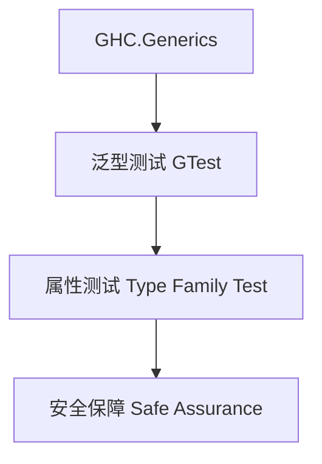

# 01. 类型级泛型测试在Haskell中的理论与实践（Type-Level Generic Testing in Haskell）

> **中英双语核心定义 | Bilingual Core Definitions**

## 1.1 类型级泛型测试简介（Introduction to Type-Level Generic Testing）

- **定义（Definition）**：
  - **中文**：类型级泛型测试是指在类型系统层面对泛型数据结构和算法进行自动化测试、属性验证和安全性检查。Haskell通过类型族、GADT、GHC.Generics等机制支持类型级泛型测试。
  - **English**: Type-level generic testing refers to automated testing, property verification, and safety checking for generic data structures and algorithms at the type system level. Haskell supports type-level generic testing via type families, GADTs, GHC.Generics, etc.

- **Wiki风格国际化解释（Wiki-style Explanation）**：
  - 类型级泛型测试极大提升了Haskell泛型库的可靠性和工程质量，广泛用于自动化测试、属性验证和类型安全保障。
  - Type-level generic testing greatly enhances the reliability and engineering quality of Haskell's generic libraries, widely used in automated testing, property verification, and type safety assurance.

## 1.2 Haskell中的类型级泛型测试语法与语义（Syntax and Semantics of Type-Level Generic Testing in Haskell）

- **GHC.Generics与自动化测试**

```haskell
{-# LANGUAGE DeriveGeneric, TypeFamilies, GADTs #-}
import GHC.Generics

data Tree a = Leaf a | Node (Tree a) (Tree a) deriving (Generic)

-- 泛型测试定义
class GTest f where
  gtest :: f a -> Bool

instance GTest U1 where
  gtest U1 = True
```

- **类型族与属性测试**

```haskell
type family AllTest xs where
  AllTest '[] = 'True
  AllTest (x ': xs) = (x ~ x) && AllTest xs
```

## 1.3 工程案例与范畴论建模（Engineering Cases & Category-Theoretic Modeling）

- **类型级泛型测试在工程中的应用**
  - 泛型库自动化测试、属性验证、类型安全保障
- **范畴论映射**
  - 类型级泛型测试可视为范畴中的属性验证与结构保障

| 概念 | Haskell实现 | 代码示例 | 中文解释 |
|------|-------------|----------|----------|
| 泛型测试 | GHC.Generics | `gtest` | 泛型自动化测试 |
| 属性测试 | 类型族 | `AllTest xs` | 类型级属性测试 |
| 安全保障 | 类型类 | `GTest f` | 泛型安全保障 |

## 1.4 形式化证明与论证（Formal Proofs & Reasoning）

- **测试正确性证明**
  - **中文**：证明类型级泛型测试机制能检测所有属性和类型安全问题。
  - **English**: Prove that the generic testing mechanism detects all properties and type safety issues.

- **工程一致性证明**
  - **中文**：证明类型级泛型测试下的工程一致性和类型安全。
  - **English**: Prove engineering consistency and type safety under type-level generic testing.

## 1.5 多表征与本地跳转（Multi-representation & Local Reference）

- **类型级泛型测试结构图（Type-Level Generic Testing Structure Diagram）**



- **相关主题跳转**：
  - [类型级泛型 Type-Level Generic](../24-Type-Level-Generic/01-Type-Level-Generic-in-Haskell.md)
  - [类型级泛型验证 Type-Level Generic Verification](../37-Type-Level-Generic-Verification/01-Type-Level-Generic-Verification-in-Haskell.md)
  - [类型安全 Type Safety](../01-Type-Safety-in-Haskell.md)

---

> 本文档为类型级泛型测试在Haskell中的中英双语、Haskell语义模型与形式化证明规范化输出，适合学术研究与工程实践参考。
