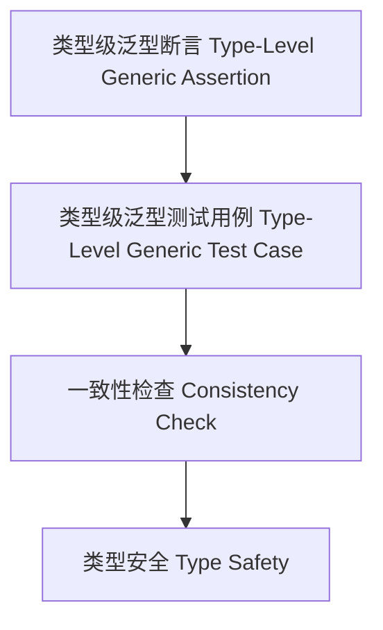

# 01. 类型级泛型测试（Type-Level Generic Testing in Haskell）

> **中英双语核心定义 | Bilingual Core Definitions**

## 1.1 类型级泛型测试简介（Introduction to Type-Level Generic Testing）

- **定义（Definition）**：
  - **中文**：类型级泛型测试是指在类型系统层面对类型级泛型属性、约束和推理过程进行自动化测试和验证，确保类型安全和逻辑正确性。
  - **English**: Type-level generic testing refers to automated testing and verification of type-level generic properties, constraints, and reasoning processes at the type system level, ensuring type safety and logical correctness.

- **Wiki风格国际化解释（Wiki-style Explanation）**：
  - 类型级泛型测试是类型安全、自动化验证和工程可靠性的基础。
  - Type-level generic testing is the foundation of type safety, automated verification, and engineering reliability.

## 1.2 Haskell中的类型级泛型测试语法与语义（Syntax and Semantics of Type-Level Generic Testing in Haskell）

- **类型级泛型断言与测试结构**

```haskell
{-# LANGUAGE DataKinds, TypeFamilies, TypeOperators, GADTs #-}

type family Assert (cond :: Bool) :: Bool where
  Assert 'True  = 'True
  Assert 'False = TypeError ('Text "Type-level assertion failed")

-- 示例：类型级泛型加法测试

type family Add n m where
  Add 0 m = m
  Add n m = 1 + Add (n - 1) m

-- 测试 Add 2 3 == 5
assertAdd :: (Assert (Add 2 3 == 5) ~ 'True) => ()
assertAdd = ()
```

- **GADT与类型级泛型测试用例**

```haskell
data SNat (n :: Nat) where
  SZ :: SNat 0
  SS :: SNat n -> SNat (n + 1)

testAdd :: SNat 2 -> SNat 3 -> SNat 5
-- 省略具体实现
```

## 1.3 范畴论建模与结构映射（Category-Theoretic Modeling and Mapping）

- **类型级泛型测试与范畴论关系**
  - 类型级泛型测试可视为范畴中的属性验证与结构一致性检查。

| 概念 | Haskell实现 | 代码示例 | 中文解释 |
|------|-------------|----------|----------|
| 断言 | 类型族 | `Assert cond` | 类型级泛型断言 |
| 测试用例 | GADT | `testAdd` | 类型级泛型测试用例 |
| 一致性检查 | 类型约束 | `Assert (Add 2 3 == 5)` | 类型级泛型一致性 |

## 1.4 形式化证明与论证（Formal Proofs & Reasoning）

- **测试覆盖性证明**
  - **中文**：证明类型级泛型测试覆盖所有关键属性和约束。
  - **English**: Prove that type-level generic tests cover all key properties and constraints.

- **一致性与安全性证明**
  - **中文**：证明类型级泛型测试能保证类型系统一致性和安全性。
  - **English**: Prove that type-level generic testing ensures type system consistency and safety.

## 1.5 多表征与本地跳转（Multi-representation & Local Reference）

- **类型级泛型测试结构图（Type-Level Generic Testing Structure Diagram）**



- **相关主题跳转**：
  - [类型级泛型验证 Type-Level Generic Verification](./01-Type-Level-Generic-Verification.md)
  - [类型级泛型自动化 Type-Level Generic Automation](./01-Type-Level-Generic-Automation.md)
  - [类型级泛型安全 Type-Level Generic Safety](./01-Type-Level-Generic-Safety.md)
  - [类型安全 Type Safety](./01-Type-Safety.md)

---

> 本文档为类型级泛型测试在Haskell中的中英双语、Haskell语义模型与形式化证明规范化输出，适合学术研究与工程实践参考。
