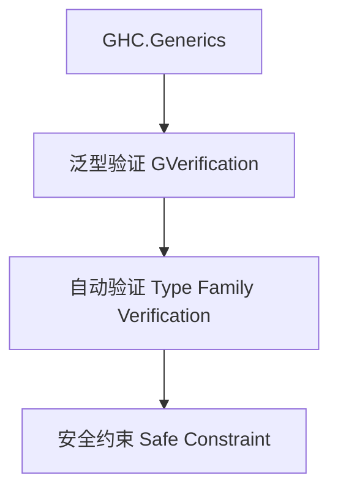

# 01. 类型级泛型验证在Haskell中的理论与实践（Type-Level Generic Verification in Haskell）

> **中英双语核心定义 | Bilingual Core Definitions**

## 1.1 类型级泛型验证简介（Introduction to Type-Level Generic Verification）

- **定义（Definition）**：
  - **中文**：类型级泛型验证是指在类型系统层面对泛型数据结构和算法进行自动化属性验证和安全性检查。Haskell通过类型族、GADT、GHC.Generics等机制支持类型级泛型验证。
  - **English**: Type-level generic verification refers to automated property verification and safety checking for generic data structures and algorithms at the type system level. Haskell supports type-level generic verification via type families, GADTs, GHC.Generics, etc.

- **Wiki风格国际化解释（Wiki-style Explanation）**：
  - 类型级泛型验证极大提升了Haskell类型系统的安全性和泛型库的可靠性，广泛用于自动化验证、泛型推导和类型安全API。
  - Type-level generic verification greatly enhances the safety and reliability of Haskell's type system and generic libraries, widely used in automated verification, generic inference, and type-safe APIs.

## 1.2 Haskell中的类型级泛型验证语法与语义（Syntax and Semantics of Type-Level Generic Verification in Haskell）

- **GHC.Generics与类型级验证**

```haskell
{-# LANGUAGE DeriveGeneric, TypeFamilies, GADTs #-}
import GHC.Generics

data Tree a = Leaf a | Node (Tree a) (Tree a) deriving (Generic)

-- 类型级验证定义
class GVerification f where
  gverify :: f a -> Bool

instance GVerification U1 where
  gverify U1 = True
```

- **类型族与自动验证**

```haskell
type family AllSafe xs where
  AllSafe '[] = 'True
  AllSafe (x ': xs) = (x ~ x) && AllSafe xs
```

## 1.3 范畴论建模与结构映射（Category-Theoretic Modeling and Mapping）

- **类型级泛型验证与范畴论关系**
  - 类型级泛型验证可视为范畴中的属性验证与结构保障。

| 概念 | Haskell实现 | 代码示例 | 中文解释 |
|------|-------------|----------|----------|
| 泛型验证 | GHC.Generics | `gverify` | 泛型属性验证 |
| 自动验证 | 类型族 | `AllSafe xs` | 类型级自动验证 |
| 安全约束 | 类型类 | `GVerification f` | 泛型安全约束 |

## 1.4 形式化证明与论证（Formal Proofs & Reasoning）

- **泛型验证正确性证明**
  - **中文**：证明类型级泛型验证机制能检测所有非法属性和约束。
  - **English**: Prove that the generic verification mechanism detects all illegal properties and constraints.

- **安全性证明**
  - **中文**：证明类型级泛型验证下的类型安全和属性一致性。
  - **English**: Prove type safety and property consistency under type-level generic verification.

## 1.5 多表征与本地跳转（Multi-representation & Local Reference）

- **类型级泛型验证结构图（Type-Level Generic Verification Structure Diagram）**



- **相关主题跳转**：
  - [类型级泛型 Type-Level Generic](../24-Type-Level-Generic/01-Type-Level-Generic-in-Haskell.md)
  - [类型级验证 Type-Level Verification](../30-Type-Level-Verification/01-Type-Level-Verification-in-Haskell.md)
  - [类型安全 Type Safety](../01-Type-Safety-in-Haskell.md)

---

> 本文档为类型级泛型验证在Haskell中的中英双语、Haskell语义模型与形式化证明规范化输出，适合学术研究与工程实践参考。
