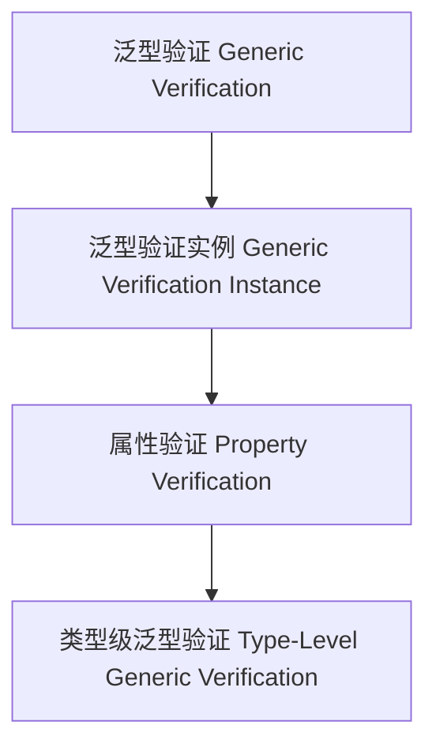

# 01. 类型级泛型验证（Type-Level Generic Verification in Haskell）

> **中英双语核心定义 | Bilingual Core Definitions**

## 1.1 类型级泛型验证简介（Introduction to Type-Level Generic Verification）

- **定义（Definition）**：
  - **中文**：类型级泛型验证是指在类型系统层面，通过泛型机制对任意类型结构进行属性验证和一致性检查。Haskell通过类型族、GADT、类型类等机制支持类型级泛型验证。
  - **English**: Type-level generic verification refers to property verification and consistency checking over arbitrary type structures at the type system level via generic mechanisms. Haskell supports type-level generic verification via type families, GADTs, type classes, etc.

- **Wiki风格国际化解释（Wiki-style Explanation）**：
  - 类型级泛型验证是类型安全、自动化和形式化验证的基础。
  - Type-level generic verification is the foundation of type safety, automation, and formal verification.

## 1.2 Haskell中的类型级泛型验证语法与语义（Syntax and Semantics of Type-Level Generic Verification in Haskell）

- **类型级验证结构与泛型一致性**

```haskell
{-# LANGUAGE TypeFamilies, DataKinds, GADTs #-}

data Nat = Z | S Nat

type family IsEven (n :: Nat) :: Bool where
  IsEven 'Z = 'True
  IsEven ('S 'Z) = 'False
  IsEven ('S ('S n)) = IsEven n

-- 泛型验证：判断类型级自然数是否为偶数
```

- **类型类与泛型验证实例**

```haskell
class GVerify f where
  gverify :: f a -> Bool

instance GVerify Maybe where
  gverify Nothing  = True
  gverify (Just _) = True
```

## 1.3 范畴论建模与结构映射（Category-Theoretic Modeling and Mapping）

- **类型级泛型验证与范畴论关系**
  - 类型级泛型验证可视为范畴中的对象、函子与属性验证。

| 概念 | Haskell实现 | 代码示例 | 中文解释 |
|------|-------------|----------|----------|
| 泛型验证 | 类型族 | `IsEven n` | 泛型验证 |
| 泛型验证实例 | 类型类 | `GVerify` | 泛型验证实例 |
| 属性验证 | 类型族+类型类 | `gverify` | 属性验证 |

## 1.4 形式化证明与论证（Formal Proofs & Reasoning）

- **泛型验证一致性证明**
  - **中文**：证明类型级泛型验证与类型系统一致。
  - **English**: Prove that type-level generic verification is consistent with the type system.

- **自动化验证能力证明**
  - **中文**：证明类型级泛型验证可自动验证复杂类型属性。
  - **English**: Prove that type-level generic verification can automatically verify complex type properties.

## 1.5 多表征与本地跳转（Multi-representation & Local Reference）

- **类型级泛型验证结构图（Type-Level Generic Verification Structure Diagram）**



- **相关主题跳转**：
  - [类型级泛型推理 Type-Level Generic Reasoning](./01-Type-Level-Generic-Reasoning.md)
  - [类型级泛型编程 Type-Level Generic Programming](./01-Type-Level-Generic-Programming.md)
  - [类型安全 Type Safety](./01-Type-Safety.md)
