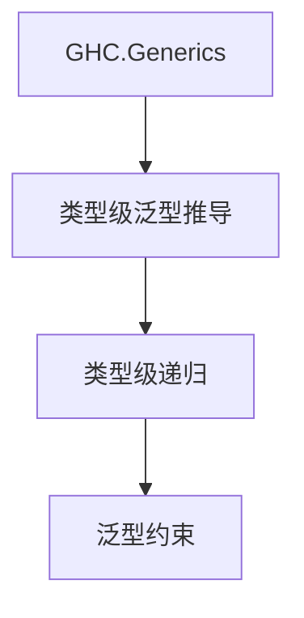

# 01. 类型级泛型在Haskell中的理论与实践（Type-Level Generic in Haskell）

> **中英双语核心定义 | Bilingual Core Definitions**

## 1.1 类型级泛型简介（Introduction to Type-Level Generic）

- **定义（Definition）**：
  - **中文**：类型级泛型是指在类型系统层面实现通用的数据结构、算法和约束，支持类型安全的泛型推导和自动化。Haskell通过类型族、GADT、泛型编程等机制支持类型级泛型。
  - **English**: Type-level generic refers to implementing generic data structures, algorithms, and constraints at the type system level, supporting type-safe generic inference and automation. Haskell supports type-level generics via type families, GADTs, and generic programming.

- **Wiki风格国际化解释（Wiki-style Explanation）**：
  - 类型级泛型极大提升了Haskell类型系统的抽象能力和代码复用性，广泛用于泛型库、自动推导和类型安全API。
  - Type-level generics greatly enhance the abstraction and code reuse of Haskell's type system, widely used in generic libraries, automatic inference, and type-safe APIs.

## 1.2 Haskell中的类型级泛型语法与语义（Syntax and Semantics of Type-Level Generic in Haskell）

- **类型族与泛型推导**

```haskell
{-# LANGUAGE TypeFamilies, GADTs, DeriveGeneric #-}
import GHC.Generics

data Person = Person { name :: String, age :: Int } deriving (Generic)

-- 类型级泛型推导
class GShow a where
  gshow :: a -> String

instance (Generic a, GShow' (Rep a)) => GShow a where
  gshow = gshow' . from

class GShow' f where
  gshow' :: f a -> String

instance GShow' U1 where
  gshow' U1 = "U1"
```

- **类型级递归与归纳**

```haskell
type family Length xs where
  Length '[] = 0
  Length (_ ': xs) = 1 + Length xs
```

## 1.3 范畴论建模与结构映射（Category-Theoretic Modeling and Mapping）

- **类型级泛型与范畴论关系**
  - 类型级泛型可视为范畴中的函子、自然变换与自由代数结构。

| 概念 | Haskell实现 | 代码示例 | 中文解释 |
|------|-------------|----------|----------|
| 泛型推导 | GHC.Generics | `deriving (Generic)` | 自动泛型 |
| 类型级递归 | 类型族 | `Length xs` | 类型级归纳 |
| 泛型约束 | 类型类 | `GShow a` | 类型安全泛型 |

## 1.4 形式化证明与论证（Formal Proofs & Reasoning）

- **泛型推导安全性证明**
  - **中文**：证明类型级泛型推导和递归在类型系统下是安全的。
  - **English**: Prove that type-level generic inference and recursion are safe under the type system.

- **泛型能力证明**
  - **中文**：证明类型级泛型可表达复杂的数据结构和算法。
  - **English**: Prove that type-level generics can express complex data structures and algorithms.

## 1.5 多表征与本地跳转（Multi-representation & Local Reference）

- **类型级泛型结构图（Type-Level Generic Structure Diagram）**



- **相关主题跳转**：
  - [类型元编程 Type Metaprogramming](../18-Type-Metaprogramming/01-Type-Metaprogramming-in-Haskell.md)
  - [类型级编程 Type-Level Programming](../12-Type-Level-Programming/01-Type-Level-Programming-in-Haskell.md)
  - [类型安全 Type Safety](../14-Type-Safety/01-Type-Safety-in-Haskell.md)

---

> 本文档为类型级泛型在Haskell中的中英双语、Haskell语义模型与形式化证明规范化输出，适合学术研究与工程实践参考。
