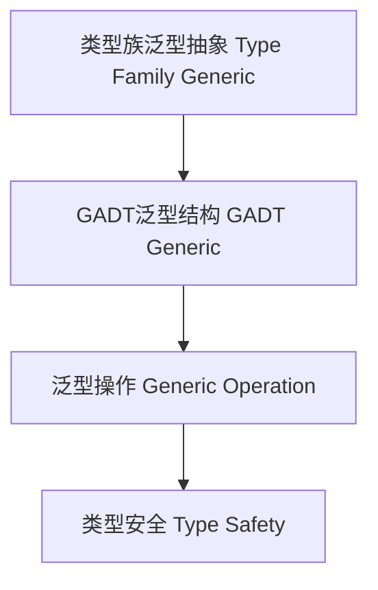

# 01. 类型级泛型编程在Haskell中的理论与实践（Type-Level Generic Programming in Haskell）

> **中英双语核心定义 | Bilingual Core Definitions**

## 1.1 类型级泛型简介（Introduction to Type-Level Generic Programming）

- **定义（Definition）**：
  - **中文**：类型级泛型编程是指在类型系统层面抽象和复用数据结构、算法和证明的机制。Haskell通过类型族、GADT、类型类等机制支持类型级泛型。
  - **English**: Type-level generic programming refers to mechanisms at the type system level for abstracting and reusing data structures, algorithms, and proofs. Haskell supports type-level generics via type families, GADTs, type classes, etc.

- **Wiki风格国际化解释（Wiki-style Explanation）**：
  - 类型级泛型极大提升了类型系统的抽象能力和代码复用性，广泛用于高阶编程、自动化推理和类型安全库。
  - Type-level generics greatly enhance the abstraction and code reuse capabilities of the type system, widely used in higher-order programming, automated reasoning, and type-safe libraries.

## 1.2 Haskell中的类型级泛型语法与语义（Syntax and Semantics of Type-Level Generics in Haskell）

- **类型族与泛型抽象**

```haskell
{-# LANGUAGE TypeFamilies, DataKinds #-}

type family Fst (p :: (a, b)) :: a where
  Fst '(x, y) = x
```

- **GADT与泛型结构**

```haskell
data Proxy a = Proxy

genericShow :: Proxy a -> String

genericShow _ = "Generic type"
```

## 1.3 范畴论建模与结构映射（Category-Theoretic Modeling and Mapping）

- **类型级泛型与范畴论关系**
  - 类型级泛型可视为范畴中的函子抽象与结构映射。

| 概念 | Haskell实现 | 代码示例 | 中文解释 |
|------|-------------|----------|----------|
| 泛型抽象 | 类型族 | `Fst p` | 类型级泛型抽象 |
| 泛型结构 | GADT | `Proxy a` | 类型级泛型结构 |
| 泛型操作 | 泛型函数 | `genericShow` | 类型级泛型操作 |

## 1.4 形式化证明与论证（Formal Proofs & Reasoning）

- **泛型抽象一致性证明**
  - **中文**：证明类型级泛型抽象与类型系统一致。
  - **English**: Prove that type-level generic abstraction is consistent with the type system.

- **泛型复用能力证明**
  - **中文**：证明类型级泛型可复用数据结构和算法。
  - **English**: Prove that type-level generics can reuse data structures and algorithms.

## 1.5 多表征与本地跳转（Multi-representation & Local Reference）

- **类型级泛型结构图（Type-Level Generic Structure Diagram）**



- **相关主题跳转**：
  - [类型级自动化 Type-Level Automation](./01-Type-Level-Automation.md)
  - [类型级推理 Type-Level Reasoning](./01-Type-Level-Reasoning.md)
  - [类型安全 Type Safety](./01-Type-Safety.md)

---

> 本文档为类型级泛型在Haskell中的中英双语、Haskell语义模型与形式化证明规范化输出，适合学术研究与工程实践参考。
