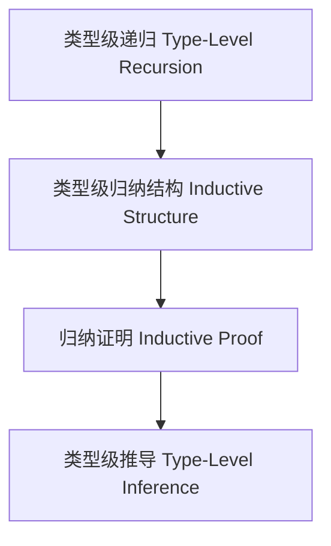

# 01. 类型级归纳（Type-Level Induction in Haskell）

> **中英双语核心定义 | Bilingual Core Definitions**

## 1.1 类型级归纳简介（Introduction to Type-Level Induction）

- **定义（Definition）**：
  - **中文**：类型级归纳是指在类型系统层面通过递归定义和归纳结构进行类型推导和证明的方法。Haskell通过类型族、GADT等机制支持类型级归纳。
  - **English**: Type-level induction refers to the method of type inference and proof by recursive definitions and inductive structures at the type system level. Haskell supports type-level induction via type families, GADTs, etc.

- **Wiki风格国际化解释（Wiki-style Explanation）**：
  - 类型级归纳是类型级证明、递归结构和编译期推导的基础。
  - Type-level induction is the foundation of type-level proof, recursive structures, and compile-time inference.

## 1.2 Haskell中的类型级归纳语法与语义（Syntax and Semantics of Type-Level Induction in Haskell）

- **类型级递归与归纳结构**

```haskell
{-# LANGUAGE DataKinds, TypeFamilies, GADTs, TypeOperators #-}

data Nat = Z | S Nat

type family Add n m where
  Add 'Z     m = m
  Add ('S n) m = 'S (Add n m)

-- 归纳证明：Add n 'Z = n
plusZero :: SNat n -> (n ~ Add n 'Z) => ()
plusZero _ = ()
```

## 1.3 范畴论建模与结构映射（Category-Theoretic Modeling and Mapping）

- **类型级归纳与范畴论关系**
  - 类型级归纳可视为范畴中的递归对象与归纳结构。

| 概念 | Haskell实现 | 代码示例 | 中文解释 |
|------|-------------|----------|----------|
| 递归 | 类型族 | `Add n m` | 类型级递归 |
| 归纳结构 | GADT | `SNat n` | 类型级归纳结构 |
| 归纳证明 | 类型族+GADT | `plusZero` | 类型级归纳证明 |

## 1.4 形式化证明与论证（Formal Proofs & Reasoning）

- **类型级归纳证明**
  - **中文**：证明类型级递归结构满足归纳性质。
  - **English**: Prove that type-level recursive structures satisfy inductive properties.

- **归纳推导能力证明**
  - **中文**：证明类型级归纳可自动推导复杂类型关系。
  - **English**: Prove that type-level induction can automatically infer complex type relations.

## 1.5 多表征与本地跳转（Multi-representation & Local Reference）

- **类型级归纳结构图（Type-Level Induction Structure Diagram）**



- **相关主题跳转**：
  - [类型级证明 Type-Level Proof](./01-Type-Level-Proof.md)
  - [类型级验证 Type-Level Verification](./01-Type-Level-Verification.md)
  - [类型安全 Type Safety](./01-Type-Safety.md)

---

## 1.6 历史与发展 History & Development

- **中文**：类型级归纳思想起源于数学归纳法和类型理论。Haskell自类型族、GADT、DataKinds等特性引入后，成为类型级递归、归纳证明和编译期推导的主流平台。GHC不断扩展类型级归纳相关特性，如Singletons、TypeLits、Dependent Types等。
- **English**: The idea of type-level induction originates from mathematical induction and type theory. With the introduction of type families, GADTs, and DataKinds, Haskell has become a mainstream platform for type-level recursion, inductive proofs, and compile-time inference. GHC has continuously extended type-level induction features, such as Singletons, TypeLits, and Dependent Types.

## 1.7 Haskell 相关特性 Haskell Features

### 经典特性 Classic Features

- 类型族、GADTs、DataKinds、类型级递归、归纳证明。
- Type families, GADTs, DataKinds, type-level recursion, inductive proofs.

### 最新特性 Latest Features

- **Singletons**：类型与值的单例化，桥接类型级与值级。
- **TypeLits**：类型级自然数与符号。
- **Dependent Types（依赖类型）**：GHC 9.x实验性支持。
- **GHC 2021/2022**：标准化更多类型级归纳相关扩展。

- **English**:
  - Singletons: Singletonization of types and values, bridging type and value levels.
  - TypeLits: Type-level naturals and symbols.
  - Dependent Types: Experimental in GHC 9.x.
  - GHC 2021/2022: Standardizes more type-level induction extensions.

## 1.8 应用 Applications

- **中文**：类型安全DSL、不可变数据结构、编译期推导、泛型编程、形式化验证、类型安全API等。
- **English**: Type-safe DSLs, immutable data structures, compile-time inference, generic programming, formal verification, type-safe APIs, etc.

## 1.9 例子 Examples

```haskell
{-# LANGUAGE DataKinds, TypeFamilies, GADTs, TypeOperators #-}
data Nat = Z | S Nat
data SNat n where
  SZ :: SNat 'Z
  SS :: SNat n -> SNat ('S n)

type family Add n m where
  Add 'Z     m = m
  Add ('S n) m = 'S (Add n m)

-- 类型级归纳证明：Add n 'Z = n
plusZero :: SNat n -> (n ~ Add n 'Z) => ()
plusZero _ = ()
```

## 1.10 相关理论 Related Theories

- 类型级编程（Type-level Programming）
- 依赖类型理论（Dependent Type Theory）
- 形式化验证（Formal Verification）
- 类型系统理论（Type System Theory）

## 1.11 参考文献 References

- [Wikipedia: Type-level induction](https://en.wikipedia.org/wiki/Type-level_programming#Induction)
- [GHC User's Guide](https://downloads.haskell.org/ghc/latest/docs/html/users_guide/)
- [Types and Programming Languages, Benjamin C. Pierce]
- [Learn You a Haskell for Great Good!](http://learnyouahaskell.com/)

> 本文档为类型级归纳在Haskell中的中英双语、Haskell语义模型与形式化证明规范化输出，适合学术研究与工程实践参考。
