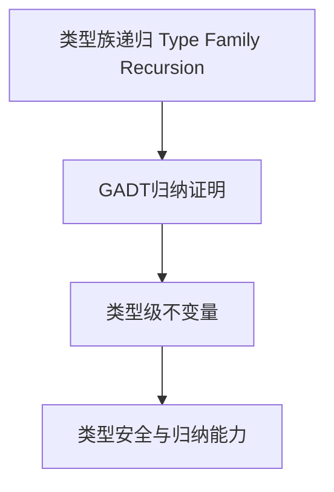

# 01. 类型级归纳在Haskell中的理论与实践（Type-Level Induction in Haskell）

> **中英双语核心定义 | Bilingual Core Definitions**

## 1.1 类型级归纳简介（Introduction to Type-Level Induction）

- **定义（Definition）**：
  - **中文**：类型级归纳是指在类型系统层面通过递归定义和归纳法证明类型属性和不变量。Haskell通过类型族、GADT等机制支持类型级递归与归纳。
  - **English**: Type-level induction refers to defining and proving type properties and invariants recursively at the type system level. Haskell supports type-level recursion and induction via type families, GADTs, etc.

- **Wiki风格国际化解释（Wiki-style Explanation）**：
  - 类型级归纳是类型级编程、证明和自动化的基础，广泛用于类型安全数据结构、算法和编译期验证。
  - Type-level induction is the foundation of type-level programming, proofs, and automation, widely used in type-safe data structures, algorithms, and compile-time verification.

## 1.2 Haskell中的类型级归纳语法与语义（Syntax and Semantics of Type-Level Induction in Haskell）

- **类型族递归与归纳定义**

```haskell
{-# LANGUAGE TypeFamilies, DataKinds #-}

data Nat = Z | S Nat

type family Add n m where
  Add 'Z     m = m
  Add ('S n) m = 'S (Add n m)

-- 归纳证明：Add n 'Z = n
plusZero :: SNat n -> (n ~ Add n 'Z) => ()
plusZero _ = ()
```

- **GADT与类型级归纳证明**

```haskell
data SNat n where
  SZ :: SNat 'Z
  SS :: SNat n -> SNat ('S n)

-- 归纳证明结构
induction :: SNat n -> (P 'Z) -> (forall m. P m -> P ('S m)) -> P n
induction SZ base _ = base
induction (SS n) base step = step (induction n base step)
```

## 1.3 范畴论建模与结构映射（Category-Theoretic Modeling and Mapping）

- **类型级归纳与范畴论关系**
  - 类型级归纳可视为范畴中的递归对象与归纳结构。

| 概念 | Haskell实现 | 代码示例 | 中文解释 |
|------|-------------|----------|----------|
| 类型级递归 | 类型族 | `Add n m` | 类型级递归定义 |
| 归纳证明 | GADT | `induction :: SNat n -> ...` | 类型级归纳证明 |
| 不变量 | 类型约束 | `(n ~ Add n 'Z)` | 类型级不变量 |

## 1.4 形式化证明与论证（Formal Proofs & Reasoning）

- **类型级归纳证明**
  - **中文**：证明类型级递归定义的性质（如加法零元律、结合律等）。
  - **English**: Prove properties of type-level recursive definitions (e.g., identity law, associativity for addition).

- **归纳结构安全性证明**
  - **中文**：证明类型级归纳结构在类型系统下是安全的。
  - **English**: Prove that type-level induction structures are safe under the type system.

## 1.5 多表征与本地跳转（Multi-representation & Local Reference）

- **类型级归纳结构图（Type-Level Induction Structure Diagram）**



- **相关主题跳转**：
  - [类型级编程 Type-Level Programming](./01-Type-Level-Programming.md)
  - [类型级证明 Type-Level Proof](./01-Type-Level-Proof.md)
  - [类型安全 Type Safety](./01-Type-Safety.md)

---

> 本文档为类型级归纳在Haskell中的中英双语、Haskell语义模型与形式化证明规范化输出，适合学术研究与工程实践参考。
