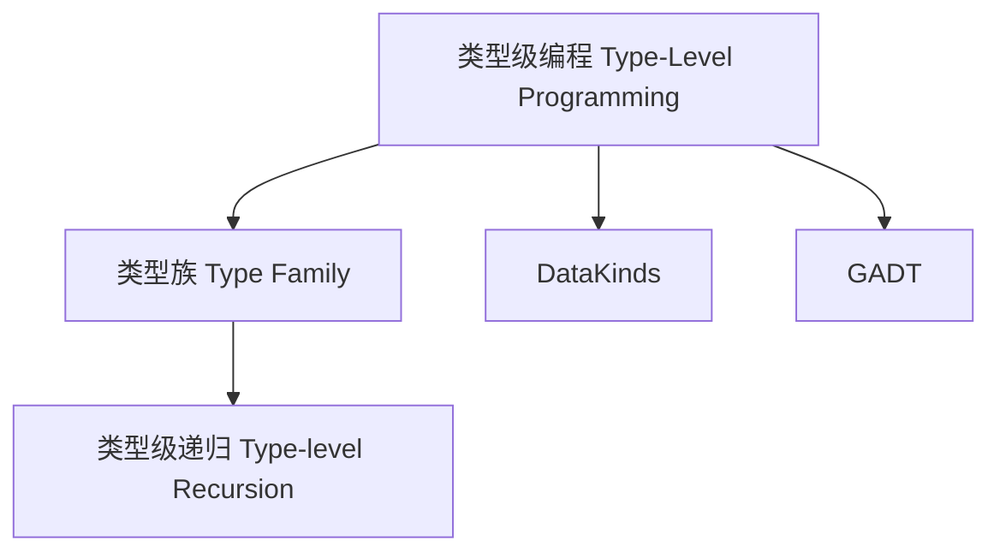

# 类型级编程在Haskell中的理论与实践（Type-Level Programming in Haskell）

## 定义 Definition
- **中文**：类型级编程是指在类型系统层面进行计算和逻辑推理，Haskell通过类型族、GADT、DataKinds等特性支持类型级函数、类型推导和类型约束。
- **English**: Type-level programming refers to computation and logic reasoning at the type system level. Haskell supports type-level functions, inference, and constraints via type families, GADTs, DataKinds, etc.

## 类型级编程核心概念 Core Concepts
- **类型族（Type Family）**：类型级函数。
- **DataKinds**：提升数据类型为类型层级。
- **类型级约束**：类型类、约束族。
- **类型级递归与归纳**：类型级算法。

## Haskell实现与现代语言对比 Haskell & Modern Language Comparison
- Haskell：类型族、GADT、DataKinds、类型类。
- Scala 3：类型级函数、隐式参数、类型类。
- Rust：const generics、trait bound（有限支持）。
- TypeScript：条件类型、映射类型。

### Haskell 类型级编程示例
```haskell
{-# LANGUAGE TypeFamilies, DataKinds, GADTs #-}

type family Add (a :: Nat) (b :: Nat) :: Nat where
  Add 0 b = b
  Add a 0 = a
  Add a b = Add (a - 1) (b + 1)
```

## 结构图 Structure Diagram


## 形式化论证与证明 Formal Reasoning & Proofs
- **类型级函数正确性证明**：类型族递归终止性、类型推导一致性。
- **类型级约束证明**：类型类约束下的类型安全。

### 证明示例 Proof Example
- 证明类型族Add的归纳终止性。
- 证明类型级编程可实现编译期约束。

## 工程应用 Engineering Application
- 类型安全API、编译期验证、DSL、泛型推导、类型驱动优化。

## 本地跳转 Local References
- [GADT](../29-GADT/01-GADT-in-Haskell.md)
- [类型族 Type Family](../31-Type-Family/01-Type-Family-in-Haskell.md)
- [类型安全 Type Safety](../14-Type-Safety/01-Type-Safety-in-Haskell.md) 