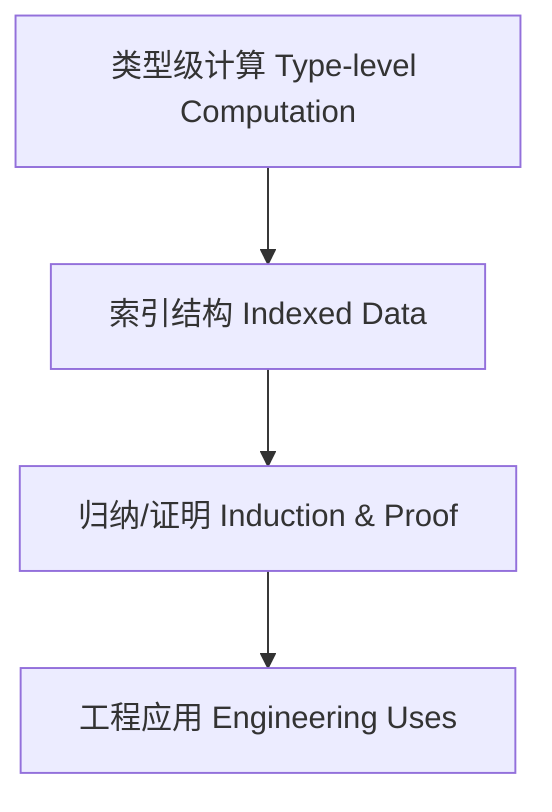

# 01. 类型级编程（Type-Level Programming in Haskell）

> 中英双语；对标 Wikipedia/nLab/教材；补齐范畴论语义、依赖/线性协同、工程案例与结构图。

## 1.1 定义与动机 Definition & Motivation

- 中文：类型级编程是在类型系统层面进行计算与推导，使编译期能表达约束、规格与不变量，从而提升安全性与自动化。
- English: Type-level programming performs computation and inference at the type system level, enabling compile-time specifications and invariants for safety and automation.

核心机制：DataKinds、GADTs、Type Families、TypeLits、Singletons、Promoted kinds 等。

## 1.2 语法与语义 Syntax and Semantics

### 1.2.1 类型族与类型级函数 Type Families

```haskell
{-# LANGUAGE TypeFamilies, DataKinds #-}

data Nat = Z | S Nat

type family Add n m where
  Add 'Z     m = m
  Add ('S n) m = 'S (Add n m)
```

### 1.2.2 GADTs 与索引数据 GADTs and Indexed Data

```haskell
{-# LANGUAGE GADTs, DataKinds, KindSignatures #-}

data Vec (n :: Nat) a where
  VNil  :: Vec 'Z a
  VCons :: a -> Vec n a -> Vec ('S n) a

tailVec :: Vec ('S n) a -> Vec n a
tailVec (VCons _ xs) = xs
```

### 1.2.3 单例与桥接 Singletons Bridge

```haskell
{-# LANGUAGE GADTs, DataKinds #-}

data SNat (n :: Nat) where
  SZ :: SNat 'Z
  SS :: SNat n -> SNat ('S n)
```

## 1.3 范畴论与语义 Category-theoretic Semantics

- 类型作为对象，类型构造视作函子，约束/变换对应自然变换
- 依赖类型扩展下，Π/Σ 与函子极限/余极限相关；在 Haskell 中以 GADT/TF 近似

## 1.4 与依赖/线性类型的协同 Synergy with Dependent/Linear Types

- 与依赖类型：以索引与约束在类型层表达不变量；与证明环境（Agda/Coq/Lean）高度契合
- 与线性/仿射：在类型级同时追踪资源使用次数与结构性质，形成更强静态保证

## 1.5 工程应用 Engineering Applications

- 类型安全 DSL 与协议/状态机编译期验证
- 编译期数据布局/维度与单位检查（矩阵维度、物理单位）
- API 兼容性、版本与能力模型的类型级约束

## 1.6 结构图 Structure Diagram



## 1.7 历史与发展 History & Development

- Haskell 自 GADTs/Type Families/DataKinds 起形成体系；后续引入 Singletons、TypeLits、QuantifiedConstraints；Dependent Haskell 正在推进

## 1.8 相关理论 Related Theories

- 类型理论、依赖类型理论、范畴论、形式化验证、泛型编程、线性/仿射类型

## 1.9 参考文献 References

- Wikipedia: Type-level programming
- nLab: type-level programming, GADT, type family
- GHC User’s Guide
- Pierce: Types and Programming Languages
- Learn You a Haskell for Great Good!

> 本文面向学术与工程读者，示例与术语对齐国际百科与教材。
