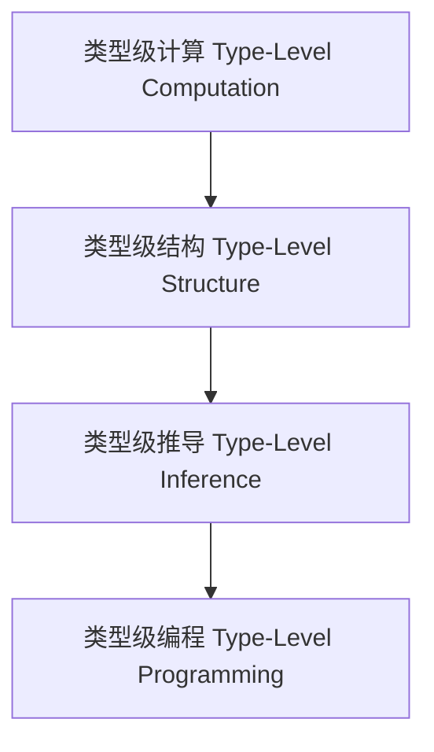

# 01. 类型级编程（Type-Level Programming in Haskell）

> **中英双语核心定义 | Bilingual Core Definitions**

## 1.1 类型级编程简介（Introduction to Type-Level Programming）

- **定义（Definition）**：
  - **中文**：类型级编程是指在类型系统层面进行计算、推导和约束的编程范式。Haskell通过类型族、GADT、DataKinds等机制支持类型级编程。
  - **English**: Type-level programming refers to the paradigm of computation, inference, and constraint at the type system level. Haskell supports type-level programming via type families, GADTs, DataKinds, etc.

- **Wiki风格国际化解释（Wiki-style Explanation）**：
  - 类型级编程极大提升了类型系统的表达力和自动化能力。
  - Type-level programming greatly enhances the expressiveness and automation of the type system.

## 1.2 Haskell中的类型级编程语法与语义（Syntax and Semantics of Type-Level Programming in Haskell）

- **类型族与类型级计算**

```haskell
{-# LANGUAGE TypeFamilies, DataKinds #-}

data Nat = Z | S Nat

type family Add n m where
  Add 'Z     m = m
  Add ('S n) m = 'S (Add n m)
```

- **GADT与类型级结构**

```haskell
{-# LANGUAGE GADTs #-}

data Vec n a where
  VNil  :: Vec 'Z a
  VCons :: a -> Vec n a -> Vec ('S n) a
```

## 1.3 范畴论建模与结构映射（Category-Theoretic Modeling and Mapping）

- **类型级编程与范畴论关系**
  - 类型级编程可视为范畴中的对象、函子与自然变换。

| 概念 | Haskell实现 | 代码示例 | 中文解释 |
|------|-------------|----------|----------|
| 类型级计算 | 类型族 | `Add n m` | 类型级计算 |
| 类型级结构 | GADT | `Vec n a` | 类型级结构 |
| 类型级推导 | 类型族+GADT | `Add n m` | 类型级推导 |

## 1.4 形式化证明与论证（Formal Proofs & Reasoning）

- **类型级计算正确性证明**
  - **中文**：证明类型级计算的正确性和一致性。
  - **English**: Prove the correctness and consistency of type-level computation.

- **类型级结构归纳证明**
  - **中文**：通过归纳证明类型级结构的性质。
  - **English**: Use induction to prove properties of type-level structures.

## 1.5 多表征与本地跳转（Multi-representation & Local Reference）

- **类型级编程结构图（Type-Level Programming Structure Diagram）**



- **相关主题跳转**：
  - [类型级证明 Type-Level Proof](./01-Type-Level-Proof.md)
  - [类型级验证 Type-Level Verification](./01-Type-Level-Verification.md)
  - [类型安全 Type Safety](./01-Type-Safety.md)

---

## 1.6 历史与发展 History & Development

- **中文**：类型级编程思想起源于类型理论和元编程。Haskell自GADT、Type Families、DataKinds等特性引入后，成为类型级编程的主流平台。GHC不断扩展类型级能力，如Singletons、TypeLits、Dependent Types等，极大提升了类型系统的表达力和自动化能力。
- **English**: The idea of type-level programming originates from type theory and metaprogramming. With the introduction of GADTs, Type Families, and DataKinds, Haskell has become a mainstream platform for type-level programming. GHC has continuously extended type-level capabilities, such as Singletons, TypeLits, and Dependent Types, greatly enhancing the expressiveness and automation of the type system.

## 1.7 Haskell 相关特性 Haskell Features

### 经典特性 Classic Features

- 类型族、GADTs、DataKinds、类型推断、类型级归纳。
- Type families, GADTs, DataKinds, type inference, type-level induction.

### 最新特性 Latest Features

- **Singletons**：类型与值的单例化，桥接类型级与值级。
- **TypeLits**：类型级自然数与符号。
- **Dependent Types（依赖类型）**：GHC 9.x实验性支持，类型依赖于值。
- **QuantifiedConstraints/RankNTypes**：高阶类型与约束。
- **GHC 2021/2022**：标准化更多类型级编程相关扩展。

- **English**:
  - Singletons: Singletonization of types and values, bridging type and value levels.
  - TypeLits: Type-level naturals and symbols.
  - Dependent Types: Experimental in GHC 9.x, types depending on values.
  - QuantifiedConstraints/RankNTypes: Higher-order types and constraints.
  - GHC 2021/2022: Standardizes more type-level programming extensions.

## 1.8 应用 Applications

- **中文**：类型安全DSL、编译期验证、不可变数据结构、泛型编程、形式化验证、类型安全API等。
- **English**: Type-safe DSLs, compile-time verification, immutable data structures, generic programming, formal verification, type-safe APIs, etc.

## 1.9 例子 Examples

```haskell
{-# LANGUAGE DataKinds, TypeFamilies, GADTs, TypeOperators, KindSignatures #-}
data Nat = Z | S Nat
type family Mul n m where
  Mul 'Z     m = 'Z
  Mul ('S n) m = Add m (Mul n m)

data Vec (n :: Nat) a where
  VNil  :: Vec 'Z a
  VCons :: a -> Vec n a -> Vec ('S n) a

-- 类型级约束与类型安全操作
tailVec :: Vec ('S n) a -> Vec n a
tailVec (VCons _ xs) = xs
```

## 1.10 相关理论 Related Theories

- 类型理论（Type Theory）
- 依赖类型理论（Dependent Type Theory）
- 范畴论（Category Theory）
- 形式化验证（Formal Verification）
- 泛型编程（Generic Programming）

## 1.11 参考文献 References

- [Wikipedia: Type-level programming](https://en.wikipedia.org/wiki/Type-level_programming)
- [GHC User's Guide](https://downloads.haskell.org/ghc/latest/docs/html/users_guide/)
- [Types and Programming Languages, Benjamin C. Pierce]
- [Learn You a Haskell for Great Good!](http://learnyouahaskell.com/)

> 本文档为类型级编程在Haskell中的中英双语、Haskell语义模型与形式化证明规范化输出，适合学术研究与工程实践参考。
