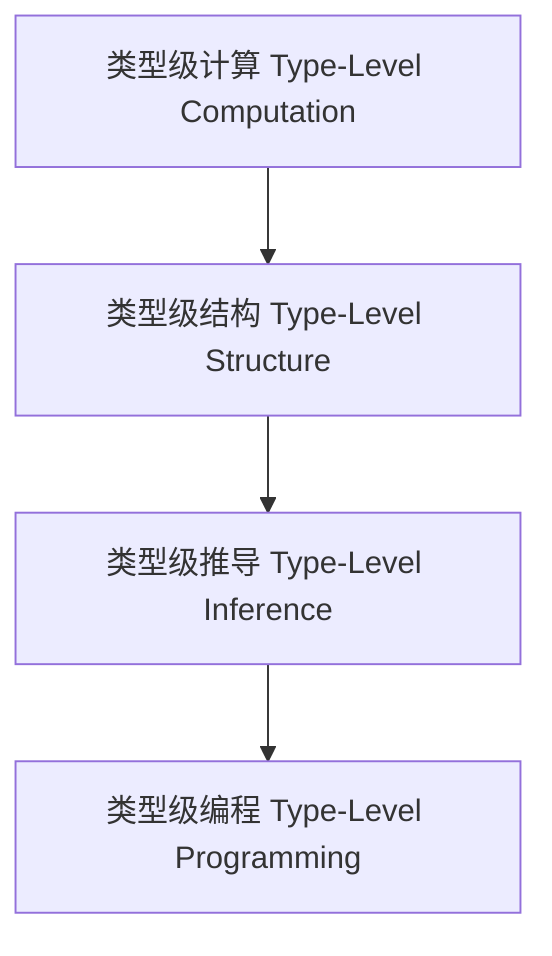

# 01. 类型级编程（Type-Level Programming in Haskell）

> **中英双语核心定义 | Bilingual Core Definitions**

## 1.1 类型级编程简介（Introduction to Type-Level Programming）

- **定义（Definition）**：
  - **中文**：类型级编程是指在类型系统层面进行计算、推导和约束的编程范式。Haskell通过类型族、GADT、DataKinds等机制支持类型级编程。
  - **English**: Type-level programming refers to the paradigm of computation, inference, and constraint at the type system level. Haskell supports type-level programming via type families, GADTs, DataKinds, etc.

- **Wiki风格国际化解释（Wiki-style Explanation）**：
  - 类型级编程极大提升了类型系统的表达力和自动化能力。
  - Type-level programming greatly enhances the expressiveness and automation of the type system.

## 1.2 Haskell中的类型级编程语法与语义（Syntax and Semantics of Type-Level Programming in Haskell）

- **类型族与类型级计算**

```haskell
{-# LANGUAGE TypeFamilies, DataKinds #-}

data Nat = Z | S Nat

type family Add n m where
  Add 'Z     m = m
  Add ('S n) m = 'S (Add n m)
```

- **GADT与类型级结构**

```haskell
{-# LANGUAGE GADTs #-}

data Vec n a where
  VNil  :: Vec 'Z a
  VCons :: a -> Vec n a -> Vec ('S n) a
```

## 1.3 范畴论建模与结构映射（Category-Theoretic Modeling and Mapping）

- **类型级编程与范畴论关系**
  - 类型级编程可视为范畴中的对象、函子与自然变换。

| 概念 | Haskell实现 | 代码示例 | 中文解释 |
|------|-------------|----------|----------|
| 类型级计算 | 类型族 | `Add n m` | 类型级计算 |
| 类型级结构 | GADT | `Vec n a` | 类型级结构 |
| 类型级推导 | 类型族+GADT | `Add n m` | 类型级推导 |

## 1.4 形式化证明与论证（Formal Proofs & Reasoning）

- **类型级计算正确性证明**
  - **中文**：证明类型级计算的正确性和一致性。
  - **English**: Prove the correctness and consistency of type-level computation.

- **类型级结构归纳证明**
  - **中文**：通过归纳证明类型级结构的性质。
  - **English**: Use induction to prove properties of type-level structures.

## 1.5 多表征与本地跳转（Multi-representation & Local Reference）

- **类型级编程结构图（Type-Level Programming Structure Diagram）**



- **相关主题跳转**：
  - [类型级证明 Type-Level Proof](./01-Type-Level-Proof.md)
  - [类型级验证 Type-Level Verification](./01-Type-Level-Verification.md)
  - [类型安全 Type Safety](./01-Type-Safety.md)

---

> 本文档为类型级编程在Haskell中的中英双语、Haskell语义模型与形式化证明规范化输出，适合学术研究与工程实践参考。
