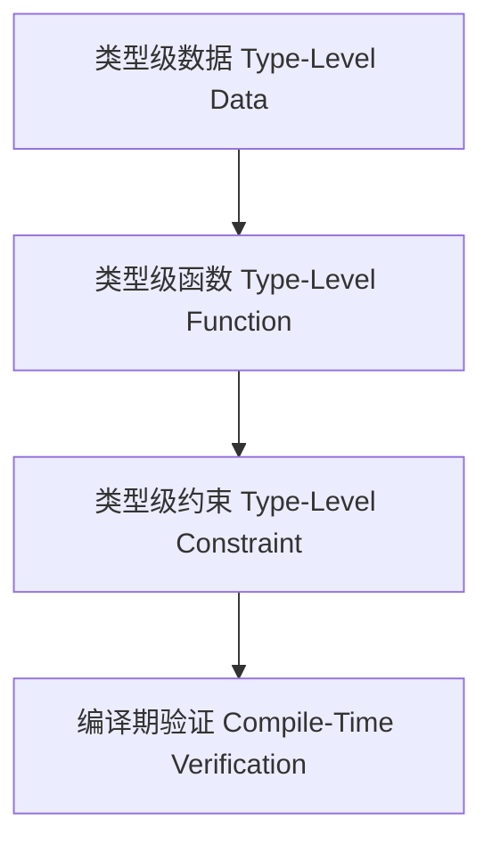

# 01. 类型级编程在Haskell中的理论与实践（Type-Level Programming in Haskell）

> **中英双语核心定义 | Bilingual Core Definitions**

## 1.1 类型级编程简介（Introduction to Type-Level Programming）

- **定义（Definition）**：
  - **中文**：类型级编程是指在类型系统层面进行计算和逻辑推理，Haskell通过类型族、GADT、类型类等机制支持类型级函数、类型级数据结构和类型级约束。
  - **English**: Type-level programming refers to computation and logic reasoning at the type system level. Haskell supports type-level functions, data structures, and constraints via type families, GADTs, type classes, etc.

- **Wiki风格国际化解释（Wiki-style Explanation）**：
  - 类型级编程极大提升了Haskell的类型安全和抽象能力，广泛用于泛型编程、类型安全API和编译期验证。
  - Type-level programming greatly enhances Haskell's type safety and abstraction, widely used in generic programming, type-safe APIs, and compile-time verification.

## 1.2 Haskell中的类型级编程语法与语义（Syntax and Semantics of Type-Level Programming in Haskell）

- **类型级自然数与数据结构（Type-Level Naturals and Data Structures）**

```haskell
{-# LANGUAGE DataKinds, TypeFamilies, GADTs #-}

data Nat = Z | S Nat

data Vec a n where
  VNil  :: Vec a 'Z
  VCons :: a -> Vec a n -> Vec a ('S n)
```

- **类型级函数与类型族（Type-Level Functions and Type Families）**

```haskell
type family Add n m where
  Add 'Z     m = m
  Add ('S n) m = 'S (Add n m)
```

- **类型级约束与编译期验证（Type-Level Constraints and Compile-Time Verification）**

```haskell
class KnownNat n where
  natVal :: proxy n -> Integer
```

## 1.3 范畴论建模与结构映射（Category-Theoretic Modeling and Mapping）

- **类型级编程与范畴论关系**
  - 类型级编程可视为类型范畴上的运算和约束。

| 概念 | Haskell实现 | 代码示例 | 中文解释 |
|------|-------------|----------|----------|
| 类型级数据 | DataKinds/GADT | `data Nat = Z \| S Nat` | 类型级自然数 |
| 类型级函数 | 类型族 | `type family Add n m` | 类型级加法 |
| 类型级约束 | 类型类 | `class KnownNat n` | 编译期约束 |

## 1.4 形式化证明与论证（Formal Proofs & Reasoning）

- **类型级编程安全性证明**
  - **中文**：证明类型级编程下的类型约束和运算在编译期得到保证。
  - **English**: Prove that type-level constraints and computations are guaranteed at compile time in type-level programming.

- **表达能力证明**
  - **中文**：证明类型级编程可表达复杂的类型关系和编译期逻辑。
  - **English**: Prove that type-level programming can express complex type relations and compile-time logic.

## 1.5 多表征与本地跳转（Multi-representation & Local Reference）

- **类型级编程结构图（Type-Level Programming Structure Diagram）**



- **相关主题跳转**：
  - [类型族 Type Family](../11-Type-Family/01-Type-Family-in-Haskell.md)
  - [依赖类型 Dependent Type](../10-Dependent-Type/01-Dependent-Type-in-Haskell.md)
  - [GADT in Haskell](../09-GADT/01-GADT-in-Haskell.md)
  - [GADT](../29-GADT/01-GADT-in-Haskell.md)
  - [类型族 Type Family](../31-Type-Family/01-Type-Family-in-Haskell.md)
  - [类型安全 Type Safety](../14-Type-Safety/01-Type-Safety-in-Haskell.md)

---

> 本文档为类型级编程在Haskell中的中英双语、Haskell语义模型与形式化证明规范化输出，适合学术研究与工程实践参考。
