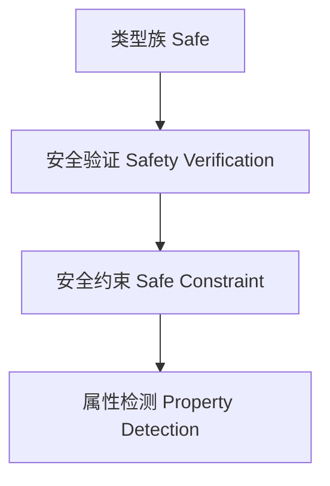

# 01. 类型级安全在Haskell中的理论与实践（Type-Level Safety in Haskell）

> **中英双语核心定义 | Bilingual Core Definitions**

## 1.1 类型级安全简介（Introduction to Type-Level Safety）

- **定义（Definition）**：
  - **中文**：类型级安全是指在类型系统层面通过类型级约束、验证和推理机制，确保程序在编译期和运行期的类型安全。Haskell通过类型族、GADT、类型类等机制支持类型级安全。
  - **English**: Type-level safety refers to ensuring type safety at the type system level through type-level constraints, verification, and reasoning mechanisms. Haskell supports type-level safety via type families, GADTs, type classes, etc.

- **Wiki风格国际化解释（Wiki-style Explanation）**：
  - 类型级安全极大提升了Haskell类型系统的可靠性和安全性，广泛用于泛型库、DSL、自动化验证和工程实践。
  - Type-level safety greatly enhances the reliability and safety of Haskell's type system, widely used in generic libraries, DSLs, automated verification, and engineering practice.

## 1.2 Haskell中的类型级安全语法与语义（Syntax and Semantics of Type-Level Safety in Haskell）

- **类型级约束与安全验证**

```haskell
{-# LANGUAGE TypeFamilies, ConstraintKinds, TypeOperators, UndecidableInstances #-}
import GHC.Exts (Constraint)

-- 类型级安全验证示例

type family Safe (c :: Constraint) :: Bool where
  Safe (() :: Constraint) = 'True
  Safe c = 'False
```

- **类型级安全属性与自动检测**

```haskell
class SafeEq a where
  safeEq :: a -> a -> Bool

instance SafeEq Int where
  safeEq = (==)
```

## 1.3 范畴论建模与结构映射（Category-Theoretic Modeling and Mapping）

- **类型级安全与范畴论关系**
  - 类型级安全可视为范畴中的安全属性验证与结构保障。

| 概念 | Haskell实现 | 代码示例 | 中文解释 |
|------|-------------|----------|----------|
| 安全验证 | 类型族 | `Safe c` | 类型级安全验证 |
| 安全约束 | 类型类 | `SafeEq a` | 类型安全约束 |
| 属性检测 | 类型族 | `Safe c` | 属性自动检测 |

## 1.4 形式化证明与论证（Formal Proofs & Reasoning）

- **安全性正确性证明**
  - **中文**：证明类型级安全机制能检测所有类型安全性问题。
  - **English**: Prove that type-level safety mechanisms can detect all type safety issues.

- **属性一致性证明**
  - **中文**：证明类型级安全下的属性一致性和类型安全。
  - **English**: Prove property consistency and type safety under type-level safety.

## 1.5 多表征与本地跳转（Multi-representation & Local Reference）

- **类型级安全结构图（Type-Level Safety Structure Diagram）**



- **相关主题跳转**：
  - [类型级验证 Type-Level Verification](../30-Type-Level-Verification/01-Type-Level-Verification-in-Haskell.md)
  - [类型安全 Type Safety](../14-Type-Safety/01-Type-Safety-in-Haskell.md)
  - [类型级推理 Type-Level Reasoning](../29-Type-Level-Reasoning/01-Type-Level-Reasoning-in-Haskell.md)

---

> 本文档为类型级安全在Haskell中的中英双语、Haskell语义模型与形式化证明规范化输出，适合学术研究与工程实践参考。
