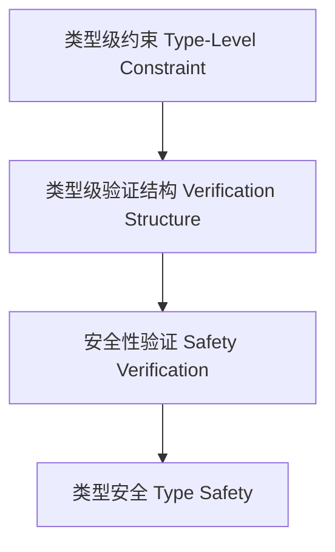

# 01. 类型级验证（Type-Level Verification in Haskell）

> **中英双语核心定义 | Bilingual Core Definitions**

## 1.1 类型级验证简介（Introduction to Type-Level Verification）

- **定义（Definition）**：
  - **中文**：类型级验证是指在类型系统层面对程序属性、约束和语义进行静态验证，确保编译期的正确性和安全性。Haskell通过类型族、GADT、类型类等机制支持类型级验证。
  - **English**: Type-level verification refers to statically verifying program properties, constraints, and semantics at the type system level, ensuring correctness and safety at compile time. Haskell supports type-level verification via type families, GADTs, type classes, etc.

- **Wiki风格国际化解释（Wiki-style Explanation）**：
  - 类型级验证是高可靠性、形式化方法和安全编程的基础。
  - Type-level verification is the foundation of high reliability, formal methods, and safe programming.

## 1.2 Haskell中的类型级验证语法与语义（Syntax and Semantics of Type-Level Verification in Haskell）

- **类型级约束与验证**

```haskell
{-# LANGUAGE DataKinds, TypeFamilies, GADTs, TypeOperators #-}

data Nat = Z | S Nat

type family LessThan n m where
  LessThan 'Z     ('S m) = 'True
  LessThan ('S n) ('S m) = LessThan n m
  LessThan n      m      = 'False

data Fin n where
  FZ :: Fin ('S n)
  FS :: Fin n -> Fin ('S n)

-- 验证：Fin n 只能构造小于 n 的自然数
safeIndex :: Fin n -> Vec n a -> a
safeIndex FZ     (VCons x _)  = x
safeIndex (FS k) (VCons _ xs) = safeIndex k xs
```

## 1.3 范畴论建模与结构映射（Category-Theoretic Modeling and Mapping）

- **类型级验证与范畴论关系**
  - 类型级验证可视为范畴中的限制函子与结构约束。

| 概念 | Haskell实现 | 代码示例 | 中文解释 |
|------|-------------|----------|----------|
| 限制 | 类型族 | `LessThan n m` | 类型级约束 |
| 验证结构 | GADT | `Fin n` | 类型级验证结构 |
| 安全索引 | GADT+类型族 | `safeIndex` | 类型安全验证 |

## 1.4 形式化证明与论证（Formal Proofs & Reasoning）

- **类型级约束验证证明**
  - **中文**：证明类型级结构满足约束和语义。
  - **English**: Prove that type-level structures satisfy constraints and semantics.

- **安全性验证能力证明**
  - **中文**：证明类型级验证可防止运行时错误。
  - **English**: Prove that type-level verification can prevent runtime errors.

## 1.5 多表征与本地跳转（Multi-representation & Local Reference）

- **类型级验证结构图（Type-Level Verification Structure Diagram）**



- **相关主题跳转**：
  - [类型级证明 Type-Level Proof](./01-Type-Level-Proof.md)
  - [类型安全 Type Safety](./01-Type-Safety.md)
  - [类型级归纳 Type-Level Induction](./01-Type-Level-Induction.md)

---

> 本文档为类型级验证在Haskell中的中英双语、Haskell语义模型与形式化证明规范化输出，适合学术研究与工程实践参考。
