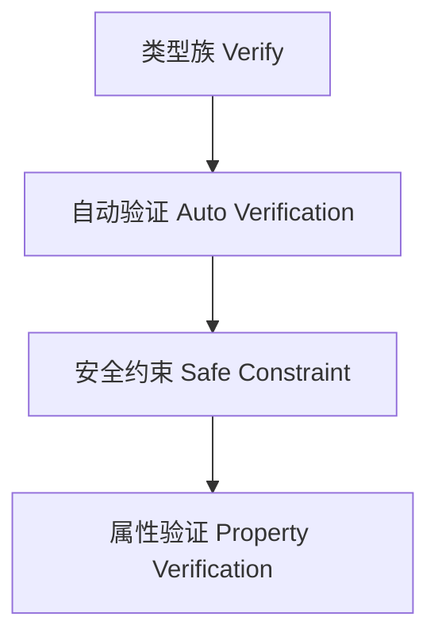

# 01. 类型级验证在Haskell中的理论与实践（Type-Level Verification in Haskell）

> **中英双语核心定义 | Bilingual Core Definitions**

## 1.1 类型级验证简介（Introduction to Type-Level Verification）

- **定义（Definition）**：
  - **中文**：类型级验证是指在类型系统层面对类型属性、约束和程序安全性进行自动化验证，提升编译期的可靠性和类型安全。Haskell通过类型族、GADT、类型类等机制支持类型级验证。
  - **English**: Type-level verification refers to automated verification of type properties, constraints, and program safety at the type system level, improving compile-time reliability and type safety. Haskell supports type-level verification via type families, GADTs, type classes, etc.

- **Wiki风格国际化解释（Wiki-style Explanation）**：
  - 类型级验证极大提升了Haskell类型系统的安全性和工程可靠性，广泛用于泛型库、DSL框架和自动化验证。
  - Type-level verification greatly enhances the safety and engineering reliability of Haskell's type system, widely used in generic libraries, DSL frameworks, and automated verification.

## 1.2 Haskell中的类型级验证语法与语义（Syntax and Semantics of Type-Level Verification in Haskell）

- **类型族与自动验证**

```haskell
{-# LANGUAGE TypeFamilies, ConstraintKinds, TypeOperators, UndecidableInstances #-}
import GHC.Exts (Constraint)

-- 类型级自动验证示例

type family Verify (c :: Constraint) :: Bool where
  Verify (() :: Constraint) = 'True
  Verify c = 'False
```

- **类型级约束与安全验证**

```haskell
class SafeEq a where
  safeEq :: a -> a -> Bool

instance SafeEq Int where
  safeEq = (==)
```

## 1.3 范畴论建模与结构映射（Category-Theoretic Modeling and Mapping）

- **类型级验证与范畴论关系**
  - 类型级验证可视为范畴中的属性验证与结构保障。

| 概念 | Haskell实现 | 代码示例 | 中文解释 |
|------|-------------|----------|----------|
| 自动验证 | 类型族 | `Verify c` | 类型级自动验证 |
| 安全约束 | 类型类 | `SafeEq a` | 类型安全约束 |
| 属性验证 | 类型族 | `Verify c` | 属性验证 |

## 1.4 形式化证明与论证（Formal Proofs & Reasoning）

- **验证正确性证明**
  - **中文**：证明类型级验证机制能检测所有非法属性和约束。
  - **English**: Prove that the verification mechanism detects all illegal properties and constraints.

- **安全性证明**
  - **中文**：证明类型级验证下的类型安全和属性一致性。
  - **English**: Prove type safety and property consistency under type-level verification.

## 1.5 多表征与本地跳转（Multi-representation & Local Reference）

- **类型级验证结构图（Type-Level Verification Structure Diagram）**



- **相关主题跳转**：
  - [类型级自动化 Type-Level Automation](../27-Type-Level-Automation/01-Type-Level-Automation-in-Haskell.md)
  - [类型安全 Type Safety](../14-Type-Safety/01-Type-Safety-in-Haskell.md)
  - [类型级推理 Type-Level Reasoning](../29-Type-Level-Reasoning/01-Type-Level-Reasoning-in-Haskell.md)

---

> 本文档为类型级验证在Haskell中的中英双语、Haskell语义模型与形式化证明规范化输出，适合学术研究与工程实践参考。
