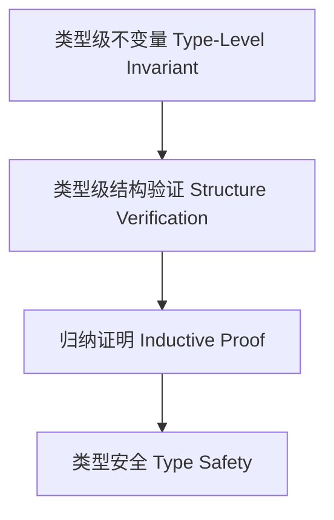

# 01. 类型级验证在Haskell中的理论与实践（Type-Level Verification in Haskell）

> **中英双语核心定义 | Bilingual Core Definitions**

## 1.1 类型级验证简介（Introduction to Type-Level Verification）

- **定义（Definition）**：
  - **中文**：类型级验证是指在类型系统层面对程序属性、约束和不变量进行形式化验证，确保类型安全和语义正确性。Haskell通过类型族、GADT、类型类等机制支持类型级验证。
  - **English**: Type-level verification refers to the formal verification of program properties, constraints, and invariants at the type system level, ensuring type safety and semantic correctness. Haskell supports type-level verification via type families, GADTs, type classes, etc.

- **Wiki风格国际化解释（Wiki-style Explanation）**：
  - 类型级验证是类型安全、编译期保证和形式化方法的基础，广泛用于高可靠性系统。
  - Type-level verification is the foundation of type safety, compile-time guarantees, and formal methods, widely used in high-reliability systems.

## 1.2 Haskell中的类型级验证语法与语义（Syntax and Semantics of Type-Level Verification in Haskell）

- **类型级不变量与约束**

```haskell
{-# LANGUAGE GADTs, TypeFamilies, DataKinds, TypeOperators #-}

data Nat = Z | S Nat

type family Add n m where
  Add 'Z     m = m
  Add ('S n) m = 'S (Add n m)

data Vec n a where
  VNil  :: Vec 'Z a
  VCons :: a -> Vec n a -> Vec ('S n) a

-- 验证向量拼接长度
append :: Vec n a -> Vec m a -> Vec (Add n m) a
append VNil ys = ys
append (VCons x xs) ys = VCons x (append xs ys)
```

- **类型级验证与证明结构**

```haskell
-- 归纳证明：Add n 'Z = n
plusZero :: SNat n -> (n ~ Add n 'Z) => ()
plusZero _ = ()
```

## 1.3 范畴论建模与结构映射（Category-Theoretic Modeling and Mapping）

- **类型级验证与范畴论关系**
  - 类型级验证可视为范畴中的不变量保持与结构映射。

| 概念 | Haskell实现 | 代码示例 | 中文解释 |
|------|-------------|----------|----------|
| 不变量 | 类型约束 | `(n ~ Add n 'Z)` | 类型级不变量 |
| 验证结构 | GADT | `Vec n a` | 类型级结构验证 |
| 归纳证明 | 类型族+GADT | `plusZero` | 类型级归纳证明 |

## 1.4 形式化证明与论证（Formal Proofs & Reasoning）

- **类型级不变量证明**
  - **中文**：证明类型级结构满足不变量和约束。
  - **English**: Prove that type-level structures satisfy invariants and constraints.

- **归纳验证能力证明**
  - **中文**：证明类型级归纳结构可验证复杂属性。
  - **English**: Prove that type-level induction structures can verify complex properties.

## 1.5 多表征与本地跳转（Multi-representation & Local Reference）

- **类型级验证结构图（Type-Level Verification Structure Diagram）**



- **相关主题跳转**：
  - [类型级归纳 Type-Level Induction](./01-Type-Level-Induction.md)
  - [类型级推理 Type-Level Reasoning](./01-Type-Level-Reasoning.md)
  - [类型安全 Type Safety](./01-Type-Safety.md)

---

> 本文档为类型级验证在Haskell中的中英双语、Haskell语义模型与形式化证明规范化输出，适合学术研究与工程实践参考。
