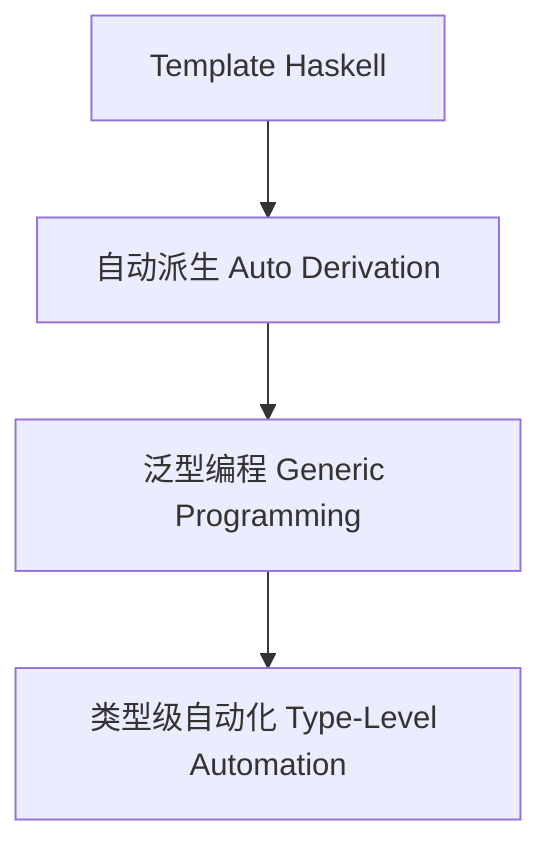

# 01. 类型元编程在Haskell中的理论与实践（Type Metaprogramming in Haskell）

> **中英双语核心定义 | Bilingual Core Definitions**

## 1.1 类型元编程简介（Introduction to Type Metaprogramming）

- **定义（Definition）**：
  - **中文**：类型元编程是指在编译期自动生成、操作和推导类型及类型级代码的技术。Haskell通过Template Haskell、类型族、GADT等机制支持类型级自动化和泛型编程。
  - **English**: Type metaprogramming refers to techniques for automatically generating, manipulating, and inferring types and type-level code at compile time. Haskell supports type-level automation and generic programming via Template Haskell, type families, GADTs, etc.

- **Wiki风格国际化解释（Wiki-style Explanation）**：
  - 类型元编程极大提升了Haskell类型系统的灵活性和自动化能力，广泛用于自动派生、泛型库和类型驱动DSL。
  - Type metaprogramming greatly enhances the flexibility and automation of Haskell's type system, widely used in automatic derivation, generic libraries, and type-driven DSLs.

## 1.2 Haskell中的类型元编程语法与语义（Syntax and Semantics of Type Metaprogramming in Haskell）

- **Template Haskell与类型级自动化**

```haskell
{-# LANGUAGE TemplateHaskell #-}
import Language.Haskell.TH

-- 自动生成数据类型的Show实例
deriveShow :: Name -> Q [Dec]
deriveShow name = [d| instance Show $(conT name) where show _ = "<auto>" |]

-- 使用：$(deriveShow ''MyType)
```

- **类型级泛型编程与自动派生**

```haskell
{-# LANGUAGE DeriveGeneric #-}
import GHC.Generics

data Person = Person { name :: String, age :: Int } deriving (Generic)

-- 泛型库可自动推导序列化、比较等实例
```

- **类型级自动化与类型安全**

```haskell
{-# LANGUAGE TypeFamilies, DataKinds #-}

type family Replicate n a where
  Replicate 'Z     a = '[]
  Replicate ('S n) a = a ': Replicate n a
```

## 1.3 范畴论建模与结构映射（Category-Theoretic Modeling and Mapping）

- **类型元编程与范畴论关系**
  - 类型元编程可视为范畴中的函子自动生成与结构提升。

| 概念 | Haskell实现 | 代码示例 | 中文解释 |
|------|-------------|----------|----------|
| 自动派生 | Template Haskell | `deriveShow` | 自动生成实例 |
| 泛型编程 | GHC.Generics | `deriving (Generic)` | 类型级泛型 |
| 类型级自动化 | 类型族 | `Replicate n a` | 类型级递归 |

## 1.4 形式化证明与论证（Formal Proofs & Reasoning）

- **类型元编程安全性证明**
  - **中文**：证明类型元编程生成的类型和实例在类型系统下是安全的。
  - **English**: Prove that types and instances generated by type metaprogramming are safe under the type system.

- **自动化与泛型能力证明**
  - **中文**：证明类型元编程可自动推导复杂类型关系和泛型实例。
  - **English**: Prove that type metaprogramming can automatically derive complex type relations and generic instances.

## 1.5 多表征与本地跳转（Multi-representation & Local Reference）

- **类型元编程结构图（Type Metaprogramming Structure Diagram）**



- **相关主题跳转**：
  - [类型级编程 Type-Level Programming](../12-Type-Level-Programming/01-Type-Level-Programming-in-Haskell.md)
  - [类型安全 Type Safety](../14-Type-Safety/01-Type-Safety-in-Haskell.md)
  - [类型级证明 Type-Level Proof](../17-Type-Level-Proof/01-Type-Level-Proof-in-Haskell.md)

---

> 本文档为类型元编程在Haskell中的中英双语、Haskell语义模型与形式化证明规范化输出，适合学术研究与工程实践参考。
