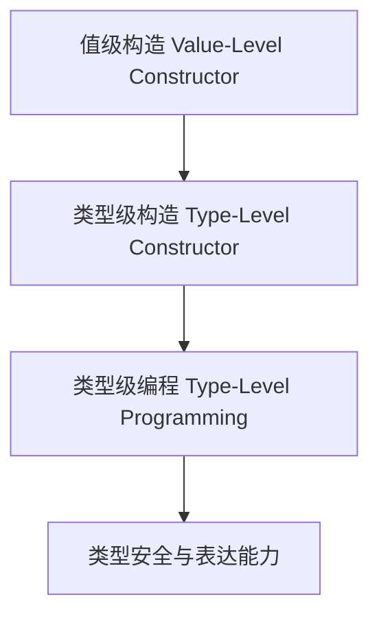

# 01. 类型推广与DataKinds在Haskell中的理论与实践（Type Promotion and DataKinds in Haskell）

> **中英双语核心定义 | Bilingual Core Definitions**

## 1.1 类型推广与DataKinds简介（Introduction to Type Promotion and DataKinds）

- **定义（Definition）**：
  - **中文**：类型推广是指将值级别的构造提升为类型级别。DataKinds是Haskell的扩展，允许数据构造器、字面量等在类型层面使用，支持类型级布尔、自然数、符号等。
  - **English**: Type promotion refers to lifting value-level constructors to the type level. DataKinds is a Haskell extension that allows data constructors, literals, etc., to be used at the type level, supporting type-level booleans, naturals, symbols, etc.

- **Wiki风格国际化解释（Wiki-style Explanation）**：
  - 类型推广和DataKinds极大丰富了Haskell类型系统的表达能力，是类型级编程、依赖类型和GADT等高级特性的基础。
  - Type promotion and DataKinds greatly enrich the expressiveness of Haskell's type system and are the foundation for type-level programming, dependent types, and advanced features like GADTs.

## 1.2 Haskell中的类型推广与DataKinds语法与语义（Syntax and Semantics of Type Promotion and DataKinds in Haskell）

- **DataKinds扩展与类型级字面量**

```haskell
{-# LANGUAGE DataKinds #-}

data Nat = Z | S Nat
-- DataKinds后，'Z 和 'S n 可用作类型级自然数

data Color = Red | Green | Blue
-- 类型级颜色：'Red, 'Green, 'Blue

-- 类型级布尔
:type True  -- True :: Bool
:type 'True -- 'True :: Bool (类型级)
```

- **类型级编程与类型推广**

```haskell
{-# LANGUAGE GADTs, DataKinds, KindSignatures #-}

data Vec :: * -> Nat -> * where
  VNil  :: Vec a 'Z
  VCons :: a -> Vec a n -> Vec a ('S n)

-- 类型级布尔与类型族
:type family And (a :: Bool) (b :: Bool) :: Bool where
  And 'True  'True  = 'True
  And _      _      = 'False
```

## 1.3 范畴论建模与结构映射（Category-Theoretic Modeling and Mapping）

- **类型推广与范畴论关系**
  - 类型推广可视为范畴中的对象提升与层级扩展。

| 概念 | Haskell实现 | 代码示例 | 中文解释 |
|------|-------------|----------|----------|
| 类型级字面量 | DataKinds | `'True`, `'Z` | 类型级常量 |
| 类型推广 | 类型级构造 | `data Vec a n` | 类型级参数 |
| 类型级布尔 | DataKinds/类型族 | `And 'True 'False` | 类型级逻辑 |

## 1.4 形式化证明与论证（Formal Proofs & Reasoning）

- **类型推广安全性证明**
  - **中文**：证明类型推广和DataKinds下的类型级运算在编译期得到保证。
  - **English**: Prove that type-level operations under type promotion and DataKinds are guaranteed at compile time.

- **表达能力证明**
  - **中文**：证明类型推广可表达更丰富的类型级结构和属性。
  - **English**: Prove that type promotion can express richer type-level structures and properties.

## 1.5 多表征与本地跳转（Multi-representation & Local Reference）

- **类型推广与DataKinds结构图（Type Promotion and DataKinds Structure Diagram）**



- **相关主题跳转**：
  - [类型级编程 Type-Level Programming](./01-Programming-in-Haskell.md)
  - [依赖类型 Dependent Type](./01-Dependent-Type.md)
  - [GADT in Haskell](./01-GADT.md)

---

## 1.6 历史与发展 History & Development

- **中文**：类型推广与DataKinds由GHC团队于2012年提出，是Haskell类型系统的重要扩展。DataKinds将数据构造器提升为类型级别，极大丰富了类型系统的表达力。GHC不断扩展DataKinds相关特性，如类型级字面量、类型级符号、类型级布尔等，为类型级编程和依赖类型奠定基础。
- **English**: Type promotion and DataKinds were introduced by the GHC team in 2012 as a major extension to the Haskell type system. DataKinds lifts data constructors to the type level, greatly enriching the expressiveness of the type system. GHC has continuously extended DataKinds features, such as type-level literals, symbols, and booleans, laying the foundation for type-level programming and dependent types.

## 1.7 Haskell 相关特性 Haskell Features

### 经典特性 Classic Features

- DataKinds、类型级字面量、类型推广、类型级布尔、类型级自然数。
- DataKinds, type-level literals, type promotion, type-level booleans, type-level naturals.

### 最新特性 Latest Features

- **TypeLits**：类型级自然数与符号。
- **Singletons**：类型与值的单例化，桥接类型级与值级。
- **Dependent Types（依赖类型）**：GHC 9.x实验性支持。
- **GHC 2021/2022**：标准化更多DataKinds相关扩展。

- **English**:
  - TypeLits: Type-level naturals and symbols.
  - Singletons: Singletonization of types and values, bridging type and value levels.
  - Dependent Types: Experimental in GHC 9.x.
  - GHC 2021/2022: Standardizes more DataKinds extensions.

## 1.8 应用 Applications

- **中文**：类型安全DSL、类型级数据结构、编译期验证、不可变数据结构、泛型编程、形式化验证等。
- **English**: Type-safe DSLs, type-level data structures, compile-time verification, immutable data structures, generic programming, formal verification, etc.

## 1.9 例子 Examples

```haskell
{-# LANGUAGE DataKinds, TypeFamilies, GADTs, KindSignatures #-}
data Nat = Z | S Nat
data Vec (a :: *) (n :: Nat) where
  VNil  :: Vec a 'Z
  VCons :: a -> Vec a n -> Vec a ('S n)

-- 类型级布尔与类型族
 type family Or (a :: Bool) (b :: Bool) :: Bool where
   Or 'True  _      = 'True
   Or _      'True  = 'True
   Or _      _      = 'False
```

## 1.10 相关理论 Related Theories

- 类型级编程（Type-level Programming）
- 依赖类型理论（Dependent Type Theory）
- 代数数据类型（Algebraic Data Types）
- 形式化验证（Formal Verification）

## 1.11 参考文献 References

- [Wikipedia: DataKinds](https://en.wikipedia.org/wiki/Type-level_programming#DataKinds)
- [GHC User's Guide](https://downloads.haskell.org/ghc/latest/docs/html/users_guide/)
- [Types and Programming Languages, Benjamin C. Pierce]
- [Learn You a Haskell for Great Good!](http://learnyouahaskell.com/)

> 本文档为类型推广与DataKinds在Haskell中的中英双语、Haskell语义模型与形式化证明规范化输出，适合学术研究与工程实践参考。
