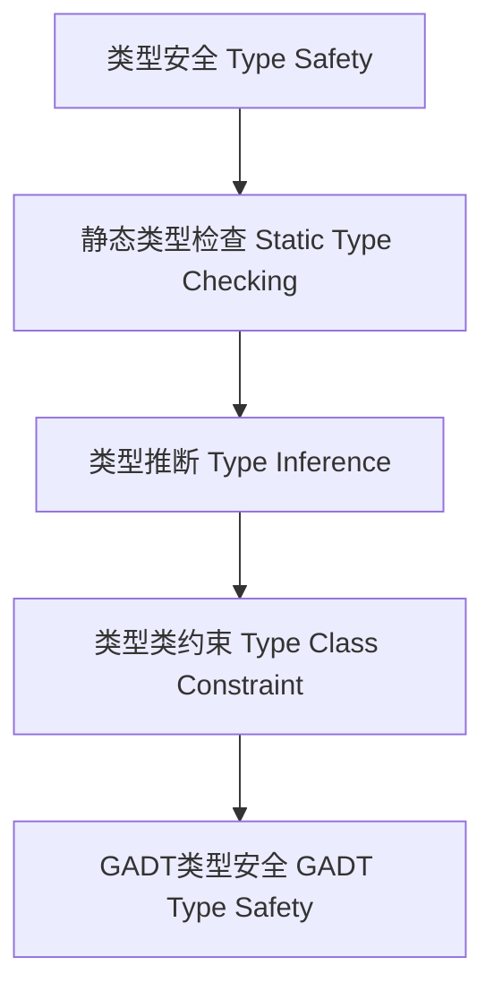

# 01. 类型安全在Haskell中的理论与实践（Type Safety in Haskell）

> **中英双语核心定义 | Bilingual Core Definitions**

## 1.1 类型安全简介（Introduction to Type Safety）

- **定义（Definition）**：
  - **中文**：类型安全是指程序在运行时不会发生类型错误，所有操作都符合类型系统的约束。Haskell通过强类型系统、类型推断和类型检查保证类型安全。
  - **English**: Type safety means that a program will not encounter type errors at runtime, and all operations conform to the constraints of the type system. Haskell ensures type safety through a strong type system, type inference, and type checking.

- **Wiki风格国际化解释（Wiki-style Explanation）**：
  - 类型安全是现代编程语言设计的核心目标，提升了程序的可靠性和可维护性。
  - Type safety is a core goal of modern programming language design, improving program reliability and maintainability.

## 1.2 Haskell中的类型安全机制（Type Safety Mechanisms in Haskell）

- **静态类型检查（Static Type Checking）**
- **类型推断（Type Inference）**
- **类型类约束（Type Class Constraints）**
- **GADT与类型级约束（GADT & Type-Level Constraints）**
- **不可变数据结构（Immutable Data Structures）**

### Haskell 类型安全示例

```haskell
-- 静态类型检查
add :: Int -> Int -> Int
add x y = x + y

-- 类型推断
id x = x  -- id :: a -> a

-- 类型类约束
safeEq :: Eq a => a -> a -> Bool
safeEq x y = x == y

-- GADT类型安全
{-# LANGUAGE GADTs #-}
data Expr a where
  LitInt  :: Int -> Expr Int
  Add     :: Expr Int -> Expr Int -> Expr Int

eval :: Expr a -> a
eval (LitInt n)   = n
eval (Add e1 e2)  = eval e1 + eval e2
```

## 1.3 范畴论建模与结构映射（Category-Theoretic Modeling and Mapping）

- **类型安全与范畴论关系**
  - 类型安全可视为范畴中对象与态射的合法组合。

| 概念 | Haskell实现 | 代码示例 | 中文解释 |
|------|-------------|----------|----------|
| 类型安全 | 静态类型检查 | `add :: Int -> Int -> Int` | 编译期保证 |
| 类型推断 | 自动类型推导 | `id x = x` | 类型自动传播 |
| 类型类约束 | 多态安全 | `Eq a => a -> a -> Bool` | 受限多态 |
| GADT | 类型级约束 | `data Expr a where ...` | 类型安全表达 |

## 1.4 形式化证明与论证（Formal Proofs & Reasoning）

- **类型保持性证明（Preservation Proof）**
  - **中文**：证明类型推理规则下，归约不改变类型。
  - **English**: Prove that under type inference rules, reduction does not change the type.

- **进展性证明（Progress Proof）**
  - **中文**：证明类型正确的表达式要么是值，要么可归约。
  - **English**: Prove that a well-typed expression is either a value or can be further reduced.

## 1.5 多表征与本地跳转（Multi-representation & Local Reference）

- **类型安全结构图（Type Safety Structure Diagram）**



- **相关主题跳转**：
  - [类型推断与多态 Type Inference and Polymorphism](../06-Type-Inference-and-Polymorphism/01-Type-Inference-and-Polymorphism-in-Haskell.md)
  - [GADT in Haskell](../09-GADT/01-GADT-in-Haskell.md)
  - [类型等价 Type Equality](../13-Type-Equality/01-Type-Equality-in-Haskell.md)

---

> 本文档为类型安全在Haskell中的中英双语、Haskell语义模型与形式化证明规范化输出，适合学术研究与工程实践参考。
