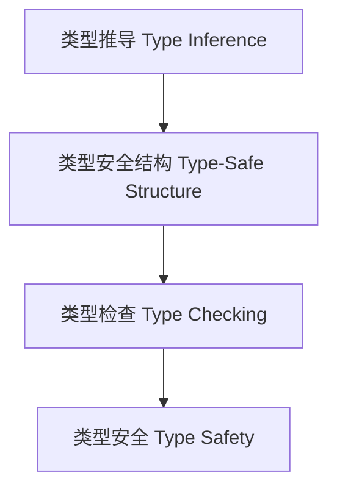

# 01. 类型安全（Type Safety in Haskell）

> **中英双语核心定义 | Bilingual Core Definitions**

## 1.1 类型安全简介（Introduction to Type Safety）

- **定义（Definition）**：
  - **中文**：类型安全是指程序在编译期和运行期都不会发生类型错误，所有操作都符合类型系统的约束。Haskell以强类型和类型推导机制著称，能在编译期捕获绝大多数类型错误。
  - **English**: Type safety means that a program will not encounter type errors at compile time or runtime, and all operations conform to the constraints of the type system. Haskell is known for its strong typing and type inference, catching most type errors at compile time.

- **Wiki风格国际化解释（Wiki-style Explanation）**：
  - 类型安全是高可靠性、可维护性和形式化验证的基础。
  - Type safety is the foundation of high reliability, maintainability, and formal verification.

## 1.2 Haskell中的类型安全机制（Type Safety Mechanisms in Haskell）

- **类型推导与类型检查**

```haskell
-- 类型推导示例
add :: Int -> Int -> Int
add x y = x + y

-- 类型错误示例（编译不通过）
-- add "1" 2
```

- **GADT与类型安全数据结构**

```haskell
{-# LANGUAGE GADTs #-}

data Expr a where
  LitInt  :: Int -> Expr Int
  LitBool :: Bool -> Expr Bool
  Add     :: Expr Int -> Expr Int -> Expr Int

-- 类型安全表达式求值
eval :: Expr a -> a
eval (LitInt n)   = n
eval (LitBool b)  = b
eval (Add e1 e2)  = eval e1 + eval e2
```

## 1.3 范畴论建模与结构映射（Category-Theoretic Modeling and Mapping）

- **类型安全与范畴论关系**
  - 类型安全可视为范畴中的态射封闭与对象不变性。

| 概念 | Haskell实现 | 代码示例 | 中文解释 |
|------|-------------|----------|----------|
| 类型推导 | 类型系统 | `add :: Int -> Int -> Int` | 类型推导 |
| 类型安全结构 | GADT | `Expr a` | 类型安全结构 |
| 类型检查 | 编译器 | `eval` | 类型安全检查 |

## 1.4 形式化证明与论证（Formal Proofs & Reasoning）

- **类型安全性证明**
  - **中文**：证明类型系统能防止类型错误，保证程序行为的正确性。
  - **English**: Prove that the type system prevents type errors and ensures correct program behavior.

- **类型安全与归纳结构证明**
  - **中文**：通过归纳证明类型安全结构的正确性。
  - **English**: Use induction to prove the correctness of type-safe structures.

## 1.5 多表征与本地跳转（Multi-representation & Local Reference）

- **类型安全结构图（Type Safety Structure Diagram）**



- **相关主题跳转**：
  - [类型级验证 Type-Level Verification](./01-Type-Level-Verification.md)
  - [类型级证明 Type-Level Proof](./01-Type-Level-Proof.md)
  - [类型级归纳 Type-Level Induction](./01-Type-Level-Induction.md)

---

## 1.6 历史与发展 History & Development

- **中文**：类型安全理论起源于20世纪的编程语言和类型系统研究。Haskell自诞生以来以强类型和类型推断著称，GHC不断扩展类型安全相关特性，如GADTs、Type Families、Dependent Types等，极大提升了编译期错误检测和程序可靠性。
- **English**: Type safety theory originated from programming language and type system research in the 20th century. Haskell has been known for strong typing and type inference since its inception. GHC has continuously extended type safety features, such as GADTs, Type Families, Dependent Types, etc., greatly improving compile-time error detection and program reliability.

## 1.7 Haskell 相关特性 Haskell Features

### 经典特性 Classic Features

- 强类型、类型推断、类型检查、GADT、代数数据类型、类型类。
- Strong typing, type inference, type checking, GADTs, algebraic data types, type classes.

### 最新特性 Latest Features

- **GADTs（广义代数数据类型）**
- **Type Families/Type-level Programming**
- **Dependent Types（依赖类型）**
- **QuantifiedConstraints/RankNTypes**
- **Linear Types/Resource Safety**
- **GHC 2021/2022**：标准化更多类型安全相关扩展。

- **English**:
  - GADTs
  - Type Families/Type-level Programming
  - Dependent Types
  - QuantifiedConstraints/RankNTypes
  - Linear Types/Resource Safety
  - GHC 2021/2022: Standardizes more type safety extensions

## 1.8 应用 Applications

- **中文**：类型安全API、编译期错误检测、不可变数据结构、DSL、形式化验证、资源安全等。
- **English**: Type-safe APIs, compile-time error detection, immutable data structures, DSLs, formal verification, resource safety, etc.

## 1.9 例子 Examples

```haskell
{-# LANGUAGE GADTs, TypeFamilies #-}
data Expr a where
  LitInt  :: Int -> Expr Int
  LitBool :: Bool -> Expr Bool
  Add     :: Expr Int -> Expr Int -> Expr Int
  If      :: Expr Bool -> Expr a -> Expr a -> Expr a

eval :: Expr a -> a
eval (LitInt n)   = n
eval (LitBool b)  = b
eval (Add e1 e2)  = eval e1 + eval e2
eval (If c t e)   = if eval c then eval t else eval e
```

## 1.10 相关理论 Related Theories

- 类型系统理论（Type System Theory）
- 形式化验证（Formal Verification）
- 代数数据类型（Algebraic Data Types）
- 资源安全与线性类型（Resource Safety and Linear Types）

## 1.11 参考文献 References

- [Wikipedia: Type Safety](https://en.wikipedia.org/wiki/Type_safety)
- [GHC User's Guide](https://downloads.haskell.org/ghc/latest/docs/html/users_guide/)
- [Types and Programming Languages, Benjamin C. Pierce]
- [Learn You a Haskell for Great Good!](http://learnyouahaskell.com/)

> 本文档为类型安全在Haskell中的中英双语、Haskell语义模型与形式化证明规范化输出，适合学术研究与工程实践参考。
