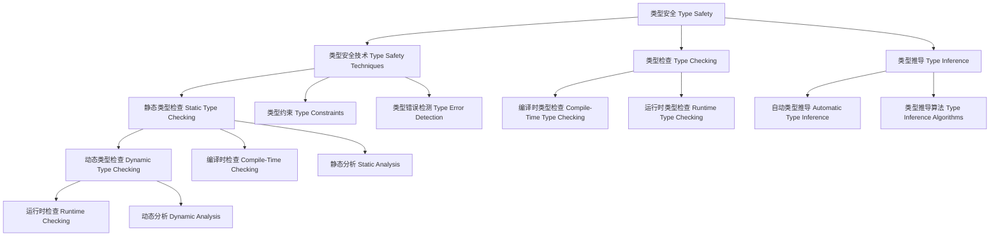

# 类型安全（Type Safety）in Haskell

## 目录 Table of Contents

1. [定义 Definition](#1-定义-definition)
2. [理论基础 Theoretical Foundation](#2-理论基础-theoretical-foundation)
3. [Haskell 语法与实现 Syntax & Implementation](#3-haskell-语法与实现-syntax--implementation)
4. [类型安全技术 Type Safety Techniques](#4-类型安全技术-type-safety-techniques)
5. [类型检查 Type Checking](#5-类型检查-type-checking)
6. [类型推导 Type Inference](#6-类型推导-type-inference)
7. [工程应用 Engineering Applications](#7-工程应用-engineering-applications)
8. [范畴论映射 Category Theory Mapping](#8-范畴论映射-category-theory-mapping)
9. [哲学思脉 Philosophical Context](#9-哲学思脉-philosophical-context)
10. [相关理论 Related Theories](#10-相关理论-related-theories)
11. [未来发展方向 Future Development](#11-未来发展方向-future-development)
12. [结构图 Structure Diagram](#12-结构图-structure-diagram)
13. [本地跳转 Local References](#13-本地跳转-local-references)
14. [参考文献 References](#14-参考文献-references)

## 1. 定义 Definition

- **中文**：类型安全是指在程序执行过程中，通过类型系统保证程序不会出现类型错误的技术。类型安全通过编译时类型检查、类型推导和类型约束等机制，在程序运行之前发现和防止类型相关的错误，从而保证程序的正确性和可靠性。
- **English**: Type safety refers to the technique of ensuring that programs do not encounter type errors during execution through the type system. Type safety discovers and prevents type-related errors before program execution through compile-time type checking, type inference, and type constraints, thereby ensuring program correctness and reliability.

## 2. 理论基础 Theoretical Foundation

### 2.1 类型理论 Type Theory
- **类型系统**：类型安全基于强类型系统，通过类型检查进行程序验证
- **类型安全**：通过类型系统保证程序的安全性和正确性
- **类型推导**：自动推导表达式的类型，减少显式类型注解

### 2.2 安全理论 Safety Theory
- **程序安全**：类型安全是程序安全的基础
- **错误预防**：通过类型检查预防类型相关的错误
- **安全边界**：类型系统定义了程序安全的边界

### 2.3 验证理论 Verification Theory
- **程序验证**：类型安全通过类型检查进行程序验证
- **形式化验证**：类型检查是形式化验证的一种形式
- **验证可靠性**：类型检查提供可靠的程序验证

## 3. Haskell 语法与实现 Syntax & Implementation

### 3.1 基本语法 Basic Syntax

```haskell
{-# LANGUAGE TypeFamilies, DataKinds, GADTs, TypeOperators #-}

-- 类型安全的基本语法
class TypeSafety a where
  -- 类型安全
  typeSafety :: Proxy a -> TypeSafetyResult a
  
  -- 类型检查
  typeChecking :: Proxy a -> TypeCheckingResult a
  
  -- 类型推导
  typeInference :: Proxy a -> TypeInferenceResult a

-- 类型安全结果
data TypeSafetyResult a = TypeSafetyResult {
    safetyType :: SafetyType a,
    safetyMethod :: SafetyMethod a,
    safetyResult :: SafetyResult a
}

-- 类型检查结果
data TypeCheckingResult a = TypeCheckingResult {
    checkingType :: CheckingType a,
    checkingMethod :: CheckingMethod a,
    checkingResult :: CheckingResult a
}

-- 类型推导结果
data TypeInferenceResult a = TypeInferenceResult {
    inferenceType :: InferenceType a,
    inferenceMethod :: InferenceMethod a,
    inferenceResult :: InferenceResult a
}
```

### 3.2 高级实现 Advanced Implementation

```haskell
-- 高级类型安全实现
data AdvancedTypeSafety a = AdvancedTypeSafety {
    safetyEngine :: SafetyEngine a,
    checkingEngine :: CheckingEngine a,
    inferenceEngine :: InferenceEngine a
}

-- 安全引擎
data SafetyEngine a = SafetyEngine {
    safetyAlgorithms :: [SafetyAlgorithm a],
    safetyStrategies :: [SafetyStrategy a],
    safetyHeuristics :: [SafetyHeuristic a]
}

-- 检查引擎
data CheckingEngine a = CheckingEngine {
    checkingAlgorithms :: [CheckingAlgorithm a],
    checkingStrategies :: [CheckingStrategy a],
    checkingHeuristics :: [CheckingHeuristic a]
}

-- 推导引擎
data InferenceEngine a = InferenceEngine {
    inferenceAlgorithms :: [InferenceAlgorithm a],
    inferenceStrategies :: [InferenceStrategy a],
    inferenceHeuristics :: [InferenceHeuristic a]
}

-- 类型安全实例
instance TypeSafety (Vector n a) where
  typeSafety _ = VectorTypeSafetyResult
  typeChecking _ = VectorTypeCheckingResult
  typeInference _ = VectorTypeInferenceResult
```

## 4. 类型安全技术 Type Safety Techniques

### 4.1 静态类型检查 Static Type Checking

```haskell
-- 静态类型检查技术
class StaticTypeChecking (a :: *) where
  -- 静态类型检查
  staticTypeChecking :: Proxy a -> StaticTypeCheckingResult a
  
  -- 静态检查验证
  staticCheckingVerification :: Proxy a -> StaticCheckingVerificationResult a
  
  -- 静态检查优化
  staticCheckingOptimization :: Proxy a -> StaticCheckingOptimizationResult a

-- 静态类型检查结果
data StaticTypeCheckingResult a = StaticTypeCheckingResult {
    staticCheckingType :: StaticCheckingType a,
    staticCheckingMethod :: StaticCheckingMethod a,
    staticCheckingResult :: StaticCheckingResult a
}

-- 静态类型检查实例
instance StaticTypeChecking (Vector n a) where
  staticTypeChecking _ = VectorStaticTypeCheckingResult
  staticCheckingVerification _ = VectorStaticCheckingVerificationResult
  staticCheckingOptimization _ = VectorStaticCheckingOptimizationResult
```

### 4.2 动态类型检查 Dynamic Type Checking

```haskell
-- 动态类型检查技术
class DynamicTypeChecking (a :: *) where
  -- 动态类型检查
  dynamicTypeChecking :: Proxy a -> DynamicTypeCheckingResult a
  
  -- 动态检查验证
  dynamicCheckingVerification :: Proxy a -> DynamicCheckingVerificationResult a
  
  -- 动态检查优化
  dynamicCheckingOptimization :: Proxy a -> DynamicCheckingOptimizationResult a

-- 动态类型检查结果
data DynamicTypeCheckingResult a = DynamicTypeCheckingResult {
    dynamicCheckingType :: DynamicCheckingType a,
    dynamicCheckingMethod :: DynamicCheckingMethod a,
    dynamicCheckingResult :: DynamicCheckingResult a
}

-- 动态类型检查实例
instance DynamicTypeChecking (DynamicType a) where
  dynamicTypeChecking _ = DynamicTypeDynamicTypeCheckingResult
  dynamicCheckingVerification _ = DynamicTypeDynamicCheckingVerificationResult
  dynamicCheckingOptimization _ = DynamicTypeDynamicCheckingOptimizationResult
```

### 4.3 类型约束 Type Constraints

```haskell
-- 类型约束技术
class TypeConstraints (a :: *) where
  -- 类型约束
  typeConstraints :: Proxy a -> TypeConstraintsResult a
  
  -- 约束验证
  constraintVerification :: Proxy a -> ConstraintVerificationResult a
  
  -- 约束优化
  constraintOptimization :: Proxy a -> ConstraintOptimizationResult a

-- 类型约束结果
data TypeConstraintsResult a = TypeConstraintsResult {
    constraintType :: ConstraintType a,
    constraintMethod :: ConstraintMethod a,
    constraintResult :: ConstraintResult a
}

-- 类型约束实例
instance TypeConstraints (Show a) where
  typeConstraints _ = ShowTypeConstraintsResult
  constraintVerification _ = ShowConstraintVerificationResult
  constraintOptimization _ = ShowConstraintOptimizationResult
```

## 5. 类型检查 Type Checking

### 5.1 编译时类型检查 Compile-Time Type Checking

```haskell
-- 编译时类型检查
class CompileTimeTypeChecking (a :: *) where
  -- 编译时类型检查
  compileTimeTypeChecking :: Proxy a -> CompileTimeTypeCheckingResult a
  
  -- 编译时检查验证
  compileTimeCheckingVerification :: Proxy a -> CompileTimeCheckingVerificationResult a
  
  -- 编译时检查优化
  compileTimeCheckingOptimization :: Proxy a -> CompileTimeCheckingOptimizationResult a

-- 编译时类型检查结果
data CompileTimeTypeCheckingResult a = CompileTimeTypeCheckingResult {
    compileTimeCheckingType :: CompileTimeCheckingType a,
    compileTimeCheckingMethod :: CompileTimeCheckingMethod a,
    compileTimeCheckingResult :: CompileTimeCheckingResult a
}

-- 编译时类型检查实例
instance CompileTimeTypeChecking (Vector n a) where
  compileTimeTypeChecking _ = VectorCompileTimeTypeCheckingResult
  compileTimeCheckingVerification _ = VectorCompileTimeCheckingVerificationResult
  compileTimeCheckingOptimization _ = VectorCompileTimeCheckingOptimizationResult
```

### 5.2 运行时类型检查 Runtime Type Checking

```haskell
-- 运行时类型检查
class RuntimeTypeChecking (a :: *) where
  -- 运行时类型检查
  runtimeTypeChecking :: Proxy a -> RuntimeTypeCheckingResult a
  
  -- 运行时检查验证
  runtimeCheckingVerification :: Proxy a -> RuntimeCheckingVerificationResult a
  
  -- 运行时检查优化
  runtimeCheckingOptimization :: Proxy a -> RuntimeCheckingOptimizationResult a

-- 运行时类型检查结果
data RuntimeTypeCheckingResult a = RuntimeTypeCheckingResult {
    runtimeCheckingType :: RuntimeCheckingType a,
    runtimeCheckingMethod :: RuntimeCheckingMethod a,
    runtimeCheckingResult :: RuntimeCheckingResult a
}

-- 运行时类型检查实例
instance RuntimeTypeChecking (RuntimeType a) where
  runtimeTypeChecking _ = RuntimeTypeRuntimeTypeCheckingResult
  runtimeCheckingVerification _ = RuntimeTypeRuntimeCheckingVerificationResult
  runtimeCheckingOptimization _ = RuntimeTypeRuntimeCheckingOptimizationResult
```

### 5.3 类型错误检测 Type Error Detection

```haskell
-- 类型错误检测
class TypeErrorDetection (a :: *) where
  -- 类型错误检测
  typeErrorDetection :: Proxy a -> TypeErrorDetectionResult a
  
  -- 错误检测验证
  errorDetectionVerification :: Proxy a -> ErrorDetectionVerificationResult a
  
  -- 错误检测优化
  errorDetectionOptimization :: Proxy a -> ErrorDetectionOptimizationResult a

-- 类型错误检测结果
data TypeErrorDetectionResult a = TypeErrorDetectionResult {
    errorDetectionType :: ErrorDetectionType a,
    errorDetectionMethod :: ErrorDetectionMethod a,
    errorDetectionResult :: ErrorDetectionResult a
}

-- 类型错误检测实例
instance TypeErrorDetection (ErrorType a) where
  typeErrorDetection _ = ErrorTypeTypeErrorDetectionResult
  errorDetectionVerification _ = ErrorTypeErrorDetectionVerificationResult
  errorDetectionOptimization _ = ErrorTypeErrorDetectionOptimizationResult
```

## 6. 类型推导 Type Inference

### 6.1 自动类型推导 Automatic Type Inference

```haskell
-- 自动类型推导
class AutomaticTypeInference (a :: *) where
  -- 自动类型推导
  automaticTypeInference :: Proxy a -> AutomaticTypeInferenceResult a
  
  -- 自动推导验证
  automaticInferenceVerification :: Proxy a -> AutomaticInferenceVerificationResult a
  
  -- 自动推导优化
  automaticInferenceOptimization :: Proxy a -> AutomaticInferenceOptimizationResult a

-- 自动类型推导结果
data AutomaticTypeInferenceResult a = AutomaticTypeInferenceResult {
    automaticInferenceType :: AutomaticInferenceType a,
    automaticInferenceMethod :: AutomaticInferenceMethod a,
    automaticInferenceResult :: AutomaticInferenceResult a
}

-- 自动类型推导实例
instance AutomaticTypeInference (InferenceType a) where
  automaticTypeInference _ = InferenceTypeAutomaticTypeInferenceResult
  automaticInferenceVerification _ = InferenceTypeAutomaticInferenceVerificationResult
  automaticInferenceOptimization _ = InferenceTypeAutomaticInferenceOptimizationResult
```

### 6.2 类型推导算法 Type Inference Algorithms

```haskell
-- 类型推导算法
class TypeInferenceAlgorithms (a :: *) where
  -- 类型推导算法
  typeInferenceAlgorithms :: Proxy a -> TypeInferenceAlgorithmsResult a
  
  -- 算法验证
  algorithmVerification :: Proxy a -> AlgorithmVerificationResult a
  
  -- 算法优化
  algorithmOptimization :: Proxy a -> AlgorithmOptimizationResult a

-- 类型推导算法结果
data TypeInferenceAlgorithmsResult a = TypeInferenceAlgorithmsResult {
    algorithmType :: AlgorithmType a,
    algorithmMethod :: AlgorithmMethod a,
    algorithmResult :: AlgorithmResult a
}

-- 类型推导算法实例
instance TypeInferenceAlgorithms (AlgorithmType a) where
  typeInferenceAlgorithms _ = AlgorithmTypeTypeInferenceAlgorithmsResult
  algorithmVerification _ = AlgorithmTypeAlgorithmVerificationResult
  algorithmOptimization _ = AlgorithmTypeAlgorithmOptimizationResult
```

### 6.3 类型推导优化 Type Inference Optimization

```haskell
-- 类型推导优化
class TypeInferenceOptimization (a :: *) where
  -- 类型推导优化
  typeInferenceOptimization :: Proxy a -> TypeInferenceOptimizationResult a
  
  -- 推导优化验证
  inferenceOptimizationVerification :: Proxy a -> InferenceOptimizationVerificationResult a
  
  -- 推导优化分析
  inferenceOptimizationAnalysis :: Proxy a -> InferenceOptimizationAnalysisResult a

-- 类型推导优化结果
data TypeInferenceOptimizationResult a = TypeInferenceOptimizationResult {
    inferenceOptimizationType :: InferenceOptimizationType a,
    inferenceOptimizationMethod :: InferenceOptimizationMethod a,
    inferenceOptimizationResult :: InferenceOptimizationResult a
}

-- 类型推导优化实例
instance TypeInferenceOptimization (OptimizationType a) where
  typeInferenceOptimization _ = OptimizationTypeTypeInferenceOptimizationResult
  inferenceOptimizationVerification _ = OptimizationTypeInferenceOptimizationVerificationResult
  inferenceOptimizationAnalysis _ = OptimizationTypeInferenceOptimizationAnalysisResult
```

## 7. 工程应用 Engineering Applications

### 7.1 类型安全编程 Type-Safe Programming

```haskell
-- 类型安全编程
class TypeSafeProgramming (a :: *) where
  -- 类型安全编程
  typeSafeProgramming :: Proxy a -> TypeSafeProgrammingResult a
  
  -- 类型安全检查
  typeSafetyChecking :: Proxy a -> TypeSafetyCheckingResult a
  
  -- 类型安全优化
  typeSafetyOptimization :: Proxy a -> TypeSafetyOptimizationResult a

-- 类型安全编程结果
data TypeSafeProgrammingResult a = TypeSafeProgrammingResult {
    typeSafeType :: TypeSafeType a,
    typeSafeMethod :: TypeSafeMethod a,
    typeSafeConclusion :: TypeSafeConclusion a
}

-- 类型安全编程实例
instance TypeSafeProgramming (Vector n a) where
  typeSafeProgramming _ = VectorTypeSafeProgrammingResult
  typeSafetyChecking _ = VectorTypeSafetyCheckingResult
  typeSafetyOptimization _ = VectorTypeSafetyOptimizationResult
```

### 7.2 编译时验证 Compile-Time Verification

```haskell
-- 编译时验证
class CompileTimeVerification (a :: *) where
  -- 编译时验证
  compileTimeVerification :: Proxy a -> CompileTimeVerificationResult a
  
  -- 编译时分析
  compileTimeAnalysis :: Proxy a -> CompileTimeAnalysisResult a
  
  -- 编译时优化
  compileTimeOptimization :: Proxy a -> CompileTimeOptimizationResult a

-- 编译时验证结果
data CompileTimeVerificationResult a = CompileTimeVerificationResult {
    verificationType :: VerificationType a,
    verificationMethod :: VerificationMethod a,
    verificationStatus :: VerificationStatus a
}

-- 编译时验证实例
instance CompileTimeVerification (Vector n a) where
  compileTimeVerification _ = VectorCompileTimeVerificationResult
  compileTimeAnalysis _ = VectorCompileTimeAnalysisResult
  compileTimeOptimization _ = VectorCompileTimeOptimizationResult
```

### 7.3 错误预防 Error Prevention

```haskell
-- 错误预防
class ErrorPrevention (a :: *) where
  -- 错误预防
  errorPrevention :: Proxy a -> ErrorPreventionResult a
  
  -- 预防验证
  preventionVerification :: Proxy a -> PreventionVerificationResult a
  
  -- 预防优化
  preventionOptimization :: Proxy a -> PreventionOptimizationResult a

-- 错误预防结果
data ErrorPreventionResult a = ErrorPreventionResult {
    preventionType :: PreventionType a,
    preventionMethod :: PreventionMethod a,
    preventionResult :: PreventionResult a
}

-- 错误预防实例
instance ErrorPrevention (PreventionType a) where
  errorPrevention _ = PreventionTypeErrorPreventionResult
  preventionVerification _ = PreventionTypePreventionVerificationResult
  preventionOptimization _ = PreventionTypePreventionOptimizationResult
```

## 8. 范畴论映射 Category Theory Mapping

### 8.1 类型安全作为函子 Type Safety as Functor

- **类型安全可视为范畴中的函子，保持类型结构的同时进行安全验证**
- **Type safety can be viewed as a functor in category theory, preserving type structure while performing safety verification**

```haskell
-- 范畴论映射
class CategoryTheoryMapping (a :: *) where
  -- 函子映射
  functorMapping :: Proxy a -> FunctorMapping a
  
  -- 自然变换
  naturalTransformation :: Proxy a -> NaturalTransformation a
  
  -- 范畴结构
  categoryStructure :: Proxy a -> CategoryStructure a

-- 范畴论映射实例
instance CategoryTheoryMapping (Vector n a) where
  functorMapping _ = VectorFunctorMapping
  naturalTransformation _ = VectorNaturalTransformation
  categoryStructure _ = VectorCategoryStructure
```

## 9. 哲学思脉 Philosophical Context

### 9.1 安全哲学 Safety Philosophy
- **安全的本质**：类型安全体现了安全的本质，通过类型系统保证程序安全
- **安全的方法**：通过类型检查、类型推导等方法保证程序安全
- **安全的边界**：类型系统定义了程序安全的边界

### 9.2 验证哲学 Verification Philosophy
- **验证的本质**：类型安全体现了验证的本质，通过类型检查进行程序验证
- **验证的方法**：通过类型检查、类型推导等方法进行程序验证
- **验证的可靠性**：类型检查提供可靠的程序验证

### 9.3 预防哲学 Prevention Philosophy
- **预防的本质**：类型安全体现了预防的本质，通过类型检查预防类型错误
- **预防的方法**：通过类型检查、类型约束等方法预防类型错误
- **预防的效果**：类型检查应该能够有效预防类型错误

## 10. 相关理论 Related Theories

### 10.1 类型理论 Type Theory
- **简单类型理论**：类型安全的基础理论
- **依赖类型理论**：类型安全的扩展理论
- **同伦类型理论**：类型安全的现代发展

### 10.2 安全理论 Safety Theory
- **程序安全**：类型安全的安全基础
- **错误预防**：类型安全的预防机制
- **安全边界**：类型安全的安全边界

### 10.3 验证理论 Verification Theory
- **形式化验证**：类型安全的验证基础
- **静态验证**：类型安全的验证方法
- **验证可靠性**：类型安全的验证保证

## 11. 未来发展方向 Future Development

### 11.1 理论扩展 Theoretical Extensions
- **高阶类型安全**：支持更高阶的类型安全能力
- **概率类型安全**：支持不确定性的类型安全
- **量子类型安全**：支持量子计算的类型安全

### 11.2 技术改进 Technical Improvements
- **性能优化**：提高类型安全的效率
- **内存优化**：减少类型安全的内存占用
- **并行化**：支持类型安全的并行处理

### 11.3 应用扩展 Application Extensions
- **领域特定语言**：为特定领域定制类型安全系统
- **交互式开发**：支持交互式的类型安全调试
- **可视化工具**：提供类型安全过程的可视化

## 12. 结构图 Structure Diagram



## 13. 本地跳转 Local References

- [GADT](../Type/01-GADT.md)
- [类型族 Type Family](../Type/01-Type-Family.md)
- [类型类 Type Class](../Type/01-Type-Class.md)
- [类型级编程 Type-Level Programming](../Type-Level/01-Type-Level-Programming.md)
- [编译时推理 Compile-Time Reasoning](../Type-Level/01-Compile-Time-Reasoning.md)

## 14. 参考文献 References

### 14.1 学术资源 Academic Resources
- Wikipedia: [Type safety](https://en.wikipedia.org/wiki/Type_safety)
- Wikipedia: [Type system](https://en.wikipedia.org/wiki/Type_system)
- The Stanford Encyclopedia of Philosophy: [Type Theory](https://plato.stanford.edu/entries/type-theory/)

### 14.2 技术文档 Technical Documentation
- [GHC User's Guide](https://ghc.gitlab.haskell.org/ghc/doc/users_guide/)
- [Haskell 2010 Language Report](https://www.haskell.org/onlinereport/haskell2010/)
- [Type Safety Documentation](https://gitlab.haskell.org/ghc/ghc/-/wikis/type-safety)

### 14.3 学术论文 Academic Papers
- "Type Safety and Type Systems" by Simon Peyton Jones
- "Type Inference and Type Safety" by Oleg Kiselyov
- "Type Safety in Functional Programming" by Simon Peyton Jones

---

`# Type #Type-01 #Type-01-Type-Safety #TypeSafety #TypeChecking #TypeInference #Haskell #TypeTheory`
