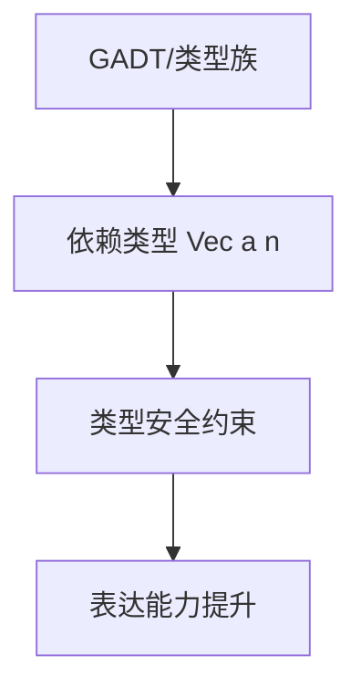

# 01. 依赖类型在Haskell中的理论与实践（Dependent Type in Haskell）

> **中英双语核心定义 | Bilingual Core Definitions**

## 1.1 依赖类型简介（Introduction to Dependent Type）

- **定义（Definition）**：
  - **中文**：依赖类型是一种类型系统，类型可以依赖于值。Haskell通过GADT、类型族等特性部分支持依赖类型，提升类型表达能力和类型安全。
  - **English**: Dependent types are types that can depend on values. Haskell partially supports dependent types via GADTs, type families, etc., enhancing type expressiveness and safety.

- **Wiki风格国际化解释（Wiki-style Explanation）**：
  - 依赖类型是现代类型理论的前沿，广泛用于形式化证明、类型级编程和高安全性系统。
  - Dependent types are at the forefront of modern type theory, widely used in formal proofs, type-level programming, and high-assurance systems.

## 1.2 Haskell中的依赖类型语法与语义（Syntax and Semantics of Dependent Type in Haskell）

- **GADT与依赖类型**

```haskell
{-# LANGUAGE GADTs #-}

data Vec a n where
  VNil  :: Vec a 0
  VCons :: a -> Vec a n -> Vec a (n+1)
```

- **类型族与依赖类型**

```haskell
{-# LANGUAGE TypeFamilies #-}

type family Elem c :: *

type instance Elem [a] = a
```

- **依赖类型的表达能力**
  - 可在类型级编码长度、约束、属性等。

## 1.3 范畴论建模与结构映射（Category-Theoretic Modeling and Mapping）

- **依赖类型与范畴论关系**
  - 依赖类型可视为范畴论中的纤维范畴（fibration category）或索引范畴。

| 概念 | Haskell实现 | 代码示例 | 中文解释 |
|------|-------------|----------|----------|
| 依赖类型 | GADT/类型族 | `data Vec a n where ...` | 类型依赖于值 |
| 类型族 | 类型级函数 | `type family Elem c` | 类型级运算 |
| 类型安全 | 静态约束 | `Vec a n` | 编译期保证 |

## 1.4 形式化证明与论证（Formal Proofs & Reasoning）

- **依赖类型安全性证明**
  - **中文**：证明依赖类型下的类型级约束在编译期得到保证。
  - **English**: Prove that type-level constraints under dependent types are guaranteed at compile time.

- **表达能力证明**
  - **中文**：证明依赖类型可表达更复杂的类型关系和属性。
  - **English**: Prove that dependent types can express more complex type relations and properties.

## 1.5 多表征与本地跳转（Multi-representation & Local Reference）

- **依赖类型结构图（Dependent Type Structure Diagram）**



- **相关主题跳转**：
  - [GADT in Haskell](../09-GADT/01-GADT-in-Haskell.md)
  - [类型族 Type Family](../11-Type-Family/01-Type-Family-in-Haskell.md)

---

> 本文档为依赖类型在Haskell中的中英双语、Haskell语义模型与形式化证明规范化输出，适合学术研究与工程实践参考。
