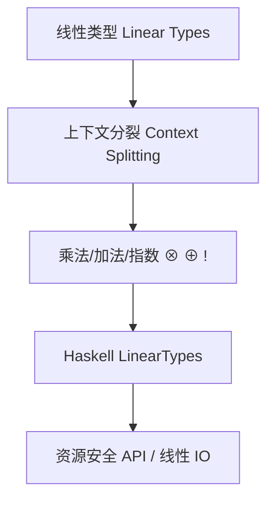

# 线性类型理论（Linear Type Theory）与Haskell/Rust/Lean实践

> 对标 Wikipedia、SEP、nLab 与线性逻辑文献；中英双语；覆盖形式系统、乘法度量（multiplicities）、工程化实践。

## 1. 定义 Definition

- 中文：线性类型理论要求变量（资源）在其作用域内按受控次数使用，典型为“恰好一次”。其动机源自 Girard 的线性逻辑：资源不可随意复制与丢弃。
- English: Linear type theory constrains how many times a variable (resource) may be used within its scope, typically exactly once. It is motivated by Girard’s linear logic: resources cannot be duplicated or discarded arbitrarily.

线性类型通过类型系统追踪资源流向，确保 API 在编译期满足使用纪律，从而实现内存/句柄/能力的安全释放与转移。

## 2. 形式系统 Formal System

### 2.1 线性上下文与分裂 Linear Context and Splitting

- Judgement forms 区分线性与非线性上下文：Γ; Δ ⊢ e : A，其中 Γ 可复制（非线性/仿射），Δ 需精确消费（线性）。
- 上下文分裂（context splitting）约束应用与并行组合时的资源分配。

### 2.2 线性逻辑—类型对应 Linear Logic as Types

- 乘法 Multiplicative: ⊗（tensor）对应并行组合，⅋（par）对应线性函数空间的对偶结构
- 加法 Additive: & 与 ⊕ 对应受限选择与合取
- 指数 Exponentials: !（of course）与 ?（why not）允许从线性世界“逃逸”到可复制/可丢弃的世界

### 2.3 线性函数与多重性 Linear Arrows and Multiplicities

- Haskell 以 a %p -> b 表示多重性为 p 的函数，p=1 表示线性；p=ω 表示常规（可复制）；编译器检查使用次数。
- Preservation/Progress 在标准小步/大步语义中同样成立，且需在代换中维护使用计数的一致性。

## 3. 与相关理论关系 Relations

- 仿射类型（Affine）：允许“至多一次”使用；线性是“恰好一次”的特例
- 依赖/时序类型：可与线性叠加表达资源与时间/状态的不变量
- 范畴/幺半范畴：张量与线性函数空间与对称单闭结构相关

## 4. 历史与发展 History & Development

- 1987 Girard 提出线性逻辑；随后出现线性 λ‑演算与类型系统
- 语言支持：Clean/Linear Lisp（早期思想）、Rust（所有权/借用与线性/仿射亲缘）、Haskell（LinearTypes，GHC 9.x 完善）
- 研究方向：multiplicity polymorphism、线性状态机/协议类型、IO/并行/FFI 资源管控

## 5. Haskell/Rust/Lean 对照 Haskell vs. Rust vs. Lean

- Haskell：LinearTypes（a %1 -> b）、multiplicities、System.IO.Linear、线性容器与线性状态变换
- Rust：ownership/borrowing/lifetimes 实现“独占或可共享只读”的资源纪律，接近仿射/线性范式
- Lean：可在依赖类型下刻画线性结构与定理；以定理方式验证资源使用性质

## 6. Haskell 实践 Haskell Practice

### 6.1 基本用法 Basic Usage

```haskell
{-# LANGUAGE LinearTypes #-}

f :: a %1 -> a
f x = x  -- ok: 恰好一次

dup :: a %1 -> (a, a)
dup x = (x, x)  -- 编译错误：x 被使用两次
```

### 6.2 线性 IO 与文件句柄 Linear IO and Handles

```haskell
{-# LANGUAGE LinearTypes #-}
import System.IO.Linear (withFile, Ur(..))

copyOnce :: FilePath %1 -> FilePath %1 -> Ur ()
copyOnce src dst = withFile src (\h1 -> withFile dst (\h2 ->
  -- 在线性区域内对句柄进行一次性使用
  Ur ()))
```

### 6.3 多重性参数与多态 Multiplicity Polymorphism (概念)

- 概念：允许对使用次数进行抽象，从而编写同时适用于线性与非线性场景的通用库。

## 7. 证明与性质 Proofs and Properties

- Preservation/Progress：与常规类型系统类似，但需对上下文分裂与使用计数进行归纳证明
- 资源正确性：以类型编码“使用次数=1”，构造非法用法不可通过类型检查
- 与仿射比较：仿射允许丢弃，线性要求消费；二者在编译器规则上表现不同

## 8. 工程应用 Engineering Applications

- 内存/句柄/网络连接/锁/事务：静态地保证获取—使用—释放的完整生命周期
- 并发与管道：借助张量与上下文分裂确保无共享可变状态下的安全组合
- FFI 与系统编程：线性封装“不安全能力”，以安全接口暴露

## 9. 结构图 Structure Diagram



## 10. 本地跳转 Local References

- [类型理论基础 Type Theory Foundation](../01-Type-Theory/01-Type-Theory-Foundation.md)
- [仿射类型理论 Affine Type Theory](../03-Affine-Type-Theory/01-Affine-Type-Theory-Foundation.md)
- [时序类型理论 Temporal Type Theory](../04-Temporal-Type-Theory/01-Temporal-Type-Theory-Foundation.md)
- [类型安全 Type Safety](../14-Type-Safety/01-Type-Safety-in-Haskell.md)

## 11. 参考文献 References

- Wikipedia: Linear type；Linear logic（Girard）
- nLab: Linear type theory, Linear logic
- GHC User's Guide; Linear Haskell（LinearTypes, System.IO.Linear）
- Rust Reference（ownership/borrowing）
- Pierce: Types and Programming Languages（资源敏感系统相关章节）
