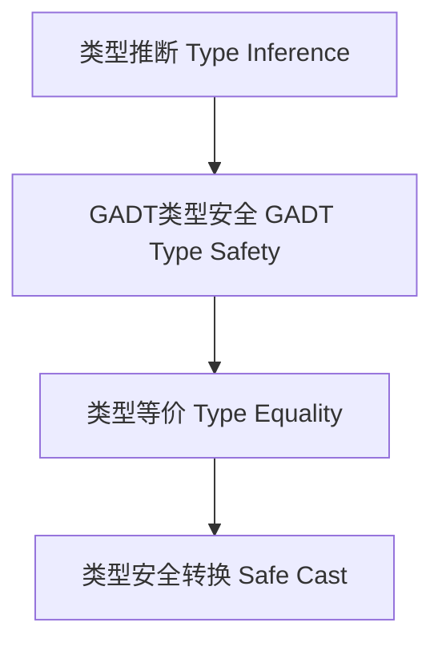

# 01. 类型安全在Haskell中的理论与实践（Type Safety in Haskell）

> **中英双语核心定义 | Bilingual Core Definitions**

## 1.1 类型安全简介（Introduction to Type Safety）

- **定义（Definition）**：
  - **中文**：类型安全是指程序在编译期和运行期不会发生类型错误。Haskell通过强类型系统、类型推断、GADT、类型族等机制实现高度类型安全。
  - **English**: Type safety means that a program will not encounter type errors at compile time or runtime. Haskell achieves high type safety through a strong type system, type inference, GADTs, type families, etc.

- **Wiki风格国际化解释（Wiki-style Explanation）**：
  - 类型安全是Haskell可靠性和抽象能力的基础，广泛用于防止运行时错误、提升代码可维护性和安全性。
  - Type safety is the foundation of Haskell's reliability and abstraction, widely used to prevent runtime errors and improve code maintainability and security.

## 1.2 Haskell中的类型安全语法与语义（Syntax and Semantics of Type Safety in Haskell）

- **类型推断与类型安全**

```haskell
id :: a -> a
id x = x  -- 类型推断保证id只能用于同类型

safeHead :: [a] -> Maybe a
safeHead []    = Nothing
safeHead (x:_) = Just x  -- 避免空列表运行时错误
```

- **GADT与类型安全**

```haskell
data Expr a where
  LitInt  :: Int  -> Expr Int
  LitBool :: Bool -> Expr Bool
  Add     :: Expr Int -> Expr Int -> Expr Int

-- 类型安全的表达式求值
safeEval :: Expr a -> a
safeEval (LitInt n)  = n
safeEval (LitBool b) = b
safeEval (Add e1 e2) = safeEval e1 + safeEval e2
```

- **类型等价与安全转换**

```haskell
data EqProof a b where
  Refl :: EqProof a a

cast :: EqProof a b -> a -> b
cast Refl x = x  -- 只有类型等价时才能安全转换
```

## 1.3 范畴论建模与结构映射（Category-Theoretic Modeling and Mapping）

- **类型安全与范畴论关系**
  - 类型安全可视为范畴中的良定义性（well-definedness）和同构保持。

| 概念 | Haskell实现 | 代码示例 | 中文解释 |
|------|-------------|----------|----------|
| 类型推断 | 类型安全 | `id :: a -> a` | 自动类型检查 |
| GADT | 类型安全表达式 | `data Expr a where ...` | 类型安全分支 |
| 类型等价 | 安全转换 | `cast :: EqProof a b -> a -> b` | 类型安全转换 |

## 1.4 形式化证明与论证（Formal Proofs & Reasoning）

- **类型安全性证明**
  - **中文**：证明类型系统保证所有表达式在编译期类型一致，运行期不会发生类型错误。
  - **English**: Prove that the type system ensures all expressions are type-consistent at compile time and no type errors occur at runtime.

- **GADT与类型安全证明**
  - **中文**：证明GADT模式匹配下的每个分支都类型安全。
  - **English**: Prove that each branch in GADT pattern matching is type safe.

## 1.5 多表征与本地跳转（Multi-representation & Local Reference）

- **类型安全结构图（Type Safety Structure Diagram）**



- **相关主题跳转**：
  - [类型推断与多态 Type Inference and Polymorphism](../06-Type-Inference-and-Polymorphism/01-Type-Inference-and-Polymorphism-in-Haskell.md)
  - [GADT in Haskell](../09-GADT/01-GADT-in-Haskell.md)
  - [类型等价 Type Equality](../13-Type-Equality/01-Type-Equality-in-Haskell.md)

---

> 本文档为类型安全在Haskell中的中英双语、Haskell语义模型与形式化证明规范化输出，适合学术研究与工程实践参考。
