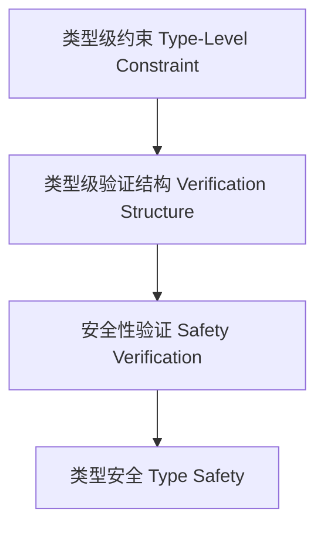

# 01. 类型级验证（Type-Level Verification in Haskell）

## 目录 Table of Contents

- 1.1 类型级验证简介
- 1.2 语法与语义
- 1.3 范畴论建模与结构映射
- 1.4 形式化证明与论证
- 1.5 多表征与本地跳转
- 1.6 历史与发展
- 1.7 Haskell 相关特性
- 1.8 应用
- 1.9 例子
- 1.10 相关理论
- 1.11 参考文献
- 1.12 定义-性质-关系-证明对齐（Skeleton）
- 1.13 课程与行业案例对齐

> **中英双语核心定义 | Bilingual Core Definitions**

## 1.1 类型级验证简介（Introduction to Type-Level Verification）

- **定义（Definition）**：
  - **中文**：类型级验证是指在类型系统层面对程序属性、约束和语义进行静态验证，确保编译期的正确性和安全性。Haskell通过类型族、GADT、类型类等机制支持类型级验证。
  - **English**: Type-level verification refers to statically verifying program properties, constraints, and semantics at the type system level, ensuring correctness and safety at compile time. Haskell supports type-level verification via type families, GADTs, type classes, etc.

- **Wiki风格国际化解释（Wiki-style Explanation）**：
  - 类型级验证是高可靠性、形式化方法和安全编程的基础。
  - Type-level verification is the foundation of high reliability, formal methods, and safe programming.

## 1.2 Haskell中的类型级验证语法与语义（Syntax and Semantics of Type-Level Verification in Haskell）

- **类型级约束与验证**

```haskell
{-# LANGUAGE DataKinds, TypeFamilies, GADTs, TypeOperators #-}

data Nat = Z | S Nat

type family LessThan n m where
  LessThan 'Z     ('S m) = 'True
  LessThan ('S n) ('S m) = LessThan n m
  LessThan n      m      = 'False

data Fin n where
  FZ :: Fin ('S n)
  FS :: Fin n -> Fin ('S n)

-- 验证：Fin n 只能构造小于 n 的自然数
safeIndex :: Fin n -> Vec n a -> a
safeIndex FZ     (VCons x _)  = x
safeIndex (FS k) (VCons _ xs) = safeIndex k xs
```

## 1.3 范畴论建模与结构映射（Category-Theoretic Modeling and Mapping）

- **类型级验证与范畴论关系**
  - 类型级验证可视为范畴中的限制函子与结构约束。

| 概念 | Haskell实现 | 代码示例 | 中文解释 |
|------|-------------|----------|----------|
| 限制 | 类型族 | `LessThan n m` | 类型级约束 |
| 验证结构 | GADT | `Fin n` | 类型级验证结构 |
| 安全索引 | GADT+类型族 | `safeIndex` | 类型安全验证 |

## 1.4 形式化证明与论证（Formal Proofs & Reasoning）

- **类型级约束验证证明**
  - **中文**：证明类型级结构满足约束和语义。
  - **English**: Prove that type-level structures satisfy constraints and semantics.

- **安全性验证能力证明**
  - **中文**：证明类型级验证可防止运行时错误。
  - **English**: Prove that type-level verification can prevent runtime errors.

## 1.5 多表征与本地跳转（Multi-representation & Local Reference）

- **类型级验证结构图（Type-Level Verification Structure Diagram）**



- **相关主题跳转**：
  - [类型级证明 Type-Level Proof](./01-Type-Level-Proof.md)
  - [类型安全 Type Safety](./01-Type-Safety.md)
  - [类型级归纳 Type-Level Induction](./01-Type-Level-Induction.md)

---

## 1.6 历史与发展 History & Development

- **中文**：类型级验证思想起源于类型理论和形式化方法。Haskell自GADT、类型族、DataKinds等特性引入后，成为类型级验证和编译期安全保证的主流平台。GHC不断扩展类型级验证相关特性，如Singletons、TypeLits、Dependent Types等。
- **English**: The idea of type-level verification originates from type theory and formal methods. With the introduction of GADTs, type families, and DataKinds, Haskell has become a mainstream platform for type-level verification and compile-time safety guarantees. GHC has continuously extended type-level verification features, such as Singletons, TypeLits, and Dependent Types.

## 1.7 Haskell 相关特性 Haskell Features

### 经典特性 Classic Features

- 类型族、GADTs、DataKinds、类型级约束、类型安全索引。
- Type families, GADTs, DataKinds, type-level constraints, type-safe indexing.

### 最新特性 Latest Features

- **Singletons**：类型与值的单例化，桥接类型级与值级。
- **TypeLits**：类型级自然数与符号。
- **Dependent Types（依赖类型）**：GHC 9.x实验性支持。
- **GHC 2021/2022**：标准化更多类型级验证相关扩展。

- **English**:
  - Singletons: Singletonization of types and values, bridging type and value levels.
  - TypeLits: Type-level naturals and symbols.
  - Dependent Types: Experimental in GHC 9.x.
  - GHC 2021/2022: Standardizes more type-level verification extensions.

## 1.8 应用 Applications

- **中文**：类型安全DSL、编译期验证、不可变数据结构、泛型编程、形式化验证、类型安全API等。
- **English**: Type-safe DSLs, compile-time verification, immutable data structures, generic programming, formal verification, type-safe APIs, etc.

## 1.9 例子 Examples

```haskell
{-# LANGUAGE DataKinds, TypeFamilies, GADTs, TypeOperators, KindSignatures #-}
data Nat = Z | S Nat
data Vec (n :: Nat) a where
  VNil  :: Vec 'Z a
  VCons :: a -> Vec n a -> Vec ('S n) a

type family LessThan n m where
  LessThan 'Z     ('S m) = 'True
  LessThan ('S n) ('S m) = LessThan n m
  LessThan n      m      = 'False

-- 类型级验证：安全索引
safeIndex :: Fin n -> Vec n a -> a
safeIndex FZ     (VCons x _)  = x
safeIndex (FS k) (VCons _ xs) = safeIndex k xs
```

## 1.10 相关理论 Related Theories

- 类型级编程（Type-level Programming）
- 依赖类型理论（Dependent Type Theory）
- 形式化验证（Formal Verification）
- 类型系统理论（Type System Theory）

## 1.11 参考文献 References

- [Wikipedia: Type-level verification](https://en.wikipedia.org/wiki/Type-level_programming#Verification)
- [GHC User's Guide](https://downloads.haskell.org/ghc/latest/docs/html/users_guide/)
- [Types and Programming Languages, Benjamin C. Pierce]
- [Learn You a Haskell for Great Good!](http://learnyouahaskell.com/)

> 本文档为类型级验证在Haskell中的中英双语、Haskell语义模型与形式化证明规范化输出，适合学术研究与工程实践参考。

## 1.12 定义-性质-关系-证明对齐（Skeleton）

- 定义：类型级约束/验证结构（LessThan、Fin、Vec）。
- 性质：边界安全、不可达状态排除、零运行时错误。
- 关系：与证明/归纳协同，支撑形式化验证。
- 证明：安全索引、约束递归保持性与完备性。

## 1.13 课程与行业案例对齐 Courses & Industry Alignment

- 课程：形式化方法/PL 课程中的静态验证与类型安全。
- 行业：协议栈边界检查、数组越界防护、配置验证。

参考模板：参见 `../Haskell_Rust_Lean/course_case_alignment_template.md`
