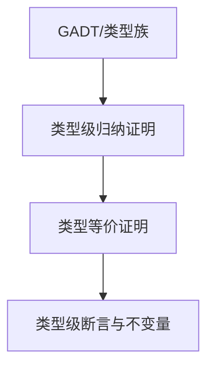

# 01. 类型级证明在Haskell中的理论与实践（Type-Level Proof in Haskell）

> **中英双语核心定义 | Bilingual Core Definitions**

## 1.1 类型级证明简介（Introduction to Type-Level Proof）

- **定义（Definition）**：
  - **中文**：类型级证明是指在类型系统层面对类型属性、约束和不变量进行形式化证明。Haskell通过GADT、类型族、类型等价、依赖类型等机制支持类型级归纳、等价和安全性证明。
  - **English**: Type-level proof refers to the formal verification of type properties, constraints, and invariants at the type system level. Haskell supports type-level induction, equality, and safety proofs via GADTs, type families, type equality, and dependent types.

- **Wiki风格国际化解释（Wiki-style Explanation）**：
  - 类型级证明是类型安全、依赖类型和编译期验证的基础，广泛用于不可变数据结构、类型安全API和形式化方法。
  - Type-level proof is the foundation of type safety, dependent types, and compile-time verification, widely used in immutable data structures, type-safe APIs, and formal methods.

## 1.2 Haskell中的类型级证明语法与语义（Syntax and Semantics of Type-Level Proof in Haskell）

- **GADT与类型级归纳证明**

```haskell
{-# LANGUAGE GADTs, DataKinds, TypeFamilies #-}

data Nat = Z | S Nat

data SNat n where
  SZ :: SNat 'Z
  SS :: SNat n -> SNat ('S n)

-- 证明 n + 0 = n
plusZero :: SNat n -> (n ~ Add n 'Z) => ()
plusZero _ = ()

type family Add n m where
  Add 'Z     m = m
  Add ('S n) m = 'S (Add n m)
```

- **类型等价与证明**

```haskell
data EqProof a b where
  Refl :: EqProof a a

symm :: EqProof a b -> EqProof b a
symm Refl = Refl
```

- **类型级断言与不变量**

```haskell
safeHead :: (n ~ 'S m) => Vec a n -> a
safeHead (VCons x _) = x
```

## 1.3 结构映射与范畴论建模（Mapping and Category-Theoretic Modeling）

| 概念 | Haskell实现 | 代码示例 | 中文解释 |
|------|-------------|----------|----------|
| 类型级归纳 | GADT/类型族 | `plusZero :: SNat n -> (n ~ Add n 'Z) => ()` | 类型级归纳证明 |
| 类型等价证明 | GADT | `EqProof a b` | 类型等价归纳 |
| 类型级断言 | 类型约束 | `(n ~ 'S m) => ...` | 类型级不变量 |

## 1.4 形式化证明与论证（Formal Proofs & Reasoning）

- **类型级归纳证明**
  - **中文**：证明类型级递归定义的性质（如加法结合律、零元律等）。
  - **English**: Prove properties of type-level recursive definitions (e.g., associativity, identity law for addition).

- **类型等价关系证明**
  - **中文**：证明类型等价关系满足自反性、对称性、传递性。
  - **English**: Prove that type equality is reflexive, symmetric, and transitive.

## 1.5 多表征与本地跳转（Multi-representation & Local Reference）

- **类型级证明结构图（Type-Level Proof Structure Diagram）**



- **相关主题跳转**：
  - [类型级编程 Type-Level Programming](../12-Type-Level-Programming/01-Type-Level-Programming-in-Haskell.md)
  - [类型等价 Type Equality](../13-Type-Equality/01-Type-Equality-in-Haskell.md)
  - [依赖类型 Dependent Type](../10-Dependent-Type/01-Dependent-Type-in-Haskell.md)

---

> 本文档为类型级证明在Haskell中的中英双语、Haskell语义模型与形式化证明规范化输出，适合学术研究与工程实践参考。
