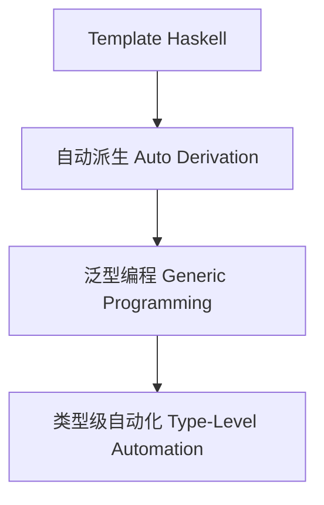

# 01. 类型元编程在Haskell中的理论与实践（Type Metaprogramming in Haskell）

> **中英双语核心定义 | Bilingual Core Definitions**

## 1.1 类型元编程简介（Introduction to Type Metaprogramming）

- **定义（Definition）**：
  - **中文**：类型元编程是指在编译期自动生成、操作和推导类型及类型级代码的技术。Haskell通过Template Haskell、类型族、GADT等机制支持类型级自动化和泛型编程。
  - **English**: Type metaprogramming refers to techniques for automatically generating, manipulating, and inferring types and type-level code at compile time. Haskell supports type-level automation and generic programming via Template Haskell, type families, GADTs, etc.

- **Wiki风格国际化解释（Wiki-style Explanation）**：
  - 类型元编程极大提升了Haskell类型系统的灵活性和自动化能力，广泛用于自动派生、泛型库和类型驱动DSL。
  - Type metaprogramming greatly enhances the flexibility and automation of Haskell's type system, widely used in automatic derivation, generic libraries, and type-driven DSLs.

## 1.2 Haskell中的类型元编程语法与语义（Syntax and Semantics of Type Metaprogramming in Haskell）

- **Template Haskell与类型级自动化**

```haskell
{-# LANGUAGE TemplateHaskell #-}
import Language.Haskell.TH

-- 自动生成数据类型的Show实例
deriveShow :: Name -> Q [Dec]
deriveShow name = [d| instance Show $(conT name) where show _ = "<auto>" |]

-- 使用：$(deriveShow ''MyType)
```

- **类型级泛型编程与自动派生**

```haskell
{-# LANGUAGE DeriveGeneric #-}
import GHC.Generics

data Person = Person { name :: String, age :: Int } deriving (Generic)

-- 泛型库可自动推导序列化、比较等实例
```

- **类型级自动化与类型安全**

```haskell
{-# LANGUAGE TypeFamilies, DataKinds #-}

type family Replicate n a where
  Replicate 'Z     a = '[]
  Replicate ('S n) a = a ': Replicate n a
```

## 1.3 范畴论建模与结构映射（Category-Theoretic Modeling and Mapping）

- **类型元编程与范畴论关系**
  - 类型元编程可视为范畴中的函子自动生成与结构提升。

| 概念 | Haskell实现 | 代码示例 | 中文解释 |
|------|-------------|----------|----------|
| 自动派生 | Template Haskell | `deriveShow` | 自动生成实例 |
| 泛型编程 | GHC.Generics | `deriving (Generic)` | 类型级泛型 |
| 类型级自动化 | 类型族 | `Replicate n a` | 类型级递归 |

## 1.4 形式化证明与论证（Formal Proofs & Reasoning）

- **类型元编程安全性证明**
  - **中文**：证明类型元编程生成的类型和实例在类型系统下是安全的。
  - **English**: Prove that types and instances generated by type metaprogramming are safe under the type system.

- **自动化与泛型能力证明**
  - **中文**：证明类型元编程可自动推导复杂类型关系和泛型实例。
  - **English**: Prove that type metaprogramming can automatically derive complex type relations and generic instances.

## 1.5 多表征与本地跳转（Multi-representation & Local Reference）

- **类型元编程结构图（Type Metaprogramming Structure Diagram）**



- **相关主题跳转**：
  - [类型级编程 Type-Level Programming](./01-Type-Level-Programming.md)
  - [类型安全 Type Safety](./01-Type-Safety.md)
  - [类型级证明 Type-Level Proof](./01-Type-Level-Proof.md)

---

## 1.6 历史与发展 History & Development

- **中文**：类型元编程思想起源于元编程和类型理论。Haskell自Template Haskell、GHC.Generics、类型族等特性引入后，成为类型级自动化和泛型编程的主流平台。GHC不断扩展类型元编程相关特性，如TypeApplications、DerivingVia、Type-level Macros等。
- **English**: The idea of type metaprogramming originates from metaprogramming and type theory. With the introduction of Template Haskell, GHC.Generics, and type families, Haskell has become a mainstream platform for type-level automation and generic programming. GHC has continuously extended type metaprogramming features, such as TypeApplications, DerivingVia, and type-level macros.

## 1.7 Haskell 相关特性 Haskell Features

### 经典特性 Classic Features

- Template Haskell、GHC.Generics、类型族、GADTs、自动派生、类型级递归。
- Template Haskell, GHC.Generics, type families, GADTs, automatic derivation, type-level recursion.

### 最新特性 Latest Features

- **TypeApplications**：类型应用语法，支持显式类型传递。
- **DerivingVia/DerivingStrategies**：灵活的自动派生机制。
- **Type-level Macros/Meta-programming**：类型级宏与元编程。
- **GHC 2021/2022**：标准化更多类型元编程相关扩展。

- **English**:
  - TypeApplications: Syntax for explicit type passing.
  - DerivingVia/DerivingStrategies: Flexible automatic derivation mechanisms.
  - Type-level Macros/Meta-programming: Type-level macros and metaprogramming.
  - GHC 2021/2022: Standardizes more type metaprogramming extensions.

## 1.8 应用 Applications

- **中文**：自动派生、泛型库、类型安全DSL、编译期验证、序列化、不可变数据结构等。
- **English**: Automatic derivation, generic libraries, type-safe DSLs, compile-time verification, serialization, immutable data structures, etc.

## 1.9 例子 Examples

```haskell
{-# LANGUAGE TemplateHaskell, DeriveGeneric, TypeApplications #-}
import Language.Haskell.TH
import GHC.Generics

-- 自动生成Show实例
$(deriveShow ''MyType)

data Person = Person { name :: String, age :: Int } deriving (Generic)

-- 使用TypeApplications进行类型安全操作
typeName :: forall a. Typeable a => String
typeName = show (typeRep @a)
```

## 1.10 相关理论 Related Theories

- 类型级编程（Type-level Programming）
- 泛型编程（Generic Programming）
- 元编程理论（Metaprogramming Theory）
- 形式化验证（Formal Verification）

## 1.11 参考文献 References

- [Wikipedia: Metaprogramming](https://en.wikipedia.org/wiki/Metaprogramming)
- [GHC User's Guide](https://downloads.haskell.org/ghc/latest/docs/html/users_guide/)
- [Types and Programming Languages, Benjamin C. Pierce]
- [Learn You a Haskell for Great Good!](http://learnyouahaskell.com/)

> 本文档为类型元编程在Haskell中的中英双语、Haskell语义模型与形式化证明规范化输出，适合学术研究与工程实践参考。
