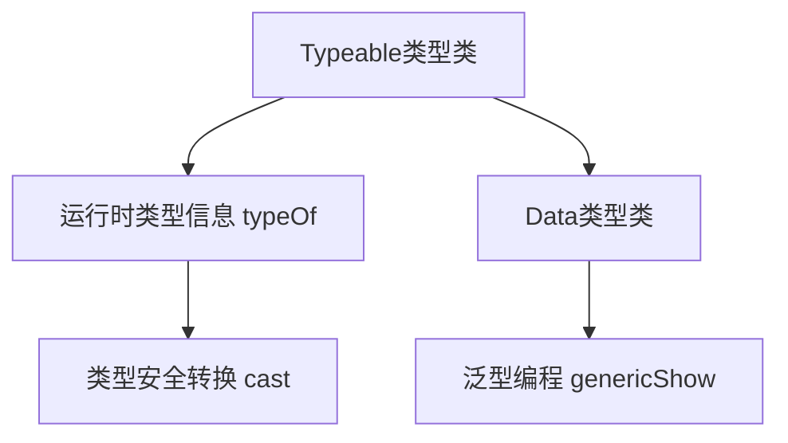

# 01. 类型反射在Haskell中的理论与实践（Type Reflection in Haskell）

## 目录 Table of Contents

- 1.1 类型反射简介
- 1.2 语法与语义
- 1.3 范畴论建模与结构映射
- 1.4 形式化证明与论证
- 1.5 多表征与本地跳转
- 1.6 历史与发展
- 1.7 Haskell 相关特性
- 1.8 应用
- 1.9 例子
- 1.10 相关理论
- 1.11 参考文献

> **中英双语核心定义 | Bilingual Core Definitions**

## 1.1 类型反射简介（Introduction to Type Reflection）

- **定义（Definition）**：
  - **中文**：类型反射是指在运行时获取和操作类型信息的能力。Haskell通过Typeable、Data等类型类支持类型反射，实现类型安全的运行时类型检查和泛型编程。
  - **English**: Type reflection refers to the ability to obtain and manipulate type information at runtime. Haskell supports type reflection via the Typeable and Data type classes, enabling type-safe runtime type checks and generic programming.

- **Wiki风格国际化解释（Wiki-style Explanation）**：
  - 类型反射是Haskell泛型编程和类型安全运行时操作的基础，广泛用于序列化、泛型算法和类型驱动的设计。
  - Type reflection is the foundation of Haskell's generic programming and type-safe runtime operations, widely used in serialization, generic algorithms, and type-driven design.

## 1.2 Haskell中的类型反射语法与语义（Syntax and Semantics of Type Reflection in Haskell）

- **Typeable类型类与运行时类型信息**

```haskell
{-# LANGUAGE DeriveDataTypeable #-}
import Data.Typeable

data MyType = MyCon Int deriving (Typeable)

showType :: Typeable a => a -> String
showType x = show (typeOf x)
```

- **Data类型类与泛型编程**

```haskell
import Data.Data

data Tree a = Leaf a | Node (Tree a) (Tree a) deriving (Data, Typeable)

genericShow :: (Data a) => a -> String
genericShow = show . toConstr
```

- **类型反射与安全类型转换**

```haskell
import Data.Typeable

castMaybe :: (Typeable a, Typeable b) => a -> Maybe b
castMaybe = cast
```

## 1.3 范畴论建模与结构映射（Category-Theoretic Modeling and Mapping）

- **类型反射与范畴论关系**
  - 类型反射可视为范畴中的对象标识与同构检测。

| 概念 | Haskell实现 | 代码示例 | 中文解释 |
|------|-------------|----------|----------|
| 类型反射 | Typeable/Data | `typeOf x` | 运行时类型信息 |
| 泛型编程 | Data类型类 | `toConstr` | 类型驱动操作 |
| 类型安全转换 | cast | `cast x` | 类型安全运行时转换 |

## 1.4 形式化证明与论证（Formal Proofs & Reasoning）

- **类型反射安全性证明**
  - **中文**：证明类型反射下的类型转换和操作在类型系统约束下是安全的。
  - **English**: Prove that type conversions and operations under type reflection are safe under the type system constraints.

- **类型信息一致性证明**
  - **中文**：证明Typeable和Data类型类提供的类型信息与编译期类型一致。
  - **English**: Prove that the type information provided by Typeable and Data is consistent with compile-time types.

## 1.5 多表征与本地跳转（Multi-representation & Local Reference）

- **类型反射结构图（Type Reflection Structure Diagram）**



- **相关主题跳转**：
  - [类型安全 Type Safety](../14-Type-Safety/01-Type-Safety-in-Haskell.md)
  - [类型级编程 Type-Level Programming](../12-Type-Level-Programming/01-Type-Level-Programming-in-Haskell.md)
  - [GADT in Haskell](../09-GADT/01-GADT-in-Haskell.md)

---

## 1.6 历史与发展 History & Development

- **中文**：类型反射理论起源于面向对象和泛型编程。Haskell自Typeable、Data等类型类引入后，成为类型安全反射和泛型编程的主流平台。GHC不断扩展类型反射相关特性，如TypeRep、TypeApplications、Typeable的多态种类支持等。
- **English**: Type reflection theory originated from object-oriented and generic programming. With the introduction of Typeable and Data type classes, Haskell has become a mainstream platform for type-safe reflection and generic programming. GHC has continuously extended type reflection features, such as TypeRep, TypeApplications, and polymorphic kind support for Typeable.

## 1.7 Haskell 相关特性 Haskell Features

### 经典特性 Classic Features

- Typeable类型类、Data类型类、运行时类型信息、类型安全转换、泛型编程。
- Typeable type class, Data type class, runtime type information, type-safe conversion, generic programming.

### 最新特性 Latest Features

- **TypeRep**：类型级反射与类型表示。
- **TypeApplications**：类型应用语法，支持显式类型传递。
- **PolyKinds/Typeable多态种类**：Typeable支持多种类类型。
- **GHC 2021/2022**：标准化更多类型反射相关扩展。

- **English**:
  - TypeRep: Type-level reflection and type representation.
  - TypeApplications: Syntax for explicit type passing.
  - PolyKinds/Typeable polymorphic kinds: Typeable supports polymorphic kinds.
  - GHC 2021/2022: Standardizes more type reflection extensions.

## 1.8 应用 Applications

- **中文**：泛型编程、序列化、类型安全容器、运行时类型检查、DSL、类型驱动设计等。
- **English**: Generic programming, serialization, type-safe containers, runtime type checking, DSLs, type-driven design, etc.

## 1.9 例子 Examples

```haskell
{-# LANGUAGE TypeApplications #-}
import Data.Typeable

showType' :: forall a. Typeable a => a -> String
showType' _ = show (typeRep @a)

-- 类型安全容器
import Data.Dynamic

data Box = forall a. Typeable a => Box a

unbox :: Typeable a => Box -> Maybe a
unbox (Box x) = cast x
```

## 1.10 相关理论 Related Theories

- 类型系统理论（Type System Theory）
- 泛型编程（Generic Programming）
- 运行时反射（Runtime Reflection）
- 形式化验证（Formal Verification）

## 1.11 参考文献 References

- [Wikipedia: Type reflection](https://en.wikipedia.org/wiki/Type_reflection)
- [GHC User's Guide](https://downloads.haskell.org/ghc/latest/docs/html/users_guide/)
- [Types and Programming Languages, Benjamin C. Pierce]
- [Learn You a Haskell for Great Good!](http://learnyouahaskell.com/)

> 本文档为类型反射在Haskell中的中英双语、Haskell语义模型与形式化证明规范化输出，适合学术研究与工程实践参考。
