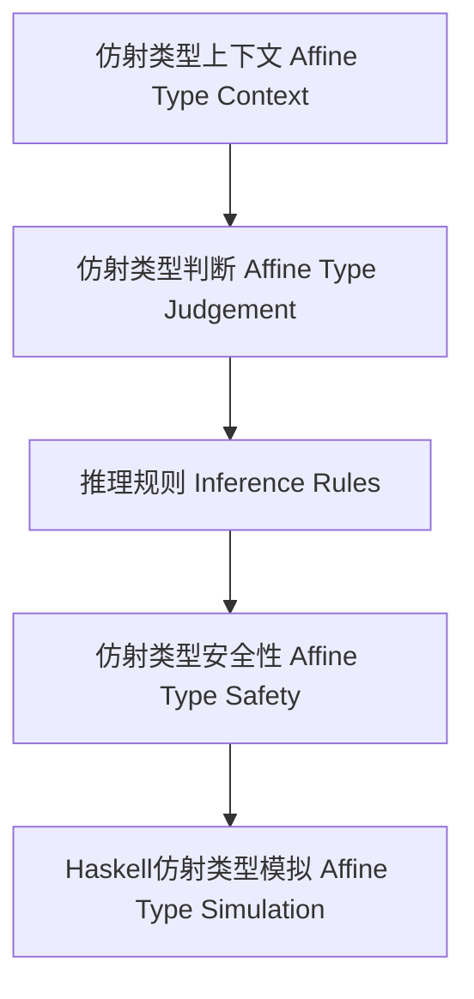

# 仿射类型理论与Haskell实现（Affine Type Theory in Haskell）

## 目录 Table of Contents

- 定义 Definition
- 仿射类型系统核心概念 Core Concepts
- Haskell实现与现代语言对比 Haskell & Modern Language Comparison
- 结构图 Structure Diagram
- 形式化论证与证明 Formal Reasoning & Proofs
- 工程应用 Engineering Application
- 本地跳转 Local References
- 历史与发展 History & Development
- Haskell 相关特性 Haskell Features
- 应用 Applications
- 例子 Examples
- 相关理论 Related Theories
- 参考文献 References

## 定义 Definition

- **中文**：仿射类型理论是一种类型系统，要求每个变量最多使用一次（可以不用），广泛用于内存安全、资源管理和并发场景。Haskell可通过类型类、newtype等模拟仿射类型。
- **English**: Affine type theory is a type system that requires each variable to be used at most once (possibly zero times). Haskell can simulate affine types via type classes, newtype, etc., widely used for memory safety, resource management, and concurrency.

## 仿射类型系统核心概念 Core Concepts

- **仿射类型上下文（Affine Type Context）**：变量最多用一次。
- **仿射类型构造（Affine Type Constructors）**：仿射函数类型、加法积类型、加法类型等。
- **仿射推理规则（Inference Rules）**：变量、仿射抽象、仿射应用、弱化。

## Haskell实现与现代语言对比 Haskell & Modern Language Comparison

- Haskell：无原生仿射类型，可用newtype、类型类模拟。
- Rust：所有权与借用系统，严格实现仿射类型约束。
- OCaml/F#：无原生仿射类型。

### Haskell 仿射类型模拟示例

```haskell
newtype Affine a = Affine { useOnce :: Maybe a }

consume :: Affine a -> (a -> b) -> Maybe b
consume (Affine (Just x)) f = Just (f x)
consume _ _ = Nothing
```

## 结构图 Structure Diagram



## 形式化论证与证明 Formal Reasoning & Proofs

- **仿射类型保持性（Preservation）**：归约后仿射类型不变。
- **进展性（Progress）**：类型正确的表达式要么是值，要么可归约。
- **资源唯一性证明**：每个仿射变量在作用域内最多用一次。

### 证明示例 Proof Example

- 对每个推理规则，证明仿射类型在归约后保持不变。
- 对每个语法构造，证明要么是值，要么可以继续归约。

## 工程应用 Engineering Application

- 内存安全、资源管理、并发、Rust所有权模型、Haskell资源安全抽象。

## 本地跳转 Local References

- [类型理论基础 Type Theory Foundation](../01-Type-Theory/01-Type-Theory-Foundation.md)
- [线性类型理论 Linear Type Theory](../02-Linear-Type-Theory/01-Linear-Type-Theory-Foundation.md)
- [时序类型理论 Temporal Type Theory](../04-Temporal-Type-Theory/01-Temporal-Type-Theory-Foundation.md)
- [类型安全 Type Safety](../14-Type-Safety/01-Type-Safety-in-Haskell.md)

---

## 历史与发展 History & Development

- **中文**：仿射类型理论起源于线性逻辑的推广，允许变量最多使用一次（可不使用），广泛应用于内存安全、资源管理和并发。Haskell通过类型类和newtype等机制可模拟仿射类型思想，Rust则在所有权系统中严格实现。
- **English**: Affine type theory originated as a generalization of linear logic, allowing variables to be used at most once (possibly zero times). It is widely used for memory safety, resource management, and concurrency. Haskell can simulate affine types via type classes and newtype, while Rust strictly enforces them in its ownership system.

## Haskell 相关特性 Haskell Features

### 经典特性 Classic Features

- 类型类、newtype、不可变数据结构、资源安全抽象等。
- Type classes, newtype, immutable data structures, resource-safe abstractions, etc.

### 最新特性 Latest Features

- **Linear Types（线性类型）**：GHC 8.12+支持，变量必须恰好使用一次，仿射类型可通过约束松弛模拟。
- **Type-level Programming**：类型级资源管理与约束。
- **GHC 2021/2022**：标准化类型系统扩展。

- **English**:
  - Linear Types: Supported since GHC 8.12+, variables must be used exactly once; affine types can be simulated by relaxing constraints.
  - Type-level programming: Type-level resource management and constraints.
  - GHC 2021/2022: Standardizes type system extensions.

## 应用 Applications

- **中文**：内存安全API、资源管理、并发、不可变数据结构、所有权建模等。
- **English**: Memory-safe APIs, resource management, concurrency, immutable data structures, ownership modeling, etc.

## 例子 Examples

```haskell
newtype Affine a = Affine { useOnce :: Maybe a }

consume :: Affine a -> (a -> b) -> Maybe b
consume (Affine (Just x)) f = Just (f x)
consume _ _ = Nothing
```

## 相关理论 Related Theories

- 线性类型理论（Linear Type Theory）
- 资源敏感类型系统（Resource-sensitive Type Systems）
- 不可变数据结构（Immutable Data Structures）
- 并发与分布式系统（Concurrency and Distributed Systems）

## 参考文献 References

- [Wikipedia: Affine Type](https://en.wikipedia.org/wiki/Affine_type)
- [GHC User's Guide](https://downloads.haskell.org/ghc/latest/docs/html/users_guide/)
- [Rust Ownership](https://doc.rust-lang.org/book/ch04-01-what-is-ownership.html)
- [Learn You a Haskell for Great Good!](http://learnyouahaskell.com/)
