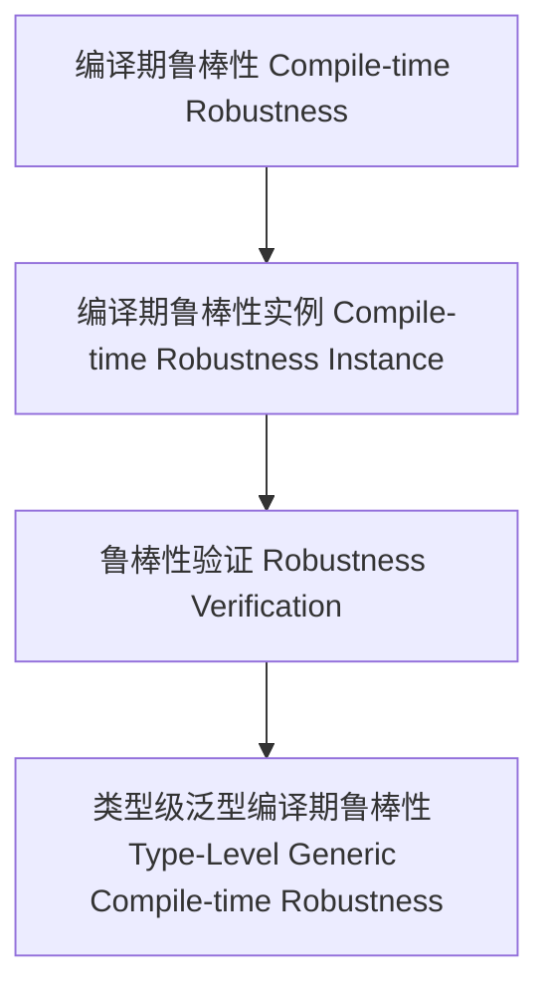

# 01. 类型级泛型编译期鲁棒性（Type-Level Generic Compile-time Robustness in Haskell）

> **中英双语核心定义 | Bilingual Core Definitions**

## 1.1 类型级泛型编译期鲁棒性简介（Introduction to Type-Level Generic Compile-time Robustness）

- **定义（Definition）**：
  - **中文**：类型级泛型编译期鲁棒性是指在类型系统层面，通过泛型机制在编译期确保任意类型结构的语义在推导、验证和自动化过程中具有鲁棒性和容错性。Haskell通过类型族、GADT、类型类等机制支持类型级泛型编译期鲁棒性。
  - **English**: Type-level generic compile-time robustness refers to ensuring the robustness and fault tolerance of the semantics of arbitrary type structures during inference, verification, and automation at compile time via generic mechanisms at the type system level. Haskell supports type-level generic compile-time robustness via type families, GADTs, type classes, etc.

- **Wiki风格国际化解释（Wiki-style Explanation）**：
  - 类型级泛型编译期鲁棒性是类型安全、可靠性和自动化语义推理的基础。
  - Type-level generic compile-time robustness is the foundation of type safety, reliability, and automated semantic reasoning.

## 1.2 Haskell中的类型级泛型编译期鲁棒性语法与语义（Syntax and Semantics of Type-Level Generic Compile-time Robustness in Haskell）

- **类型级鲁棒性结构与泛型语义推导**

```haskell
{-# LANGUAGE TypeFamilies, DataKinds, GADTs #-}

data Nat = Z | S Nat

type family CompiletimeRobustSemantics (n :: Nat) :: Bool where
  CompiletimeRobustSemantics 'Z = 'True
  CompiletimeRobustSemantics ('S n) = CompiletimeRobustSemantics n

-- 泛型编译期鲁棒性：递归验证类型级自然数语义的鲁棒性
```

- **类型类与泛型编译期鲁棒性实例**

```haskell
class GCompiletimeSemanticRobust f where
  gcompiletimeSemanticRobust :: f a -> Bool

instance GCompiletimeSemanticRobust Maybe where
  gcompiletimeSemanticRobust Nothing  = True
  gcompiletimeSemanticRobust (Just _) = True
```

## 1.3 范畴论建模与结构映射（Category-Theoretic Modeling and Mapping）

- **类型级泛型编译期鲁棒性与范畴论关系**
  - 类型级泛型编译期鲁棒性可视为范畴中的对象、函子与鲁棒性验证。

| 概念 | Haskell实现 | 代码示例 | 中文解释 |
|------|-------------|----------|----------|
| 编译期鲁棒性 | 类型族 | `CompiletimeRobustSemantics n` | 编译期鲁棒性 |
| 编译期鲁棒性实例 | 类型类 | `GCompiletimeSemanticRobust` | 编译期鲁棒性实例 |
| 鲁棒性验证 | 类型族+类型类 | `gcompiletimeSemanticRobust` | 鲁棒性验证 |

## 1.4 形式化证明与论证（Formal Proofs & Reasoning）

- **编译期鲁棒性证明**
  - **中文**：证明类型级泛型编译期鲁棒性可确保复杂类型结构语义的健壮性。
  - **English**: Prove that type-level generic compile-time robustness ensures the robustness of the semantics of complex type structures.

- **自动化鲁棒性能力证明**
  - **中文**：证明类型级泛型编译期鲁棒性可自动保证复杂类型结构语义的鲁棒性。
  - **English**: Prove that type-level generic compile-time robustness can automatically ensure the robustness of the semantics of complex type structures.

## 1.5 多表征与本地跳转（Multi-representation & Local Reference）

- **类型级泛型编译期鲁棒性结构图（Type-Level Generic Compile-time Robustness Structure Diagram）**



- **相关主题跳转**：
  - [类型级泛型编译期语义验证 Type-Level Generic Compile-time Semantic Validation](./01-Type-Level-Generic-Compiletime-Semantic-Validation.md)
  - [类型级泛型编译期一致性 Type-Level Generic Compile-time Consistency](./01-Type-Level-Generic-Compiletime-Consistency.md)
  - [类型安全 Type Safety](./01-Type-Safety.md)
