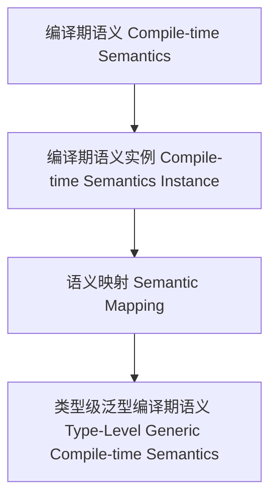

# 01. 类型级泛型编译期语义（Type-Level Generic Compile-time Semantics in Haskell）

> **中英双语核心定义 | Bilingual Core Definitions**

## 1.1 类型级泛型编译期语义简介（Introduction to Type-Level Generic Compile-time Semantics）

- **定义（Definition）**：
  - **中文**：类型级泛型编译期语义是指在类型系统层面，通过泛型机制在编译期对任意类型结构的语义进行建模、推导和验证。Haskell通过类型族、GADT、类型类等机制支持类型级泛型编译期语义。
  - **English**: Type-level generic compile-time semantics refers to modeling, inferring, and verifying the semantics of arbitrary type structures at compile time via generic mechanisms at the type system level. Haskell supports type-level generic compile-time semantics via type families, GADTs, type classes, etc.

- **Wiki风格国际化解释（Wiki-style Explanation）**：
  - 类型级泛型编译期语义是类型安全、自动化和形式化语义分析的基础。
  - Type-level generic compile-time semantics is the foundation of type safety, automation, and formal semantic analysis.

## 1.2 Haskell中的类型级泛型编译期语义语法与语义（Syntax and Semantics of Type-Level Generic Compile-time Semantics in Haskell）

- **类型级语义结构与泛型建模**

```haskell
{-# LANGUAGE TypeFamilies, DataKinds, GADTs #-}

data Nat = Z | S Nat

type family CompiletimeSemantics (n :: Nat) :: String where
  CompiletimeSemantics 'Z = "Zero"
  CompiletimeSemantics ('S n) = "Succ(" ++ CompiletimeSemantics n ++ ")"

-- 泛型编译期语义：类型级自然数的编译期语义解释
```

- **类型类与泛型编译期语义实例**

```haskell
class GCompiletimeSemantics f where
  gcompiletimeSemantics :: f a -> String

instance GCompiletimeSemantics Maybe where
  gcompiletimeSemantics Nothing  = "Nothing"
  gcompiletimeSemantics (Just _) = "Just value"
```

## 1.3 范畴论建模与结构映射（Category-Theoretic Modeling and Mapping）

- **类型级泛型编译期语义与范畴论关系**
  - 类型级泛型编译期语义可视为范畴中的对象、函子与语义映射。

| 概念 | Haskell实现 | 代码示例 | 中文解释 |
|------|-------------|----------|----------|
| 编译期语义 | 类型族 | `CompiletimeSemantics n` | 编译期语义 |
| 编译期语义实例 | 类型类 | `GCompiletimeSemantics` | 编译期语义实例 |
| 语义映射 | 类型族+类型类 | `gcompiletimeSemantics` | 语义映射 |

## 1.4 形式化证明与论证（Formal Proofs & Reasoning）

- **编译期语义一致性证明**
  - **中文**：证明类型级泛型编译期语义与类型系统和领域语义一致。
  - **English**: Prove that type-level generic compile-time semantics is consistent with the type system and domain semantics.

- **自动化语义推导能力证明**
  - **中文**：证明类型级泛型编译期语义可自动推导复杂类型结构的语义。
  - **English**: Prove that type-level generic compile-time semantics can automatically infer the semantics of complex type structures.

## 1.5 多表征与本地跳转（Multi-representation & Local Reference）

- **类型级泛型编译期语义结构图（Type-Level Generic Compile-time Semantics Structure Diagram）**



- **相关主题跳转**：
  - [类型级泛型编译期一致性 Type-Level Generic Compile-time Consistency](./01-Type-Level-Generic-Compiletime-Consistency.md)
  - [类型级泛型语义 Type-Level Generic Semantics](./01-Type-Level-Generic-Semantics.md)
  - [类型安全 Type Safety](./01-Type-Safety.md)
