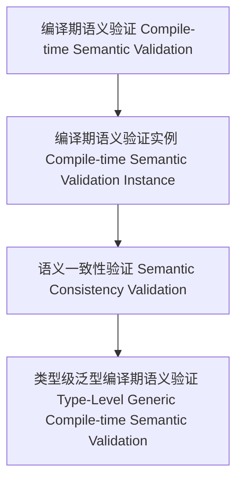

# 01. 类型级泛型编译期语义验证（Type-Level Generic Compile-time Semantic Validation in Haskell）

> **中英双语核心定义 | Bilingual Core Definitions**

## 1.1 类型级泛型编译期语义验证简介（Introduction to Type-Level Generic Compile-time Semantic Validation）

- **定义（Definition）**：
  - **中文**：类型级泛型编译期语义验证是指在类型系统层面，通过泛型机制在编译期对任意类型结构的语义进行验证和一致性检查。Haskell通过类型族、GADT、类型类等机制支持类型级泛型编译期语义验证。
  - **English**: Type-level generic compile-time semantic validation refers to validating and checking the consistency of the semantics of arbitrary type structures at compile time via generic mechanisms at the type system level. Haskell supports type-level generic compile-time semantic validation via type families, GADTs, type classes, etc.

- **Wiki风格国际化解释（Wiki-style Explanation）**：
  - 类型级泛型编译期语义验证是类型安全、自动化和形式化语义分析的基础。
  - Type-level generic compile-time semantic validation is the foundation of type safety, automation, and formal semantic analysis.

## 1.2 Haskell中的类型级泛型编译期语义验证语法与语义（Syntax and Semantics of Type-Level Generic Compile-time Semantic Validation in Haskell）

- **类型级语义验证结构与泛型一致性**

```haskell
{-# LANGUAGE TypeFamilies, DataKinds, GADTs #-}

data Nat = Z | S Nat

type family CompiletimeIsValidSemantics (n :: Nat) :: Bool where
  CompiletimeIsValidSemantics 'Z = 'True
  CompiletimeIsValidSemantics ('S n) = CompiletimeIsValidSemantics n

-- 泛型编译期语义验证：递归验证类型级自然数的语义有效性
```

- **类型类与泛型编译期语义验证实例**

```haskell
class GCompiletimeSemanticValidate f where
  gcompiletimeSemanticValidate :: f a -> Bool

instance GCompiletimeSemanticValidate Maybe where
  gcompiletimeSemanticValidate Nothing  = True
  gcompiletimeSemanticValidate (Just _) = True
```

## 1.3 范畴论建模与结构映射（Category-Theoretic Modeling and Mapping）

- **类型级泛型编译期语义验证与范畴论关系**
  - 类型级泛型编译期语义验证可视为范畴中的对象、函子与语义一致性验证。

| 概念 | Haskell实现 | 代码示例 | 中文解释 |
|------|-------------|----------|----------|
| 编译期语义验证 | 类型族 | `CompiletimeIsValidSemantics n` | 编译期语义验证 |
| 编译期语义验证实例 | 类型类 | `GCompiletimeSemanticValidate` | 编译期语义验证实例 |
| 语义一致性验证 | 类型族+类型类 | `gcompiletimeSemanticValidate` | 语义一致性验证 |

## 1.4 形式化证明与论证（Formal Proofs & Reasoning）

- **编译期语义验证一致性证明**
  - **中文**：证明类型级泛型编译期语义验证与类型系统和领域语义一致。
  - **English**: Prove that type-level generic compile-time semantic validation is consistent with the type system and domain semantics.

- **自动化语义验证能力证明**
  - **中文**：证明类型级泛型编译期语义验证可自动验证复杂类型结构的语义。
  - **English**: Prove that type-level generic compile-time semantic validation can automatically validate the semantics of complex type structures.

## 1.5 多表征与本地跳转（Multi-representation & Local Reference）

- **类型级泛型编译期语义验证结构图（Type-Level Generic Compile-time Semantic Validation Structure Diagram）**



- **相关主题跳转**：
  - [类型级泛型编译期语义 Type-Level Generic Compile-time Semantics](./01-Type-Level-Generic-Compiletime-Semantics.md)
  - [类型级泛型编译期一致性 Type-Level Generic Compile-time Consistency](./01-Type-Level-Generic-Compiletime-Consistency.md)
  - [类型安全 Type Safety](./01-Type-Safety.md)
