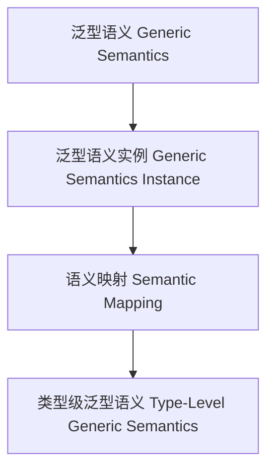

# 01. 类型级泛型语义（Type-Level Generic Semantics in Haskell）

> **中英双语核心定义 | Bilingual Core Definitions**

## 1.1 类型级泛型语义简介（Introduction to Type-Level Generic Semantics）

- **定义（Definition）**：
  - **中文**：类型级泛型语义是指在类型系统层面，通过泛型机制对任意类型结构的语义进行建模、推导和验证。Haskell通过类型族、GADT、类型类等机制支持类型级泛型语义。
  - **English**: Type-level generic semantics refers to modeling, inferring, and verifying the semantics of arbitrary type structures at the type system level via generic mechanisms. Haskell supports type-level generic semantics via type families, GADTs, type classes, etc.

- **Wiki风格国际化解释（Wiki-style Explanation）**：
  - 类型级泛型语义是类型安全、自动化和形式化语义分析的基础。
  - Type-level generic semantics is the foundation of type safety, automation, and formal semantic analysis.

## 1.2 Haskell中的类型级泛型语义语法与语义（Syntax and Semantics of Type-Level Generic Semantics in Haskell）

- **类型级语义结构与泛型建模**

```haskell
{-# LANGUAGE TypeFamilies, DataKinds, GADTs #-}

data Nat = Z | S Nat

type family Semantics (n :: Nat) :: String where
  Semantics 'Z = "Zero"
  Semantics ('S n) = "Succ(" ++ Semantics n ++ ")"

-- 泛型语义：类型级自然数的语义解释
```

- **类型类与泛型语义实例**

```haskell
class GSemantics f where
  gsemantics :: f a -> String

instance GSemantics Maybe where
  gsemantics Nothing  = "Nothing"
  gsemantics (Just _) = "Just value"
```

## 1.3 范畴论建模与结构映射（Category-Theoretic Modeling and Mapping）

- **类型级泛型语义与范畴论关系**
  - 类型级泛型语义可视为范畴中的对象、函子与语义映射。

| 概念 | Haskell实现 | 代码示例 | 中文解释 |
|------|-------------|----------|----------|
| 泛型语义 | 类型族 | `Semantics n` | 泛型语义 |
| 泛型语义实例 | 类型类 | `GSemantics` | 泛型语义实例 |
| 语义映射 | 类型族+类型类 | `gsemantics` | 语义映射 |

## 1.4 形式化证明与论证（Formal Proofs & Reasoning）

- **泛型语义一致性证明**
  - **中文**：证明类型级泛型语义与类型系统和领域语义一致。
  - **English**: Prove that type-level generic semantics is consistent with the type system and domain semantics.

- **自动化语义推导能力证明**
  - **中文**：证明类型级泛型语义可自动推导复杂类型结构的语义。
  - **English**: Prove that type-level generic semantics can automatically infer the semantics of complex type structures.

## 1.5 多表征与本地跳转（Multi-representation & Local Reference）

- **类型级泛型语义结构图（Type-Level Generic Semantics Structure Diagram）**



- **相关主题跳转**：
  - [类型级泛型一致性 Type-Level Generic Consistency](./01-Type-Level-Generic-Consistency.md)
  - [类型级泛型编程 Type-Level Generic Programming](./01-Type-Level-Generic-Programming.md)
  - [类型安全 Type Safety](./01-Type-Safety.md)
