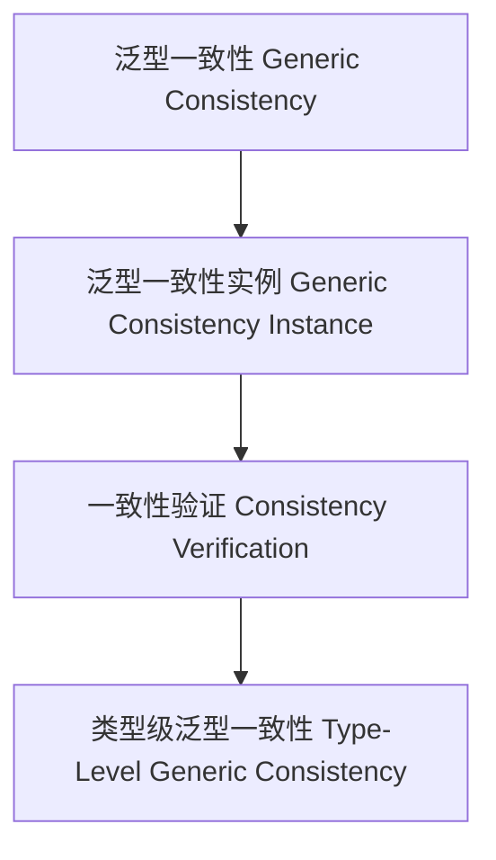

# 01. 类型级泛型一致性（Type-Level Generic Consistency in Haskell）

> **中英双语核心定义 | Bilingual Core Definitions**

## 1.1 类型级泛型一致性简介（Introduction to Type-Level Generic Consistency）

- **定义（Definition）**：
  - **中文**：类型级泛型一致性是指在类型系统层面，通过泛型机制确保所有类型结构和属性在推导、验证和自动化过程中保持一致。Haskell通过类型族、GADT、类型类等机制支持类型级泛型一致性。
  - **English**: Type-level generic consistency refers to ensuring that all type structures and properties remain consistent during inference, verification, and automation at the type system level via generic mechanisms. Haskell supports type-level generic consistency via type families, GADTs, type classes, etc.

- **Wiki风格国际化解释（Wiki-style Explanation）**：
  - 类型级泛型一致性是类型安全、可靠性和自动化推理的基础。
  - Type-level generic consistency is the foundation of type safety, reliability, and automated reasoning.

## 1.2 Haskell中的类型级泛型一致性语法与语义（Syntax and Semantics of Type-Level Generic Consistency in Haskell）

- **类型级一致性结构与泛型推导**

```haskell
{-# LANGUAGE TypeFamilies, DataKinds, GADTs #-}

data Nat = Z | S Nat

type family IsConsistent (xs :: [Nat]) :: Bool where
  IsConsistent '[] = 'True
  IsConsistent (x ': xs) = IsConsistentOne x && IsConsistent xs

-- 伪代码：IsConsistentOne 可定义为类型级谓词，判断某类型推导是否一致
```

- **类型类与泛型一致性实例**

```haskell
class GConsistent f where
  gconsistent :: f a -> Bool

instance GConsistent Maybe where
  gconsistent Nothing  = True
  gconsistent (Just _) = True
```

## 1.3 范畴论建模与结构映射（Category-Theoretic Modeling and Mapping）

- **类型级泛型一致性与范畴论关系**
  - 类型级泛型一致性可视为范畴中的对象、函子与一致性验证。

| 概念 | Haskell实现 | 代码示例 | 中文解释 |
|------|-------------|----------|----------|
| 泛型一致性 | 类型族 | `IsConsistent xs` | 泛型一致性 |
| 泛型一致性实例 | 类型类 | `GConsistent` | 泛型一致性实例 |
| 一致性验证 | 类型族+类型类 | `gconsistent` | 一致性验证 |

## 1.4 形式化证明与论证（Formal Proofs & Reasoning）

- **泛型一致性证明**
  - **中文**：证明类型级泛型一致性能确保所有类型结构推导和验证过程一致。
  - **English**: Prove that type-level generic consistency ensures all type structure inference and verification processes are consistent.

- **自动化一致性能力证明**
  - **中文**：证明类型级泛型一致性可自动保证复杂类型结构推导和验证的一致性。
  - **English**: Prove that type-level generic consistency can automatically ensure the consistency of inference and verification for complex type structures.

## 1.5 多表征与本地跳转（Multi-representation & Local Reference）

- **类型级泛型一致性结构图（Type-Level Generic Consistency Structure Diagram）**



- **相关主题跳转**：
  - [类型级泛型验证 Type-Level Generic Verification](./01-Type-Level-Generic-Verification.md)
  - [类型级泛型编程 Type-Level Generic Programming](./01-Type-Level-Generic-Programming.md)
  - [类型安全 Type Safety](./01-Type-Safety.md)
