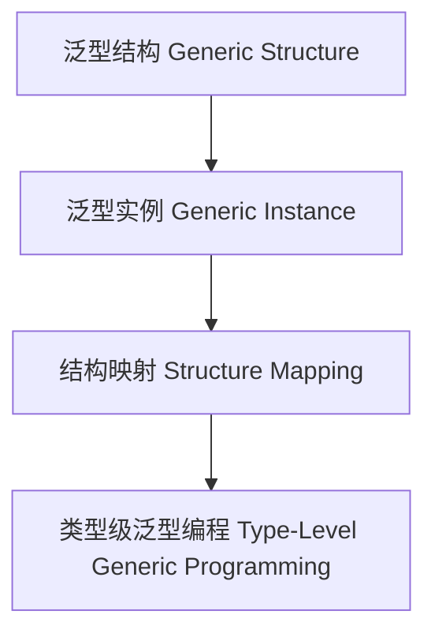

# 01. 类型级泛型编程（Type-Level Generic Programming in Haskell）

> **中英双语核心定义 | Bilingual Core Definitions**

## 1.1 类型级泛型编程简介（Introduction to Type-Level Generic Programming）

- **定义（Definition）**：
  - **中文**：类型级泛型编程是指在类型系统层面，通过抽象和通用机制对任意类型结构进行编程和推导。Haskell通过类型族、GADT、类型类等机制支持类型级泛型编程。
  - **English**: Type-level generic programming refers to programming and inference over arbitrary type structures at the type system level via abstraction and generic mechanisms. Haskell supports type-level generic programming via type families, GADTs, type classes, etc.

- **Wiki风格国际化解释（Wiki-style Explanation）**：
  - 类型级泛型编程是类型级自动化、代码复用和高阶抽象的基础。
  - Type-level generic programming is the foundation of type-level automation, code reuse, and higher-order abstraction.

## 1.2 Haskell中的类型级泛型编程语法与语义（Syntax and Semantics of Type-Level Generic Programming in Haskell）

- **类型级泛型结构与推导**

```haskell
{-# LANGUAGE TypeFamilies, DataKinds, GADTs, KindSignatures #-}

data Nat = Z | S Nat

type family Rep a :: *

type instance Rep [a] = Either () (a, [a])

data GenericList a where
  GNil  :: GenericList a
  GCons :: a -> GenericList a -> GenericList a
```

- **类型类与泛型实例**

```haskell
class GShow f where
  gshow :: f a -> String

instance GShow GenericList where
  gshow GNil = "[]"
  gshow (GCons x xs) = show x ++ ", " ++ gshow xs
```

## 1.3 范畴论建模与结构映射（Category-Theoretic Modeling and Mapping）

- **类型级泛型编程与范畴论关系**
  - 类型级泛型编程可视为范畴中的函子、自然变换与结构映射。

| 概念 | Haskell实现 | 代码示例 | 中文解释 |
|------|-------------|----------|----------|
| 泛型结构 | 类型族 | `Rep a` | 泛型结构 |
| 泛型实例 | 类型类 | `GShow` | 泛型实例 |
| 结构映射 | 类型族+类型类 | `gshow` | 结构映射 |

## 1.4 形式化证明与论证（Formal Proofs & Reasoning）

- **泛型结构一致性证明**
  - **中文**：证明类型级泛型结构与原类型结构一致。
  - **English**: Prove that type-level generic structures are consistent with the original type structures.

- **自动化推导能力证明**
  - **中文**：证明类型级泛型编程可自动推导任意类型结构。
  - **English**: Prove that type-level generic programming can automatically infer arbitrary type structures.

## 1.5 多表征与本地跳转（Multi-representation & Local Reference）

- **类型级泛型编程结构图（Type-Level Generic Programming Structure Diagram）**



- **相关主题跳转**：
  - [类型级泛型归纳 Type-Level Generic Induction](./01-Type-Level-Generic-Induction.md)
  - [类型级编程 Type-Level Programming](./01-Type-Level-Programming.md)
  - [类型安全 Type Safety](./01-Type-Safety.md)
