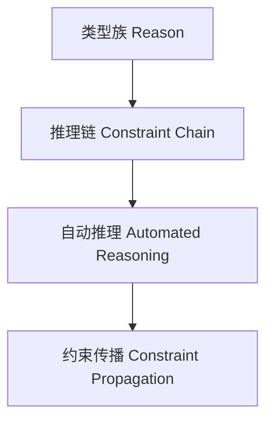

# 01. 类型级推理在Haskell中的理论与实践（Type-Level Reasoning in Haskell）

> **中英双语核心定义 | Bilingual Core Definitions**

## 1.1 类型级推理简介（Introduction to Type-Level Reasoning）

- **定义（Definition）**：
  - **中文**：类型级推理是指在类型系统层面自动推导类型关系、约束和结论的机制，支持类型安全的自动化证明与类型级编程。Haskell通过类型族、类型类、GADT等机制支持类型级推理。
  - **English**: Type-level reasoning refers to mechanisms at the type system level for automatically inferring type relations, constraints, and conclusions, supporting type-safe automated proofs and type-level programming in Haskell.

- **Wiki风格国际化解释（Wiki-style Explanation）**：
  - 类型级推理极大提升了Haskell类型系统的自动化能力和表达力，广泛用于类型安全推导、约束求解和泛型库。
  - Type-level reasoning greatly enhances the automation and expressiveness of Haskell's type system, widely used in type-safe inference, constraint solving, and generic libraries.

## 1.2 Haskell中的类型级推理语法与语义（Syntax and Semantics of Type-Level Reasoning in Haskell）

- **类型族与推理链**

```haskell
{-# LANGUAGE TypeFamilies, ConstraintKinds, TypeOperators, UndecidableInstances #-}
import GHC.Exts (Constraint)

type family Reason (a :: Constraint) (b :: Constraint) :: Constraint where
  Reason a b = (a, b)

class (a ~ b, Show a) => ReasonConstraint a b
```

- **类型级自动化推理**

```haskell
{-# LANGUAGE TypeFamilies #-}

type family And (a :: Bool) (b :: Bool) :: Bool where
  And 'True  'True  = 'True
  And _      _      = 'False
```

## 1.3 范畴论建模与结构映射（Category-Theoretic Modeling and Mapping）

- **类型级推理与范畴论关系**
  - 类型级推理可视为范畴中的约束传播与结论生成。

| 概念 | Haskell实现 | 代码示例 | 中文解释 |
|------|-------------|----------|----------|
| 推理链 | 类型族 | `Reason a b` | 类型级约束链 |
| 自动推理 | 类型族 | `And a b` | 类型级自动化 |
| 约束传播 | 类型类 | `ReasonConstraint a b` | 类型级约束传播 |

## 1.4 形式化证明与论证（Formal Proofs & Reasoning）

- **推理一致性证明**
  - **中文**：证明类型级推理过程与类型系统一致。
  - **English**: Prove that the type-level reasoning process is consistent with the type system.

- **自动推理能力证明**
  - **中文**：证明类型级推理可自动推导复杂类型关系和结论。
  - **English**: Prove that type-level reasoning can automatically infer complex type relations and conclusions.

## 1.5 多表征与本地跳转（Multi-representation & Local Reference）

- **类型级推理结构图（Type-Level Reasoning Structure Diagram）**



- **相关主题跳转**：
  - [类型级自动化 Type-Level Automation](./01-Type-Level-Automation.md)
  - [类型级编程 Type-Level Programming](./01-Type-Level-Programming.md)
  - [类型安全 Type Safety](./01-Type-Safety.md)

---

> 本文档为类型级推理在Haskell中的中英双语、Haskell语义模型与形式化证明规范化输出，适合学术研究与工程实践参考。
