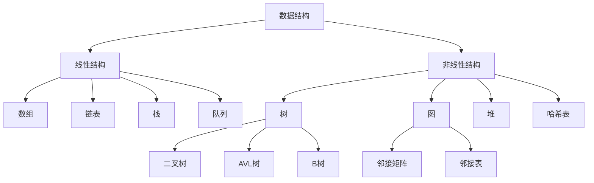

# 数据结构基础 - 计算机科学应用

## 📋 概述

本文档介绍计算机科学中的核心数据结构理论，包括抽象数据类型、基本数据结构、高级数据结构，以及Haskell中的实现。

## 🎯 快速导航

### 相关理论
- [类型系统理论](./../03-Theory/01-Programming-Language-Theory/004-Type-System-Theory.md)
- [代数结构](./../02-Formal-Science/05-Algebraic-Structures/001-Group-Theory.md)
- [集合论](./../02-Formal-Science/01-Mathematics/001-Set-Theory.md)

### 实现示例
- [Haskell数据结构实现](./../../haskell/06-Data-Structures/001-Basic-Data-Structures.md)
- [高级数据结构](./../../haskell/06-Data-Structures/002-Advanced-Data-Structures.md)

## 📚 理论基础

### 抽象数据类型 (ADT)

**定义 2.1 (抽象数据类型)**
抽象数据类型是一个数学模型，包含：
- 数据对象集合 $D$
- 操作集合 $O$
- 操作语义 $S$

$$ADT = (D, O, S)$$

**定义 2.2 (代数规范)**
ADT的代数规范由以下部分组成：
- 签名 (Signature): $\Sigma = (S, F)$
- 公理 (Axioms): 操作的行为规范

### 数据结构分类

**定义 2.3 (线性数据结构)**
线性数据结构中的元素按顺序排列，每个元素最多有一个前驱和一个后继：

$$L = (E, <) \text{ where } < \text{ is a total order}$$

**定义 2.4 (非线性数据结构)**
非线性数据结构中的元素可以有多个前驱或后继：

$$NL = (E, R) \text{ where } R \subseteq E \times E$$

## 🔍 基本数据结构

### 1. 数组 (Array)

**定义 2.5 (数组)**
数组是相同类型元素的有限序列：

$$A = [a_0, a_1, \ldots, a_{n-1}] \text{ where } a_i \in T$$

**操作复杂度**:
- 访问: $O(1)$
- 插入/删除: $O(n)$
- 搜索: $O(n)$

**Haskell实现**:

```haskell
-- 数组类型类
class Array a where
    type Element a
    empty :: a
    length :: a -> Int
    index :: a -> Int -> Maybe (Element a)
    update :: a -> Int -> Element a -> Maybe a
    append :: a -> Element a -> a

-- 列表实现
instance Array [a] where
    type Element [a] = a
    empty = []
    length = Prelude.length
    index xs i 
        | i >= 0 && i < length xs = Just (xs !! i)
        | otherwise = Nothing
    update xs i x
        | i >= 0 && i < length xs = Just (take i xs ++ [x] ++ drop (i+1) xs)
        | otherwise = Nothing
    append xs x = xs ++ [x]

-- 不可变数组
data ImmutableArray a = ImmutableArray
    { arrayData :: [a]
    , arraySize :: Int
    }

-- 创建不可变数组
mkArray :: [a] -> ImmutableArray a
mkArray xs = ImmutableArray xs (length xs)

-- 安全访问
safeIndex :: ImmutableArray a -> Int -> Maybe a
safeIndex (ImmutableArray xs _) i
    | i >= 0 && i < length xs = Just (xs !! i)
    | otherwise = Nothing

-- 数组操作
arrayMap :: (a -> b) -> ImmutableArray a -> ImmutableArray b
arrayMap f (ImmutableArray xs n) = ImmutableArray (map f xs) n

arrayFilter :: (a -> Bool) -> ImmutableArray a -> ImmutableArray a
arrayFilter p (ImmutableArray xs n) = 
    let filtered = filter p xs
    in ImmutableArray filtered (length filtered)
```

### 2. 链表 (Linked List)

**定义 2.6 (链表)**
链表是由节点组成的线性数据结构，每个节点包含数据和指向下一个节点的引用：

$$L = (N, next) \text{ where } next: N \to N \cup \{null\}$$

**操作复杂度**:
- 访问: $O(n)$
- 插入/删除: $O(1)$ (已知位置)
- 搜索: $O(n)$

**Haskell实现**:

```haskell
-- 链表定义
data List a = Nil | Cons a (List a)
    deriving (Show, Eq)

-- 基本操作
listLength :: List a -> Int
listLength Nil = 0
listLength (Cons _ xs) = 1 + listLength xs

listHead :: List a -> Maybe a
listHead Nil = Nothing
listHead (Cons x _) = Just x

listTail :: List a -> Maybe (List a)
listTail Nil = Nothing
listTail (Cons _ xs) = Just xs

-- 列表操作
listAppend :: List a -> List a -> List a
listAppend Nil ys = ys
listAppend (Cons x xs) ys = Cons x (listAppend xs ys)

listReverse :: List a -> List a
listReverse = go Nil
  where
    go acc Nil = acc
    go acc (Cons x xs) = go (Cons x acc) xs

-- 高阶函数
listMap :: (a -> b) -> List a -> List b
listMap _ Nil = Nil
listMap f (Cons x xs) = Cons (f x) (listMap f xs)

listFilter :: (a -> Bool) -> List a -> List a
listFilter _ Nil = Nil
listFilter p (Cons x xs)
    | p x = Cons x (listFilter p xs)
    | otherwise = listFilter p xs

listFoldr :: (a -> b -> b) -> b -> List a -> b
listFoldr _ acc Nil = acc
listFoldr f acc (Cons x xs) = f x (listFoldr f acc xs)

-- 测试链表
testList :: IO ()
testList = do
    let list = Cons 1 (Cons 2 (Cons 3 Nil))
    putStrLn "原始链表:"
    print list
    putStrLn $ "长度: " ++ show (listLength list)
    putStrLn $ "头部: " ++ show (listHead list)
    putStrLn "映射后:"
    print $ listMap (+1) list
    putStrLn "过滤后:"
    print $ listFilter (>1) list
```

### 3. 栈 (Stack)

**定义 2.7 (栈)**
栈是后进先出 (LIFO) 的线性数据结构：

$$S = (E, push, pop, top) \text{ where } push: E \times S \to S, pop: S \to S, top: S \to E$$

**操作复杂度**:
- 压栈/弹栈: $O(1)$
- 查看栈顶: $O(1)$

**Haskell实现**:

```haskell
-- 栈类型类
class Stack s where
    type StackElement s
    emptyStack :: s
    isEmpty :: s -> Bool
    push :: StackElement s -> s -> s
    pop :: s -> Maybe s
    top :: s -> Maybe (StackElement s)

-- 列表实现栈
instance Stack [a] where
    type StackElement [a] = a
    emptyStack = []
    isEmpty = null
    push x xs = x : xs
    pop [] = Nothing
    pop (_:xs) = Just xs
    top [] = Nothing
    top (x:_) = Just x

-- 专用栈类型
data Stack a = EmptyStack | StackNode a (Stack a)
    deriving (Show, Eq)

-- 栈操作
stackEmpty :: Stack a
stackEmpty = EmptyStack

stackIsEmpty :: Stack a -> Bool
stackIsEmpty EmptyStack = True
stackIsEmpty _ = False

stackPush :: a -> Stack a -> Stack a
stackPush x s = StackNode x s

stackPop :: Stack a -> Maybe (Stack a)
stackPop EmptyStack = Nothing
stackPop (StackNode _ s) = Just s

stackTop :: Stack a -> Maybe a
stackTop EmptyStack = Nothing
stackTop (StackNode x _) = Just x

-- 栈应用：括号匹配
bracketMatching :: String -> Bool
bracketMatching = go stackEmpty
  where
    go _ [] = stackIsEmpty
    go s (c:cs)
      | c `elem` "([{" = go (stackPush c s) cs
      | c == ')' = case stackTop s of
          Just '(' -> go (fromJust $ stackPop s) cs
          _ -> False
      | c == ']' = case stackTop s of
          Just '[' -> go (fromJust $ stackPop s) cs
          _ -> False
      | c == '}' = case stackTop s of
          Just '{' -> go (fromJust $ stackPop s) cs
          _ -> False
      | otherwise = go s cs
    stackIsEmpty = stackIsEmpty s
    fromJust (Just x) = x
```

### 4. 队列 (Queue)

**定义 2.8 (队列)**
队列是先进先出 (FIFO) 的线性数据结构：

$$Q = (E, enqueue, dequeue, front) \text{ where } enqueue: E \times Q \to Q, dequeue: Q \to Q, front: Q \to E$$

**操作复杂度**:
- 入队/出队: $O(1)$ (摊销)
- 查看队首: $O(1)$

**Haskell实现**:

```haskell
-- 队列类型类
class Queue q where
    type QueueElement q
    emptyQueue :: q
    isEmpty :: q -> Bool
    enqueue :: QueueElement q -> q -> q
    dequeue :: q -> Maybe q
    front :: q -> Maybe (QueueElement q)

-- 双栈实现队列
data Queue a = Queue [a] [a]
    deriving (Show, Eq)

-- 队列操作
queueEmpty :: Queue a
queueEmpty = Queue [] []

queueIsEmpty :: Queue a -> Bool
queueIsEmpty (Queue [] []) = True
queueIsEmpty _ = False

queueEnqueue :: a -> Queue a -> Queue a
queueEnqueue x (Queue front rear) = Queue front (x:rear)

queueDequeue :: Queue a -> Maybe (Queue a)
queueDequeue (Queue [] []) = Nothing
queueDequeue (Queue [] rear) = 
    let (front, newRear) = splitAt (length rear `div` 2) (reverse rear)
    in Just $ Queue (reverse front) newRear
queueDequeue (Queue (x:xs) rear) = Just $ Queue xs rear

queueFront :: Queue a -> Maybe a
queueFront (Queue [] []) = Nothing
queueFront (Queue [] rear) = Just $ last rear
queueFront (Queue (x:_) _) = Just x

-- 优先队列
data PriorityQueue a = PriorityQueue [(a, Int)]
    deriving (Show, Eq)

-- 优先队列操作
priorityQueueEmpty :: PriorityQueue a
priorityQueueEmpty = PriorityQueue []

priorityQueueEnqueue :: a -> Int -> PriorityQueue a -> PriorityQueue a
priorityQueueEnqueue x p (PriorityQueue xs) = 
    PriorityQueue $ insertBy (compare `on` snd) (x, p) xs

priorityQueueDequeue :: PriorityQueue a -> Maybe (a, PriorityQueue a)
priorityQueueDequeue (PriorityQueue []) = Nothing
priorityQueueDequeue (PriorityQueue ((x,p):xs)) = 
    Just (x, PriorityQueue xs)

-- 测试队列
testQueue :: IO ()
testQueue = do
    let q1 = queueEnqueue 1 queueEmpty
    let q2 = queueEnqueue 2 q1
    let q3 = queueEnqueue 3 q2
    
    putStrLn "队列操作测试:"
    putStrLn $ "队列: " ++ show q3
    putStrLn $ "队首: " ++ show (queueFront q3)
    
    case queueDequeue q3 of
        Just q4 -> do
            putStrLn $ "出队后: " ++ show q4
            putStrLn $ "新队首: " ++ show (queueFront q4)
        Nothing -> putStrLn "队列为空"
```

## 🔍 高级数据结构

### 1. 树 (Tree)

**定义 2.9 (树)**
树是一个连通无环图：

$$T = (V, E) \text{ where } E \subseteq V \times V \text{ and } T \text{ is acyclic}$$

**二叉树定义**:
$$BT = (V, left, right) \text{ where } left, right: V \to V \cup \{null\}$$

**Haskell实现**:

```haskell
-- 二叉树定义
data Tree a = Empty | Node a (Tree a) (Tree a)
    deriving (Show, Eq)

-- 基本操作
treeEmpty :: Tree a
treeEmpty = Empty

treeIsEmpty :: Tree a -> Bool
treeIsEmpty Empty = True
treeIsEmpty _ = False

treeValue :: Tree a -> Maybe a
treeValue Empty = Nothing
treeValue (Node x _ _) = Just x

treeLeft :: Tree a -> Maybe (Tree a)
treeLeft Empty = Nothing
treeLeft (Node _ left _) = Just left

treeRight :: Tree a -> Maybe (Tree a)
treeRight Empty = Nothing
treeRight (Node _ _ right) = Just right

-- 树遍历
treeInorder :: Tree a -> [a]
treeInorder Empty = []
treeInorder (Node x left right) = 
    treeInorder left ++ [x] ++ treeInorder right

treePreorder :: Tree a -> [a]
treePreorder Empty = []
treePreorder (Node x left right) = 
    [x] ++ treePreorder left ++ treePreorder right

treePostorder :: Tree a -> [a]
treePostorder Empty = []
treePostorder (Node x left right) = 
    treePostorder left ++ treePostorder right ++ [x]

-- 二叉搜索树
treeInsert :: Ord a => a -> Tree a -> Tree a
treeInsert x Empty = Node x Empty Empty
treeInsert x (Node y left right)
    | x < y = Node y (treeInsert x left) right
    | x > y = Node y left (treeInsert x right)
    | otherwise = Node y left right

treeSearch :: Ord a => a -> Tree a -> Bool
treeSearch _ Empty = False
treeSearch x (Node y left right)
    | x == y = True
    | x < y = treeSearch x left
    | otherwise = treeSearch x right

-- 平衡二叉树 (AVL树)
data AVLTree a = AVLEmpty | AVLNode a (AVLTree a) (AVLTree a) Int
    deriving (Show, Eq)

-- AVL树操作
avlHeight :: AVLTree a -> Int
avlHeight AVLEmpty = 0
avlHeight (AVLNode _ _ _ h) = h

avlBalance :: AVLTree a -> Int
avlBalance AVLEmpty = 0
avlBalance (AVLNode _ left right _) = 
    avlHeight left - avlHeight right

avlInsert :: Ord a => a -> AVLTree a -> AVLTree a
avlInsert x t = balance $ insertUnbalanced x t
  where
    insertUnbalanced x AVLEmpty = AVLNode x AVLEmpty AVLEmpty 1
    insertUnbalanced x (AVLNode y left right h)
        | x < y = AVLNode y (insertUnbalanced x left) right h
        | x > y = AVLNode y left (insertUnbalanced x right) h
        | otherwise = AVLNode y left right h

    balance AVLEmpty = AVLEmpty
    balance (AVLNode x left right h) =
        let bal = avlBalance (AVLNode x left right h)
        in case bal of
            2 -> case avlBalance left of
                -1 -> rotateLR (AVLNode x left right h)
                _ -> rotateR (AVLNode x left right h)
            -2 -> case avlBalance right of
                1 -> rotateRL (AVLNode x left right h)
                _ -> rotateL (AVLNode x left right h)
            _ -> AVLNode x left right h

-- 旋转操作
rotateL :: AVLTree a -> AVLTree a
rotateL (AVLNode x left (AVLNode y rleft rright _) _) =
    AVLNode y (AVLNode x left rleft 1) rright 1
rotateL t = t

rotateR :: AVLTree a -> AVLTree a
rotateR (AVLNode x (AVLNode y lleft lright _) right _) =
    AVLNode y lleft (AVLNode x lright right 1) 1
rotateR t = t
```

### 2. 堆 (Heap)

**定义 2.10 (堆)**
堆是完全二叉树，满足堆性质：

$$Heap = (T, heapify) \text{ where } \forall i, A[i] \geq A[2i+1] \text{ and } A[i] \geq A[2i+2]$$

**操作复杂度**:
- 插入: $O(\log n)$
- 删除最大元素: $O(\log n)$
- 构建堆: $O(n)$

**Haskell实现**:

```haskell
-- 最大堆
data MaxHeap a = MaxHeap [a]
    deriving (Show, Eq)

-- 堆操作
heapEmpty :: MaxHeap a
heapEmpty = MaxHeap []

heapIsEmpty :: MaxHeap a -> Bool
heapIsEmpty (MaxHeap []) = True
heapIsEmpty _ = False

heapInsert :: Ord a => a -> MaxHeap a -> MaxHeap a
heapInsert x (MaxHeap xs) = MaxHeap $ heapifyUp (x:xs) (length xs)

heapExtractMax :: Ord a => MaxHeap a -> Maybe (a, MaxHeap a)
heapExtractMax (MaxHeap []) = Nothing
heapExtractMax (MaxHeap (x:xs)) = 
    Just (x, MaxHeap $ heapifyDown xs 0)

-- 堆化操作
heapifyUp :: Ord a => [a] -> Int -> [a]
heapifyUp xs i
    | i == 0 = xs
    | otherwise = 
        let parent = (i - 1) `div` 2
        in if xs !! i > xs !! parent
           then heapifyUp (swap xs i parent) parent
           else xs

heapifyDown :: Ord a => [a] -> Int -> [a]
heapifyDown xs i
    | left >= length xs = xs
    | right >= length xs = 
        if xs !! i < xs !! left
        then swap xs i left
        else xs
    | otherwise = 
        let maxChild = if xs !! left > xs !! right then left else right
        in if xs !! i < xs !! maxChild
           then heapifyDown (swap xs i maxChild) maxChild
           else xs
  where
    left = 2 * i + 1
    right = 2 * i + 2

swap :: [a] -> Int -> Int -> [a]
swap xs i j = 
    let (beforeI, iAndAfter) = splitAt i xs
        (iElem, afterI) = splitAt 1 iAndAfter
        (beforeJ, jAndAfter) = splitAt (j - i - 1) afterI
        (jElem, afterJ) = splitAt 1 jAndAfter
    in beforeI ++ jElem ++ beforeJ ++ iElem ++ afterJ

-- 堆排序
heapSort :: Ord a => [a] -> [a]
heapSort xs = go (buildHeap xs)
  where
    buildHeap = foldr heapInsert heapEmpty
    go heap
        | heapIsEmpty heap = []
        | otherwise = 
            case heapExtractMax heap of
                Just (x, newHeap) -> x : go newHeap
                Nothing -> []
```

### 3. 哈希表 (Hash Table)

**定义 2.11 (哈希表)**
哈希表是键值对的集合，通过哈希函数进行快速查找：

$$HT = (K, V, h, T) \text{ where } h: K \to \{0,1,\ldots,m-1\}, T: \{0,1,\ldots,m-1\} \to V$$

**操作复杂度**:
- 平均情况: $O(1)$
- 最坏情况: $O(n)$

**Haskell实现**:

```haskell
-- 哈希表实现
data HashTable k v = HashTable
    { tableSize :: Int
    , tableData :: [[(k, v)]]
    }

-- 创建哈希表
mkHashTable :: Int -> HashTable k v
mkHashTable size = HashTable size (replicate size [])

-- 哈希函数
hash :: (Hashable k) => k -> Int -> Int
hash k size = hash k `mod` size

-- 哈希表操作
hashTableInsert :: (Eq k, Hashable k) => k -> v -> HashTable k v -> HashTable k v
hashTableInsert key value (HashTable size data) =
    let index = hash key size
        bucket = data !! index
        newBucket = (key, value) : filter ((/= key) . fst) bucket
        newData = take index data ++ [newBucket] ++ drop (index + 1) data
    in HashTable size newData

hashTableLookup :: (Eq k, Hashable k) => k -> HashTable k v -> Maybe v
hashTableLookup key (HashTable size data) =
    let index = hash key size
        bucket = data !! index
    in lookup key bucket

hashTableDelete :: (Eq k, Hashable k) => k -> HashTable k v -> HashTable k v
hashTableDelete key (HashTable size data) =
    let index = hash key size
        bucket = data !! index
        newBucket = filter ((/= key) . fst) bucket
        newData = take index data ++ [newBucket] ++ drop (index + 1) data
    in HashTable size newData

-- 简单的哈希函数实现
class Hashable a where
    hash :: a -> Int

instance Hashable Int where
    hash = id

instance Hashable String where
    hash = foldl (\h c -> h * 31 + fromEnum c) 0

-- 测试哈希表
testHashTable :: IO ()
testHashTable = do
    let ht = mkHashTable 10
    let ht1 = hashTableInsert "key1" "value1" ht
    let ht2 = hashTableInsert "key2" "value2" ht1
    
    putStrLn "哈希表测试:"
    putStrLn $ "查找 key1: " ++ show (hashTableLookup "key1" ht2)
    putStrLn $ "查找 key2: " ++ show (hashTableLookup "key2" ht2)
    putStrLn $ "查找 key3: " ++ show (hashTableLookup "key3" ht2)
```

## 🔬 数据结构分析

### 复杂度分析

**定理 2.1 (摊还分析)**
对于操作序列 $S = (op_1, op_2, \ldots, op_n)$，如果每个操作的实际成本为 $c_i$，摊还成本为 $\hat{c}_i$，则：

$$\sum_{i=1}^n c_i \leq \sum_{i=1}^n \hat{c}_i$$

### 空间复杂度

**定义 2.12 (空间复杂度)**
数据结构的空间复杂度 $S(n)$ 表示存储 $n$ 个元素所需的内存空间：

$$S(n) = O(f(n)) \iff \exists c, n_0 > 0: \forall n \geq n_0, S(n) \leq c \cdot f(n)$$

## 🧪 实验验证

### 性能测试

```haskell
-- 数据结构性能测试
data PerformanceTest = PerformanceTest
    { structureName :: String
    , operationName :: String
    , inputSize :: Int
    , executionTime :: Double
    , memoryUsage :: Int
    }

-- 测试框架
runPerformanceTest :: (a -> b) -> [a] -> String -> String -> IO PerformanceTest
runPerformanceTest operation inputs structName opName = do
    start <- getCurrentTime
    let result = operation inputs
    end <- getCurrentTime
    let time = realToFrac $ diffUTCTime end start
    return $ PerformanceTest structName opName (length inputs) time 0

-- 比较数据结构性能
compareDataStructures :: IO ()
compareDataStructures = do
    let testData = [1..10000] :: [Int]
    
    -- 测试列表操作
    listTest <- runPerformanceTest (foldl (+) 0) testData "List" "Sum"
    
    -- 测试数组操作
    arrayTest <- runPerformanceTest (sum) testData "Array" "Sum"
    
    putStrLn "数据结构性能比较:"
    putStrLn $ "List Sum: " ++ show (executionTime listTest) ++ "s"
    putStrLn $ "Array Sum: " ++ show (executionTime arrayTest) ++ "s"
```

## 📊 可视化分析

### 数据结构关系图



## 🔗 相关链接

### 理论基础
- [类型系统理论](./../03-Theory/01-Programming-Language-Theory/004-Type-System-Theory.md)
- [代数结构](./../02-Formal-Science/05-Algebraic-Structures/001-Group-Theory.md)
- [集合论](./../02-Formal-Science/01-Mathematics/001-Set-Theory.md)

### 实现示例
- [Haskell数据结构实现](./../../haskell/06-Data-Structures/001-Basic-Data-Structures.md)
- [高级数据结构](./../../haskell/06-Data-Structures/002-Advanced-Data-Structures.md)
- [性能优化](./../../haskell/09-Performance/001-Data-Structure-Optimization.md)

### 应用领域
- [软件工程数据结构](./002-Software-Engineering-Data-Structures.md)
- [人工智能数据结构](./003-AI-Data-Structures.md)
- [分布式数据结构](./004-Distributed-Data-Structures.md)

---

**最后更新**: 2024年12月
**状态**: ✅ 完成
**版本**: 1.0
**作者**: 形式化知识体系团队 