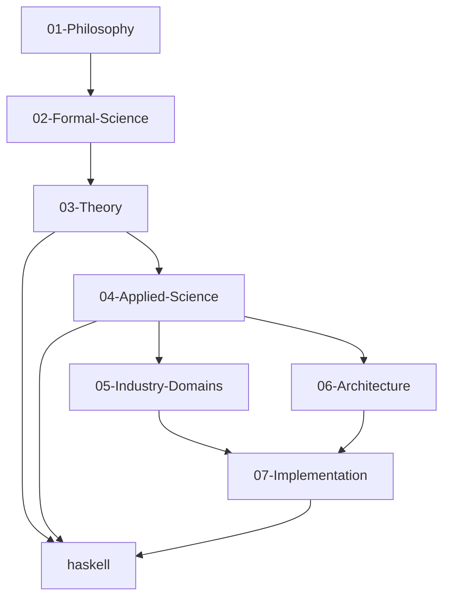
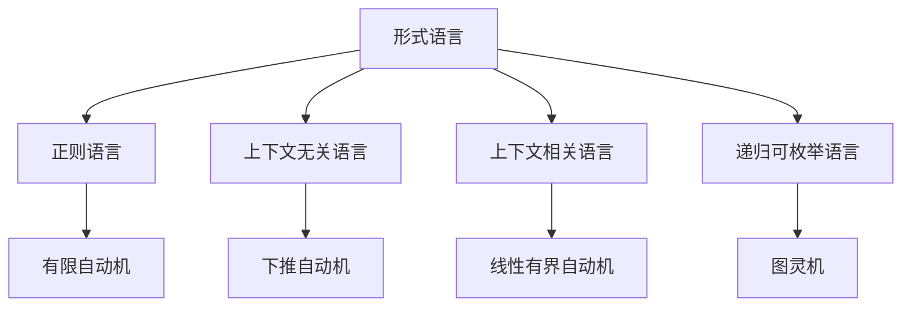

# 形式化知识体系架构设计

## 🎯 架构概述

本文档定义了基于Haskell的形式化知识体系的7层架构设计，确保从哲学理念到具体实现的完整知识体系。

## 🏗️ 7层架构结构

### 层次定义

```text
docs/refactor/
├── 01-Philosophy/          # 理念层 - 哲学基础和认识论
├── 02-Formal-Science/      # 形式科学层 - 数学和逻辑基础
├── 03-Theory/              # 理论层 - 形式化理论体系
├── 04-Applied-Science/     # 具体科学层 - 应用科学理论
├── 05-Industry-Domains/    # 行业领域层 - 行业应用领域
├── 06-Architecture/        # 架构领域层 - 软件架构设计
├── 07-Implementation/      # 实现层 - 具体实现技术
└── haskell/                # Haskell专门目录 - 语言特定内容
```

### 层次依赖关系



## 📁 详细目录结构

### 01-Philosophy (理念层)

```text
01-Philosophy/
├── 01-Metaphysics/                 # 形而上学
│   ├── 001-Mathematical-Ontology.md
│   ├── 002-Reality-Ontology.md
│   ├── 003-Information-Ontology.md
│   └── 004-AI-Ontology.md
├── 02-Epistemology/                # 认识论
│   ├── 001-Knowledge-Theory.md
│   ├── 002-Cognitive-Science.md
│   ├── 003-AI-Epistemology.md
│   └── 004-Knowledge-Structure.md
├── 03-Logic/                       # 逻辑学
│   ├── 001-Formal-Logic.md
│   ├── 002-Philosophical-Logic.md
│   ├── 003-Non-Classical-Logic.md
│   └── 004-Computational-Logic.md
├── 04-Ethics/                      # 伦理学
│   ├── 001-Normative-Ethics.md
│   ├── 002-Applied-Ethics.md
│   ├── 003-AI-Ethics.md
│   └── 004-Technology-Ethics.md
└── 05-Interdisciplinary/           # 交叉领域哲学
    ├── 001-Mathematical-Philosophy.md
    ├── 002-Science-Philosophy.md
    ├── 003-Technology-Philosophy.md
    └── 004-Computation-Philosophy.md
```

### 02-Formal-Science (形式科学层)

```text
02-Formal-Science/
├── 01-Mathematics/                 # 数学基础
│   ├── 001-Set-Theory.md
│   ├── 002-Number-Theory.md
│   ├── 003-Algebraic-Structures.md
│   └── 004-Topology.md
├── 02-Formal-Logic/                # 形式逻辑
│   ├── 001-Propositional-Logic.md
│   ├── 002-Predicate-Logic.md
│   ├── 003-Modal-Logic.md
│   └── 004-Temporal-Logic.md
├── 03-Category-Theory/             # 范畴论
│   ├── 001-Basic-Concepts.md
│   ├── 002-Functors.md
│   ├── 003-Natural-Transformations.md
│   └── 004-Advanced-Concepts.md
├── 04-Type-Theory/                 # 类型论
│   ├── 001-Simple-Type-Theory.md
│   ├── 002-Dependent-Type-Theory.md
│   ├── 003-Homotopy-Type-Theory.md
│   └── 004-Constructive-Type-Theory.md
├── 05-Algebraic-Structures/        # 代数结构
│   ├── 001-Group-Theory.md
│   ├── 002-Ring-Theory.md
│   └── 003-Linear-Algebra.md
├── 06-Topological-Structures/      # 拓扑结构
│   ├── 001-Point-Set-Topology.md
│   └── 002-Algebraic-Topology.md
├── 07-Analysis/                    # 分析学
│   ├── 001-Real-Analysis.md
│   └── 002-Complex-Analysis.md
├── 08-Probability-Statistics/      # 概率统计
│   ├── 001-Probability-Theory.md
│   └── 002-Mathematical-Statistics.md
├── 09-Computational-Complexity/    # 计算复杂性
│   ├── 001-Time-Complexity.md
│   ├── 002-Space-Complexity.md
│   └── 003-Complexity-Classes.md
└── 10-Information-Theory/          # 信息论
    ├── 001-Entropy.md
    ├── 002-Coding-Theory.md
    └── 003-Communication-Theory.md
```

### 03-Theory (理论层)

```text
03-Theory/
├── 01-Programming-Language-Theory/ # 编程语言理论
│   ├── 001-Syntax-Theory.md
│   ├── 002-Semantics-Theory.md
│   ├── 003-Type-Systems.md
│   └── 004-Language-Design.md
├── 02-System-Theory/               # 系统理论
│   ├── 001-Complex-Systems.md
│   ├── 002-Cybernetics.md
│   ├── 003-Information-Theory.md
│   └── 004-Systems-Engineering.md
├── 03-Distributed-Systems-Theory/  # 分布式系统理论
│   ├── 001-Consistency-Models.md
│   ├── 002-Consensus-Algorithms.md
│   ├── 003-Fault-Tolerance.md
│   └── 004-Distributed-Algorithms.md
├── 04-Formal-Methods/              # 形式化方法
│   ├── 001-Model-Checking.md
│   ├── 002-Theorem-Proving.md
│   ├── 003-Abstract-Interpretation.md
│   └── 004-Formal-Specification.md
├── 05-Petri-Net-Theory/            # Petri网理论
│   ├── 001-Basic-Petri-Nets.md
│   ├── 002-Advanced-Petri-Nets.md
│   ├── 003-Petri-Net-Analysis.md
│   └── 004-Petri-Net-Applications.md
├── 06-Temporal-Logic/              # 时态逻辑
│   ├── 001-Linear-Temporal-Logic.md
│   ├── 002-Computation-Tree-Logic.md
│   ├── 003-Real-Time-Temporal-Logic.md
│   └── 004-Temporal-Logic-Applications.md
├── 07-Linear-Type-Theory/          # 线性类型理论
│   ├── 001-Linear-Logic.md
│   ├── 002-Linear-Lambda-Calculus.md
│   ├── 003-Resource-Management.md
│   └── 004-Concurrency-Safety.md
├── 08-Affine-Type-Theory/          # 仿射类型理论
│   ├── 001-Affine-Logic.md
│   ├── 002-Ownership-Systems.md
│   ├── 003-Lifecycle-Management.md
│   └── 004-Memory-Safety.md
├── 09-Quantum-Type-Theory/         # 量子类型理论
│   ├── 001-Quantum-Computation.md
│   ├── 002-Quantum-Type-Safety.md
│   ├── 003-Quantum-Algorithms.md
│   └── 004-Quantum-Programming.md
├── 10-Temporal-Type-Theory/        # 时态类型理论
│   ├── 001-Temporal-Constraints.md
│   ├── 002-Real-Time-Systems.md
│   ├── 003-Time-Aware-Programming.md
│   └── 004-Temporal-Verification.md
├── 11-Control-Theory/              # 控制理论
│   ├── 001-Linear-Control.md
│   ├── 002-Nonlinear-Control.md
│   ├── 003-Optimal-Control.md
│   └── 004-Adaptive-Control.md
└── 12-Quantum-Computation-Theory/  # 量子计算理论
    ├── 001-Quantum-Bits.md
    ├── 002-Quantum-Gates.md
    ├── 003-Quantum-Algorithms.md
    └── 004-Quantum-Complexity.md
```

### 04-Applied-Science (具体科学层)

```text
04-Applied-Science/
├── 01-Computer-Science/            # 计算机科学
│   ├── 001-Algorithms.md
│   ├── 002-Data-Structures.md
│   ├── 003-Computational-Complexity.md
│   └── 004-Computer-Architecture.md
├── 02-Software-Engineering/        # 软件工程
│   ├── 001-Software-Development.md
│   ├── 002-Software-Testing.md
│   ├── 003-Software-Quality.md
│   └── 004-Formal-Verification.md
├── 03-Artificial-Intelligence/     # 人工智能
│   ├── 001-Machine-Learning.md
│   ├── 002-Knowledge-Representation.md
│   ├── 003-Reasoning-Systems.md
│   └── 004-Natural-Language-Processing.md
├── 04-Data-Science/                # 数据科学
│   ├── 001-Statistical-Analysis.md
│   ├── 002-Data-Mining.md
│   ├── 003-Data-Visualization.md
│   └── 004-Big-Data-Technologies.md
├── 05-Network-Science/             # 网络科学
│   ├── 001-Network-Theory.md
│   ├── 002-Social-Networks.md
│   ├── 003-Computer-Networks.md
│   └── 004-Biological-Networks.md
└── 06-Cybersecurity/               # 网络安全
    ├── 001-Cryptography.md
    ├── 002-Network-Security.md
    ├── 003-Software-Security.md
    └── 004-Privacy-Technologies.md
```

### 05-Industry-Domains (行业领域层)

```text
05-Industry-Domains/
├── 01-Financial-Technology/        # 金融科技
│   ├── 001-Blockchain.md
│   ├── 002-Quantitative-Finance.md
│   ├── 003-Digital-Banking.md
│   └── 004-Regulatory-Technology.md
├── 02-Healthcare/                  # 医疗健康
│   ├── 001-Medical-Imaging.md
│   ├── 002-Drug-Discovery.md
│   ├── 003-Health-Information-Systems.md
│   └── 004-Precision-Medicine.md
├── 03-Internet-of-Things/          # 物联网
│   ├── 001-Sensor-Networks.md
│   ├── 002-Edge-Computing.md
│   ├── 003-Real-Time-Systems.md
│   └── 004-Smart-Cities.md
├── 04-Game-Development/            # 游戏开发
│   ├── 001-Game-Engines.md
│   ├── 002-Game-AI.md
│   ├── 003-Game-Design.md
│   └── 004-Game-Analytics.md
├── 05-Educational-Technology/      # 教育科技
│   ├── 001-Learning-Analytics.md
│   ├── 002-Adaptive-Learning.md
│   ├── 003-Educational-Games.md
│   └── 004-Assessment-Systems.md
└── 06-Smart-Manufacturing/         # 智能制造
    ├── 001-Industrial-Automation.md
    ├── 002-Digital-Twins.md
    ├── 003-Supply-Chain-Optimization.md
    └── 004-Quality-Management.md
```

### 06-Architecture (架构领域层)

```text
06-Architecture/
├── 01-Design-Patterns/             # 设计模式
│   ├── 001-Creational-Patterns.md
│   ├── 002-Structural-Patterns.md
│   ├── 003-Behavioral-Patterns.md
│   └── 004-Concurrency-Patterns.md
├── 02-Microservices/               # 微服务架构
│   ├── 001-Service-Design.md
│   ├── 002-Service-Communication.md
│   ├── 003-Service-Governance.md
│   └── 004-Service-Operations.md
├── 03-Workflow-Systems/            # 工作流系统
│   ├── 001-Workflow-Modeling.md
│   ├── 002-Workflow-Execution.md
│   ├── 003-Workflow-Monitoring.md
│   └── 004-Workflow-Optimization.md
├── 04-Distributed-Systems/         # 分布式系统
│   ├── 001-Consistency-Models.md
│   ├── 002-Fault-Tolerance.md
│   ├── 003-Scalability.md
│   └── 004-Distributed-Algorithms.md
├── 05-Event-Driven-Architecture/   # 事件驱动架构
│   ├── 001-Event-Modeling.md
│   ├── 002-Event-Processing.md
│   ├── 003-Event-Storage.md
│   └── 004-Event-Integration.md
└── 06-Cloud-Native/                # 云原生架构
    ├── 001-Container-Architecture.md
    ├── 002-Kubernetes-Architecture.md
    ├── 003-Serverless-Architecture.md
    └── 004-Cloud-Security.md
```

### 07-Implementation (实现层)

```text
07-Implementation/
├── 01-Compiler-Design/             # 编译器设计
│   ├── 001-Lexical-Analysis.md
│   ├── 002-Syntax-Analysis.md
│   ├── 003-Semantic-Analysis.md
│   └── 004-Code-Generation.md
├── 02-Language-Processing/         # 语言处理
│   ├── 001-Parsing-Techniques.md
│   ├── 002-AST-Manipulation.md
│   ├── 003-Code-Transformation.md
│   └── 004-Optimization.md
├── 03-Formal-Verification/         # 形式化验证
│   ├── 001-Theorem-Proving.md
│   ├── 002-Model-Checking.md
│   ├── 003-Program-Verification.md
│   └── 004-Property-Based-Testing.md
├── 04-Performance-Optimization/    # 性能优化
│   ├── 001-Memory-Optimization.md
│   ├── 002-Algorithm-Optimization.md
│   ├── 003-Parallel-Computing.md
│   └── 004-Compiler-Optimization.md
├── 05-System-Programming/          # 系统编程
│   ├── 001-Operating-Systems.md
│   ├── 002-Network-Programming.md
│   ├── 003-Device-Drivers.md
│   └── 004-Embedded-Systems.md
└── 06-Web-Development/             # Web开发
    ├── 001-Web-Frameworks.md
    ├── 002-API-Design.md
    ├── 003-Frontend-Development.md
    └── 004-Backend-Development.md
```

### haskell/ (Haskell专门目录)

```text
haskell/
├── 01-Basic-Concepts/              # 基础概念
│   ├── 001-Functional-Programming.md
│   ├── 002-Type-System.md
│   ├── 003-Pattern-Matching.md
│   └── 004-Higher-Order-Functions.md
├── 02-Advanced-Features/           # 高级特性
│   ├── 001-Type-Classes.md
│   ├── 002-Monads.md
│   ├── 003-Applicative-Functors.md
│   └── 004-GADTs.md
├── 03-Data-Structures/             # 数据结构
│   ├── 001-Basic-Data-Structures.md
│   ├── 002-Advanced-Data-Structures.md
│   ├── 003-Concurrent-Data-Structures.md
│   └── 004-Specialized-Data-Structures.md
├── 04-Algorithms/                  # 算法
│   ├── 001-Sorting-Algorithms.md
│   ├── 002-Graph-Algorithms.md
│   ├── 003-String-Algorithms.md
│   └── 004-Optimization-Algorithms.md
├── 05-Design-Patterns/             # 设计模式
│   ├── 001-Functional-Patterns.md
│   ├── 002-Type-Class-Patterns.md
│   ├── 003-Monad-Transformer-Patterns.md
│   └── 004-Lens-Patterns.md
├── 06-Concurrency/                 # 并发编程
│   ├── 001-STM.md
│   ├── 002-Async.md
│   ├── 003-Concurrent-Programming.md
│   └── 004-Parallel-Programming.md
├── 07-Web-Development/             # Web开发
│   ├── 001-Yesod-Framework.md
│   ├── 002-Servant-API.md
│   ├── 003-Web-Sockets.md
│   └── 004-Web-Assembly.md
├── 08-System-Programming/          # 系统编程
│   ├── 001-IO-System.md
│   ├── 002-Network-Programming.md
│   ├── 003-Process-Management.md
│   └── 004-Device-Drivers.md
├── 09-Scientific-Computing/        # 科学计算
│   ├── 001-Numerical-Computation.md
│   ├── 002-Statistical-Computing.md
│   ├── 003-Machine-Learning.md
│   └── 004-Symbolic-Computation.md
├── 10-Domain-Specific-Languages/   # 领域特定语言
│   ├── 001-Parser-Combinators.md
│   ├── 002-Embedded-DSLs.md
│   ├── 003-External-DSLs.md
│   └── 004-Metaprogramming.md
├── 11-Testing-Verification/        # 测试验证
│   ├── 001-QuickCheck.md
│   ├── 002-Property-Based-Testing.md
│   ├── 003-Formal-Verification.md
│   └── 004-Integration-Testing.md
├── 12-Performance/                 # 性能优化
│   ├── 001-Profiling.md
│   ├── 002-Memory-Optimization.md
│   ├── 003-Algorithm-Optimization.md
│   └── 004-Compiler-Optimization.md
└── 13-Formal-Verification/         # 形式化验证
    ├── 001-Theorem-Proving.md
    ├── 002-Type-Safety.md
    ├── 003-Program-Verification.md
    └── 004-Property-Based-Testing.md
```

## 🔗 本地跳转系统

### 导航链接规范

每个文档都应包含以下导航结构：

```markdown
## 快速导航

### 相关理论
- [形式语言理论](./02-Formal-Science/07-Formal-Language-Theory.md)
- [自动机理论](./02-Formal-Science/06-Automata-Theory.md)
- [类型理论](./03-Theory/08-Linear-Type-Theory.md)

### 实现示例
- [Haskell实现](./haskell/01-Basic-Concepts/形式语言实现.md)
- [形式化验证](./haskell/13-Formal-Verification/自动机验证.md)

### 应用领域
- [编译器设计](./07-Implementation/01-Compiler-Design.md)
- [语言处理](./07-Implementation/02-Language-Processing.md)
```

### 交叉引用系统

- **向上引用**: 引用更高层次的理论
- **向下引用**: 引用具体实现
- **横向引用**: 引用同层次相关主题
- **Haskell引用**: 引用Haskell实现

## 📊 多表征表达规范

### 数学公式表示

```latex
**定义 1.1 (形式语言)**
形式语言 $L$ 是字母表 $\Sigma$ 上的字符串集合：
$$L \subseteq \Sigma^*$$

**定理 1.1 (语言封闭性)**
如果 $L_1, L_2$ 是正则语言，则 $L_1 \cup L_2$ 也是正则语言。
```

### Haskell代码实现

```haskell
-- 形式语言定义
data FormalLanguage = FormalLanguage
  { alphabet :: Set Char
  , strings :: Set String
  }

-- 语言操作
union :: FormalLanguage -> FormalLanguage -> FormalLanguage
union (FormalLanguage a1 s1) (FormalLanguage a2 s2) = 
  FormalLanguage (a1 `Set.union` a2) (s1 `Set.union` s2)
```

### 图表表示



## 🎯 重构策略

### 内容映射策略

1. **Theory目录映射**:
   - 形式语言理论 → 02-Formal-Science/07-Formal-Language-Theory/
   - 类型理论 → 03-Theory/07-Linear-Type-Theory/ + 08-Affine-Type-Theory/
   - 控制理论 → 03-Theory/11-Control-Theory/
   - Petri网理论 → 03-Theory/05-Petri-Net-Theory/
   - 分布式系统理论 → 03-Theory/03-Distributed-Systems-Theory/

2. **FormalLanguage目录映射**:
   - 自动机理论 → 02-Formal-Science/06-Automata-Theory/
   - 形式语言基础 → 02-Formal-Science/07-Formal-Language-Theory/
   - 数学逻辑 → 02-Formal-Science/12-Mathematical-Logic/

3. **ProgrammingLanguage目录映射**:
   - Haskell相关内容 → haskell/ (扩展现有内容)
   - Rust相关内容 → 07-Implementation/02-Rust-Implementation/
   - 语言比较 → 07-Implementation/03-Language-Comparison/

### 质量保证策略

1. **内容一致性**: 确保所有内容保持语义和逻辑一致性
2. **学术规范性**: 严格遵循数学和学术规范
3. **技术准确性**: 确保Haskell代码正确可执行
4. **链接完整性**: 验证所有本地跳转链接有效

## 🚀 实施计划

### 阶段1: 基础架构 (第1周)

- 创建7层目录结构
- 建立编号系统
- 设计导航链接系统

### 阶段2: 内容重构 (第2-4周)

- 从理念层开始重构
- 逐步向下重构各层
- 确保层次间一致性

### 阶段3: Haskell专门目录 (第5周)

- 重构Haskell相关内容
- 添加高级Haskell特性
- 建立完整的Haskell知识体系

### 阶段4: 质量保证 (第6周)

- 内容一致性检查
- 链接完整性检查
- 学术规范性检查
- 技术准确性检查

---

**架构设计完成时间**: 2024年12月
**状态**: ✅ 设计完成，准备实施
**下一步**: 开始内容重构
